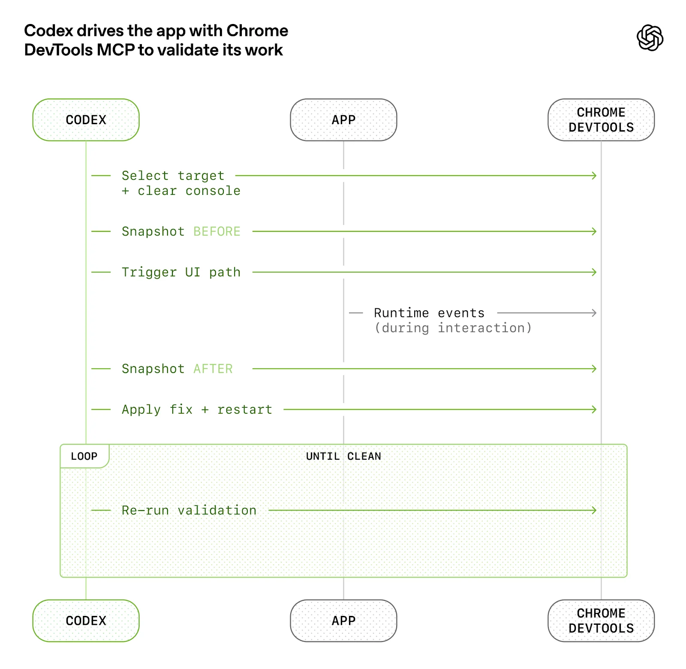
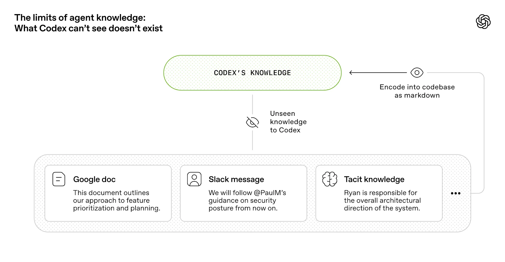

# Harness Engineering - OpenAI

[원문](https://openai.com/ko-KR/index/harness-engineering/)


> 사람이 조정하고, 에이전트가 수행

- 엔지니어링 속도를 몇 배로 높이는 데 필요한 것을 구축하기 위해 의도적으로 이 제약을 선택
- 백만 개 라인에 달하는 코드를 출시하는 데 몇 주가 소요
- 주된 업무가 더 이상 코드 작성이 아니다.
- **환경을 설계**하고, **의도를 명시**하며, Codex **에이전트**가 안정적인 작업을 수행할 수 있도록 **피드백 루프**를 구축하는 것으로 변화

-------------

# 빈 git 리포지터리로 시작

- 초기 스캐폴드(리포지터리 구조, CI 구성, 서식 지정 규칙, 패키지 관리자 설정, 애플리케이션 프레임워크) GPT‑5를 사용하여 Codex CLI에서 생성
- 에이전트에게 리포지터리에서 작업하는 방법을 알려주는 초기 AGENTS.md 파일도 Codex가 직접 작성
> - 사람이 작성한 기존의 코드가 없고, 처음부터 리포지터리는 에이전트에 의해 형성
> - 단 세 명의 엔지니어로 구성된 소규모 팀이 약 1,500개의 pull request를 열고 병합

### 개발팀의 철학 : 수동으로 작성한 코드가 없다

---------------

# 엔지니어의 역할 재정의

> **시스템, 스캐폴딩, 레버리지에 중점을 둔 다른 종류의 엔지니어링 작업이 필요**

- 초기 진행은 예상보다 더뎠는데, 이는 Codex의 역량 부족이 아니라 환경이 제대로 갖춰지지 않았기 때문
- 엔지니어링 팀의 주요 업무는 에이전트가 유용한 업무를 수행할 수 있도록 지원하는 것
  - 큰 목표를 더 작은 빌딩 블록(설계, 코드, 검토, 테스트 등)으로 세분화
  - 에이전트가 이러한 블록을 구성하도록 유도하고, 이를 사용하여 더 복잡한 작업을 해결하는 깊이 우선 작업
  - “어떤 기능이 누락되어 있으며, 에이전트가 읽기 쉽고 실행 가능하게 만들려면 어떻게 해야 할까?”에 대한 고민

----------------------

#### 프롬프트를 통해 시스템과 상호작용
- 엔지니어는 작업을 설명하고, 에이전트를 실행하고, pull request를 열도록 허용
- PR을 완료하기 위해, Codex에게 로컬에서 자체 변경 사항을 검토하게 함
- 로컬 및 클라우드에서 특정 에이전트 검토를 추가로 요청
- 사람이나 에이전트가 제공한 피드백에 응답
- 모든 에이전트 검토자가 만족할 때까지 반복하도록 지시

- Codex는 사람이 CLI에 복사하여 붙여넣지 않아도 표준 개발 도구(gh, 로컬 스크립트, 리포지터리 내장 스킬)를 직접 사용하여 컨텍스트를 수집

#### =>  [랄프 위검 루프(Ralph Wiggum Loop)](https://ghuntley.com/loop/)

----------------

# 애플리케이션의 가독성 향상

- 코드 처리량이 증가하면서, 인적 QA 역량에 병목 현상이 발생
- 사람의 시간과 주의력이 고정된 제약
  - 애플리케이션 UI, 로그, 앱 메트릭 등을 Codex가 직접 읽고 이해할 수 있도록 노력함

> 
> - 예를 들어, `git worktree`별로 앱을 부팅할 수 있게 하여 Codex가 변경사항마다 하나의 인스턴스를 실행하고 제어할 수 있게 함
> - 또한, Chrome DevTools Protocol을 에이전트 런타임에 연결하고 DOM 스냅샷, 스크린샷, 탐색 작업을 위한 **스킬**을 만듬
> - 이를 통해 Codex는 버그를 재현하고, 수정사항을 검증하며, UI 동작에 대해 직접 추론하게 됨

-------------------



------------------

- 로그, 메트릭, 추적은 각 워크트리에 대해 일시적으로 유지되는 로컬 관측 가능성 스택(**observability stack**)을 통해 Codex에 노출된다. 
- Codex는 해당 앱의 완전히 격리된 버전(로그와 메트릭 포함)에서 작업하
- 작업이 완료되면 로그와 메트릭은 삭제
- 에이전트는 LogQL로 로그를 쿼리하고 PromQL로 메트릭을 쿼리할 수 있다
- 이러한 컨텍스트가 주어지면 “서비스 시작이 800ms 이내에 완료”되도록 하거나 “이 네 가지 핵심 사용자 여정에서 어떤 스팬도 2초를 초과하지 않도록” 하는 등의 프롬프트를 다루기 쉬워진다.

------------------


-----------------

# 리포지터리 지식을 기록 시스템으로 만듦

- 컨텍스트 관리는 에이전트가 크고 복잡한 작업을 효과적으로 수행하는 데 있어 가장 큰 과제 중 하나
- 초기에 배운 교훈 => Codex에 1,000페이지의 설명서가 아닌 맵을 제공해야 한다

> "하나의 큰 AGENTS.md" 접근 방식을 시도했지만 실패

----------
## 실패 원인

- **컨텍스트는 희소 리소스**: 
  - 거대한 지침 파일로 인해 작업, 코드 및 관련 문서가 복잡해짐
  - 에이전트가 주요 제약 조건을 놓치거나 잘못된 제약 조건에 맞게 최적화를 시작

- **지침이 너무 많으면 지침이 되지 않음**: 
  - 모든 것이 “중요”하다면 중요한 것은 아무것도 없다. 
  - 에이전트는 의도적으로 탐색하는 대신 로컬에서 패턴 매칭을 수행하게 됩니다.

----------------

- **순식간에 망가짐**: 
  - 획일적인 거대 매뉴얼은 낡은 규칙들의 무덤으로 변한다. 
  - 에이전트는 무엇이 여전히 사실인지 알 수 없고, 
  - 사람들은 더 이상 이를 유지관리하지 않으며, 
  - 파일은 조용히 매력적인 골칫거리로 변한다.

- **확인하기 어려움**:
  - 단일 블롭은 기계적 점검(커버리지, 신선도, 소유권, 교차 연결)에 적합하지 않으므로 드리프트는 불가피하다.

----------------

```
AGENTS.md
ARCHITECTURE.md
docs/
├── design-docs/
│   ├── index.md
│   ├── core-beliefs.md
│   └── ...
├── exec-plans/
│   ├── active/
│   ├── completed/
│   └── tech-debt-tracker.md
├── generated/
│   └── db-schema.md
├── product-specs/
│   ├── index.md
│   ├── new-user-onboarding.md
│   └── ...
├── references/
│   ├── design-system-reference-llms.txt
│   ├── nixpacks-llms.txt
│   ├── uv-llms.txt
│   └── ...
├── DESIGN.md
├── FRONTEND.md
├── PLANS.md
├── PRODUCT_SENSE.md
├── QUALITY_SCORE.md
├── RELIABILITY.md
└── SECURITY.md
```

----------------------------
# 설계 문서화

- 설계 문서화는 검증 상태와 에이전트 우선 운영 원칙을 정의하는 몇 가지 핵심 신념을 포함하여 분류되고 색인화된다. 
- [아키텍처 문서화](#참고-artchitecture-문서화)는 도메인과 패키지 레이어링의 최상위 맵을 제공
- 품질 문서는 각 제품 도메인과 아키텍처 레이어에 등급을 매기며, 시간이 지남에 따라 격차를 추적

- **계획**은 일급 아티팩트로 간주
  - 일시적이며 간단한 계획은 작은 변경에 사용
  - 복잡한 작업은 진행 상황과 의사결정 로그와 함께 [실행계획](#참고-실행-계획) 에 포함되어 리포지터리에 저장
  - 진행 중인 계획, 완료된 계획, 그리고 알려진 기술 부채는 모두 버전화되어 관리되고 동일한 위치에 배치되어 에이전트가 외부 상황에 의존하지 않고 작업

----------------

- 에이전트는 처음부터 부담을 느끼지 않고, 작고 안정적인 진입 지점에서 시작하여 다음 단계로 나아감

- 이를 기계적으로 시행합니다. 
- 전용 린터와 CI 작업은 지식 베이스가 최신 상태이고, 교차 링크되어 있으며, 올바르게 구성되어 있는지 검증
- 반복 실행되는 **“doc-gardening”** 에이전트가 실제 코드 동작을 반영하지 않는 오래되거나 더 이상 유효하지 않은 문서화를 검토하여 수정용 pull request를 연다.

----------------------------

# [참고] Artchitecture 문서화

[Architecture.md](https://matklad.github.io/2021/02/06/ARCHITECTURE.md.html)

- 프로젝트의 물리적 아키텍처에 대한 이해도가 중요
- 이 파일은 프로젝트의 고수준 아키텍처를 설명
- 프로젝트에 기여하는 모든 사람이 읽어야 하므로 간결하게 작성
- 자주 변경될 가능성이 낮은 부분만 명시
- 코드와 항상 동기화하려고 하지 않는다

----------------------------

> 먼저 해결해야 할 문제를 전체적으로 개괄적으로 살펴본다. 그런 다음, 어느 정도 상세한 코드맵을 작성한다
- 모듈들을 큰 틀에서 설명하고, 모듈들 간의 관계를 명확히 한다
  - 코드맵은 "X를 하는 부분은 어디에 있는가?"라는 질문에 답할 수 있어야 한다. 
  - 또한, "내가 보고 있는 부분은 무엇을 하는가?"라는 질문에도 답할 수 있어야 한다. 
  - 각 모듈의 작동 방식 에 대한 세부적인 설명은 피하고, 별도의 문서나 (더 나은 방법은) 코드 내에 직접 작성하는 것이 좋다
- 코드맵은 국가 전체를 보여주는 지도이지, 각 주의 지도를 모아놓은 지도책이 아니다. 

-----------------------------

- 중요 파일, 모듈 및 타입에는 이름을 지정. 
- 직접 링크 하지 마라. (링크는 만료될 수 있다). 
- 대신, 사용자가 심볼 검색을 통해 이름으로 해당 항목을 찾도록 유도하시오.   
  - 이렇게 하면 유지 관리가 필요 없고, 이름이 비슷한 관련 항목을 쉽게 찾을 수 있다.

- 아키텍처 불변 요소를 명시적으로 언급한다. 
- 중요한 불변 요소는 종종 특정 요소의 부재 로 표현되는데, 코드만으로는 이를 파악하기가 매우 어렵다
  - 웹 개발에서 흔히 볼 수 있는 예를 생각해 보세요. 모델 레이어의 어떤 요소도 뷰에 의존하지 않는 것은 없습니다.

---------------------------

- 계층과 시스템 간의 경계도 명확히 구분한다. 
- 경계는 암묵적으로 그 뒤에 있는 시스템의 구현 방식에 대한 정보를 담고 있고,
- 가능한 모든 구현 방식을 제약하기도 한다. 
- 하지만 코드를 무작위로 살펴보는 것만으로는 경계를 찾기 어렵다. 
- 좋은 경계는 측정값이 0이어야 한다.

### [좋은 문서 예시 보기](https://github.com/rust-lang/rust-analyzer/blob/d7c99931d05e3723d878bea5dc26766791fa4e69/docs/dev/architecture.md)

-----------------------------

# [참고] 계획
- [Using PLANS.md for multi-hour problem solving](https://developers.openai.com/cookbook/articles/codex_exec_plans)


---------------------

# 에이전트의 가독성이 목표
<br>

- 코드베이스가 발전함에 따라 Codex의 설계 의사결정을 위한 프레임워크도 진화할 필요가 있다.
- 리포지터리가 전적으로 에이전트에 의해 생성되었으므로, 우선적으로 Codex의 가독성에 최적화되어 있다. 
- 팀의 목표가 신입 엔지니어링 직원을 위해 코드의 탐색성을 개선하는 것과 마찬가지로, 
- 인간 엔지니어의 목표는 에이전트가 리포지터리 자체에서 직접 전체 비즈니스 도메인에 대해 추론할 수 있도록 하는 것이다.

- 에이전트의 관점에서 보면 실행 중에 컨텍스트 내에서 액세스할 수 없는 것은 사실상 존재하지 않는다. 
- Google Docs, 채팅 스레드 또는 사람들의 머릿속에 있는 지식은 시스템에서 접근할 수 없다. 
- 리포지터리 내의 버전 관리되는 아티팩트(예: 코드, 마크다운, 스키마, 실행 계획)에만 접근할 수 있다.

---------------------



---------------------

- 점점 더 많은 컨텍스트를 리포지터리에 추가
  - 에이전트가 검색할 수 없다면, 3개월 후에 입사한 신입 사원이 알 수 없는 것과 마찬가지로 판독이 불가능

- Codex에 더 많은 컨텍스트를 제공한다는 것은 올바른 정보를 정리하고 노출하여 에이전트가 추론할 수 있도록 한다는 의미

- 리포지터리 내에서 완전히 내부화하고 추론할 수 있는 종속성과 추상화를 선호
  - “지루하다”고 자주 묘사되는 기술은 결합성, API 안정성, 학습 설정 내 표현 덕분에 에이전트가 모델링하기 더 쉬운 경향이 있다. 

- 에이전트가 검사하고 검증하며 직접 수정할 수 있는 형태로 시스템을 더 많이 끌어오면 Codex뿐만 아니라 코드베이스에서 작업하는 다른 에이전트(예: Aardvark)에서도 레버리지를 높일 수 있다.

-----------------------
# 아키텍처 및 취향 강제 적용

- 문서화만으로는 에이전트가 생성한 코드베이스를 일관되게 유지할 수 없다. 
- 구현을 세세하게 관리하지 않고 불변 조건을 강제 적용함으로써 기초를 튼튼히 유지하면서 에이전트가 빠르게 출시할 수 있도록 한다. 
> 예를 들어, Codex가 [경계에서 데이터 형태를 파싱](https://lexi-lambda.github.io/blog/2019/11/05/parse-don-t-validate/)하기를 원했지만 그 방법에 대해서는 구체적으로 명시하지 않는다

- 에이전트는 [엄격한 경계와 예측 가능한 구조](https://bits.logic.inc/p/ai-is-forcing-us-to-write-good-code)⁠를 갖춘 환경에서 가장 효과적
- 엄격한 아키텍처 모델을 중심으로 애플리케이션을 구축
- 각 비즈니스 도메인은 엄격하게 검증된 종속성 방향과 제한된 허용 에지 집합을 사용하여 고정된 계층 집합으로 나뉜다. 
- 이런 제약은 Codex가 생성한 맞춤형 린터와 구조적 테스트를 통해 기계적으로 적용

-----------------------
<style>
.cols-4060 {
  display: grid;
  grid-template-columns: 6fr 4fr;
  gap: 1.5rem;
}
</style>

<div class="cols-4060">
<div>


</div>
<div>

- 각 비즈니스 도메인 내에서(예: 앱 설정) 코드는 고정된 레이어 집합(Types → Config → Repo → Service → Runtime → UI)을 통해서만 “전달”

- 교차되는 문제(인증, 커넥터, 텔레메트, 기능 플래그)는 하나의 명시적인 인터페이스인 Providers를 통해 유입됩니다
- 그 외의 모든 것은 허용되지 않으며 기계적으로 강제 적용

</div>
</div>

------------------------

# 병합 철학을 변화시키는 처리량

- Codex의 처리량이 증가함에 따라 기존의 많은 엔지니어링 규범이 오히려 역효과를 내기 시작

  - 리포지터리는 최소한의 차단 병합 게이트로 운영된다
  - pull request는 수명이 짧다
  - 테스트 불안정성은 진행을 무기한으로 막기보다는 후속 실행으로 해결하는 경우가 많다

- 에이전트 처리량이 사람의 주의력을 훨씬 초과하는 시스템에서는 수정 비용이 저렴하고 대기 시간은 오래 걸린다

=> 이는 처리량이 적은 환경에서는 적합하지 않습니다. 여기에서 종종 적절한 절충안이 필요하다

----------------------------

# “에이전트 생성”의 실제 의미
- 코드베이스가 Codex 에이전트에 의해 생성된다는 것은 코드베이스에 있는 모든 것을 의미

- 에이전트가 생성하는 것:

  - 제품 코드 및 테스트
  - CI 구성 및 릴리스 툴링
  - 내부 개발자 도구
  - 문서화 및 설계 내역
  - 평가 하네스
  - 리뷰 코멘트 및 응답
  - 리포지터리 자체를 관리하는 스크립트
  - 생산 대시보드 정의 파일

----------------------------

- 사람은 항상 루프에 남아 있지만, 예전과는 다른 추상화 레이어에서 작업
- 업무를 우선시하고, 사용자 피드백을 수용 기준으로 바꾸며, 결과를 검증

- 에이전트가 어려움을 겪으면 이를 신호로 간주하여 도구, 가드레일, 문서화 등 무엇이 누락되었는지 파악하고 항상 Codex 자체에서 수정사항을 작성하여 리포지터리에 다시 제공한다

> - 에이전트는 우리의 표준 개발 도구를 직접 사용합니다. 
> - 에이전트는 리뷰 피드백을 가져오고, 인라인으로 응답하고, 업데이트를 푸시하며, 종종 자체 pull request를 스쿼시하고 병합하기도 합니다.

-----------------------------

# 자율성 수준의 증가

- 테스트, 검증, 리뷰, 피드백 처리, 복구 등 더 많은 개발 루프가 시스템에 직접 인코딩되면서 
- 리포지터리는 최근 Codex가 새로운 기능을 처음부터 끝까지 주도할 수 있는 중요한 임계점을 넘어섰다.

--------------------

> 이제 에이전트는 한 번의 프롬프트를 통해 다음을 수행할 수 있다.

- 코드베이스의 현재 상태 검증
- 보고된 버그 재현
- 실패 상황을 시연하는 동영상 녹화
- 수정사항 구현
- 애플리케이션을 실행하여 수정사항 검증
- 해결책을 보여 주는 두 번째 동영상 녹화
- pull request 열기
- 에이전트 및 사람 피드백에 응답하기
- 빌드 실패 감지 및 수정
- 판단이 필요한 경우에만 사람에게 에스컬레이션
- 변경사항 병합

--------------------

# 엔트로피 및 가비지 컬렉션

- 에이전트의 완전한 자율성은 새로운 문제를 야기
- Codex는 리포지터리에 이미 존재하는 패턴, 심지어 불균일하거나 최적 상태가 아닌 패턴도 복제한다. 
- 따라서, 시간이 지나면 필연적으로 드리프트가 발생합니다.

> - 처음에는 사람들이 이를 수동으로 처리했습니다. 
> - 예전에는 우리 팀이 매주 금요일(일주일의 20%)마다 “AI 슬로프”를 정리하느라 시간을 보냈습니다. 
> - 예상대로 그 방식은 확장되지 않았습니다.

------------------------


- 대신, *황금 원칙* 이라는 것을 리포지터리에 직접 인코딩하고 정기적인 정리 프로세스를 구축하기 시작

  - 실행에서도 코드베이스의 가독성과 일관성을 유지하도록 설계된 규칙
  - 예를 들어, (1) 불변 조건을 중앙에서 관리하기 위해 직접 만든 헬퍼보다 공유 유틸리티 패키지를 선호하며 (2) “YOLO-style”로 데이터를 탐색하지 않고, 경계를 검증하거나 유형 지정된 SDK에 의존하여 추측한 형태를 바탕으로 에이전트가 실수로 구축하지 못하도록 합니다. 
  - 정기적으로 편차를 검사하고, 품질 등급을 업데이트하며, 대상 리팩터링 pull request를 생성하는 Codex 백그라운드 작업을 운영
  - 대부분은 1분 이내에 검토할 수 있으며 자동으로 병합됩니다.

-----------------

- 이것은 가비지 컬렉션처럼 작동합니다. 
- 기술 부채는 고금리 대출과 같아서, 이자가 쌓여 고통스럽게 한꺼번에 갚는 것보다 조금씩 꾸준히 갚아나가는 편이 훨씬 낫습니다. 
- 사람의 취향은 한 번 포착되면 코드의 모든 라인에 지속적으로 반영됩니다. 
- 이렇게 하면 나쁜 패턴이 코드베이스에 며칠 또는 몇 주 동안 퍼지지 않도록 매일 포착하고 해결할 수 있습니다.

------------------------

# 우리가 여전히 배우고 있는 점

- 이 전략은 지금까지 OpenAI에서 내부 출시와 도입 단계까지 잘 적응

- 우리가 아직 알지 못하는 것은 완전한 에이전트 생성 시스템에서 아키텍처 일관성이 수년에 걸쳐 어떻게 진화하는지에 대한 것이다
- 우리는 사람의 판단이 가장 큰 영향력을 발휘하는 부분과 그 판단을 인코딩하여 복합적으로 활용하는 방법을 여전히 배우고 있다
- 또한 시간이 지나면서 모델의 기능이 계속 향상됨에 따라 이 시스템이 어떻게 발전할지 알 수 없다

------------------

- 소프트웨어를 구축하는 데는 여전히 규율이 필요
- 규율은 코드보다는 스캐폴딩에서 더 많이 드러난다는 점
- 코드베이스의 일관성을 유지하는 툴링, 추상화, 피드백 루프는 점점 더 중요해지고 있다

=> 현재 가장 어려운 과제는 에이전트가 우리의 목표인 복잡하고 안정적인 소프트웨어를 대규모로 구축하고 유지관리하는 데 도움이 되는 환경, 피드백 루프, 제어 시스템을 설계하는 것