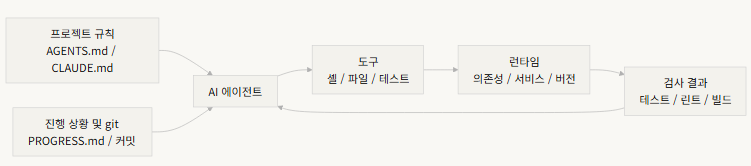

# 하네스란?

> *하네스(harness)* 라는 단어는 AI 코딩 에이전트 분야에서 자주 언급되지만, 솔직히 말하면 대부분의 사람들이 하네스라고 할 때 "프롬프트 파일"을 의미합니다. 
> 그것은 하네스가 아닙니다. 재료만 있고 가스레인지도, 칼도, 레시피도, 플레이팅 워크플로도 없이 레스토랑을 여는 것과 같습니다. 
> 그것은 레스토랑이 아닙니다. 냉장고입니다.

#### 하네스는 명확한 책임과 평가 기준을 가진 다섯 가지 하위 시스템으로 구성됩니다.

-------

# 비유로 시작하기

- 문서도 없고, 코드에 주석도 없고, 테스트 실행 방법도 아무도 알려주지 않고, CI 설정은 어딘가에 묻혀 있는 프로젝트에 갑자기 투입된 신규 엔지니어를 상상해보자.
  - 문제 해결보다 프로젝트 파악에 더 많은 시간 소요

- AI 에이전트도 정확히 같은 상황에 놓인다. 사실 더 나쁘다.
  - 여러분은 적어도 동료에게 물어볼 수 있습니다. 
  - 에이전트는 여러분이 앞에 놓아준 파일과 실행할 수 있는 명령어만 볼 수 있습니다. 

------------

- **OpenAI** 는 핵심 원칙을 *"저장소(repo)가 명세(spec)다"* 로 정의합니다 
— 필요한 모든 컨텍스트(context)는 저장소에 있어야 하며, 구조화된 지시 파일, 명시적 검증(verification) 명령어, 명확한 디렉터리 구성을 통해 전달

- **Anthropic** 의 장기 실행 에이전트 문서는 상태(state) 지속성, 명시적 복구 경로, 구조화된 진행 추적을 강조

**=> 모델 외부의 엔지니어링 인프라 전체가 모델의 역량이 실제로 얼마나 발휘되는지를 결정**

- 이미 잘 알려진 도구들
> Claude Code, Cursor, Codex, AutoGPT...

--------------

# 핵심 개념

- 하네스(harness)란 무엇인가: 모델 가중치 외부의 엔지니어링 인프라 전체. OpenAI는 엔지니어의 핵심 업무를 세 가지로 정리합니다: 환경 설계, 의도 표현, 피드백 루프 구축. Anthropic은 자사의 Claude Agent SDK를 "범용 에이전트 하네스"라고 부릅니다.
- 저장소는 단일 진실 원천(SoR)이다: 에이전트가 볼 수 없는 것은 실질적으로 존재하지 않습니다. OpenAI는 저장소를 "시스템 오브 레코드(SoR, system of record)"로 취급합니다 — 모든 필요한 컨텍스트는 구조화된 파일과 명확한 디렉터리 구성을 통해 저장소에 있어야 합니다.
- 지도를 줘라, 매뉴얼이 아니라: OpenAI의 경험 — AGENTS.md는 백과사전이 아니라 디렉터리 페이지여야 합니다. 100줄 정도가 적당합니다. 맞지 않으면 docs/ 디렉터리로 분리하여 에이전트가 필요할 때 읽도록 하십시오.

-------------

- 제약하되, 마이크로매니지하지 마라: 좋은 하네스는 실행 가능한 규칙으로 에이전트를 제약하지, 지시를 하나하나 열거하지 않습니다. OpenAI는 "불변성을 강제하되, 구현을 마이크로매니지하지 말라"고 말합니다. Anthropic은 에이전트가 자신의 작업을 자신만만하게 칭찬한다는 것을 발견했으며, 해결책은 "일하는 사람"과 "확인하는 사람"을 분리하는 것입니다.
- 컴포넌트를 하나씩 제거하라: 각 하네스 컴포넌트의 한계 기여도를 정량화하려면 하나씩 제거하고 어떤 제거가 가장 큰 성능 저하를 유발하는지 확인하십시오. Anthropic은 이 방법을 사용했으며, 모델이 강해질수록 일부 컴포넌트는 더 이상 핵심적이지 않지만 새로운 컴포넌트가 항상 등장한다는 것을 발견했습니다.

----------

# 5개으 하위 시스템 하네스 모델

- **지시(instruction)** 하위 시스템(레시피 선반): `AGENTS.md`(또는 `CLAUDE.md`)를 만들어 다음을 포함하십시오: 
  - 프로젝트 개요와 목적(한 문장), 
  - 기술 스택과 버전(Python 3.11, FastAPI 0.100+, PostgreSQL 15), 
  - 첫 실행 명령어(make setup, make test), 
  - 협상 불가능한 HARD 제약("모든 API는 OAuth 2.0을 사용해야 함"), 
  - 더 자세한 문서 링크.

--------------------

- **도구(tool)** 하위 시스템(칼 랙): 에이전트가 충분한 도구 접근권을 갖도록 하십시오. 
  - "보안"을 위해 셸을 비활성화하지 마십시오 — 에이전트가 pip install조차 실행할 수 없다면 어떻게 작업하겠습니까? 
  - 하지만 모든 것을 열어두지도 마십시오 — 최소 권한 원칙을 따르십시오.

- **환경(Environment)** 하위 시스템(가스레인지): 환경 상태가 자기 서술적이도록 만드십시오. 
  - 의존성 잠금을 위해 pyproject.toml 또는 package.json을 사용하고, 
  - 런타임 버전을 위해 .nvmrc 또는 .python-version을, 
  - 재현성을 위해 Docker 또는 devcontainers를 사용하십시오.

- **상태(state)** 하위 시스템(준비 스테이션): 장시간 작업에는 진행 추적이 필요합니다. 
  - 간단한 `PROGRESS.md` 파일을 사용하여 기록하십시오: 
    - 완료된 것, 진행 중인 것, 차단된 것. 
    - 매 세션 종료 전에 업데이트하고, 다음 세션 시작 시 읽으십시오.

------------

- **피드백(Feedback)** 하위 시스템(품질 확인 창): 이것이 투자 대비 효과가 가장 높은 하위 시스템입니다. 
  - `AGENTS.md` 에 검증 명령어를 명시적으로 나열하십시오:

검증 명령어:
- 테스트: pytest tests/ -x
- 타입 검사: mypy src/ --strict
- 린트: ruff check src/
- 전체 검증: make check (위 모두 포함)
> 하위 시스템 하나라도 빠지면 주방의 기능 구역 하나가 없는 것과 같습니다 — 요리는 할 수 있지만 항상 불편합니다.

-------------

# 한 팀의 실제 이야기

> 한 팀이 TypeScript + React 프론트엔드 앱(약 20,000줄)에 GPT-4o를 사용했습니다. 필수적으로 주방 장비를 하나씩 추가하는 4단계를 거쳤습니다:

- 1단계 — 빈 주방: README에 기본 프로젝트 설명만 있음. 
  - 5번 실행 중 1번 성공(20%). 
  - 주요 실패: 잘못된 패키지 매니저 선택(npm vs yarn), 컴포넌트 명명 컨벤션 미준수, 테스트 실행 불가.

- 2단계 — 레시피 선반 설치: 기술 스택 버전, 명명 컨벤션, 주요 아키텍처 결정이 담긴 AGENTS.md 추가. 
  - 성공률 60%로 상승. 
  - 남은 실패는 주로 환경 문제와 검증 누락.

-----------

- 3단계 — 품질 확인 창 개방: `AGENTS.md`에 검증 명령어 나열: yarn test && yarn lint && yarn build. 
  - 성공률 80%로 상승.

- 4단계 — 준비 스테이션 준비: 에이전트가 매 실행마다 완료된 작업과 미완료 작업을 기록하는 진행 파일 템플릿 도입. 성공률 80-100%로 안정화.

> 4번의 반복, 모델은 전혀 바꾸지 않았고, 성공률은 20%에서 거의 100%로. 그것이 하네스 엔지니어링의 힘입니다. 더 비싼 재료를 구매한 것이 아닙니다 — 주방을 제대로 정리한 것입니다.

-------------

# 핵심 정리

- 하네스 = 지시 + 도구 + 환경 + 상태(state) + 피드백. 다섯 가지 하위 시스템, 주방의 다섯 가지 기능 구역처럼 — 모두 필수입니다.

- 모델 가중치가 아니라면 모두 하네스입니다. 하네스가 모델 역량이 얼마나 발휘되는지를 결정합니다.

- 다섯 가지 하위 시스템 중 피드백 하위 시스템이 일반적으로 가장 낮은 투자로 가장 높은 수익을 냅니다. 검증 명령어를 먼저 맞추십시오 — 품질 확인 창이 가장 가치 있는 업그레이드입니다.

- 같은 모델에서의 컴포넌트 제거 실험은 한계 기여도 정량화에 사용하십시오. 실제 병목은 제거 실험만이 아니라 실패 기록과 귀인으로 찾으십시오.

- 하네스는 코드처럼 부패합니다. 정기적으로 감사하고 기술 부채를 갚듯 하네스 부채를 갚으십시오.