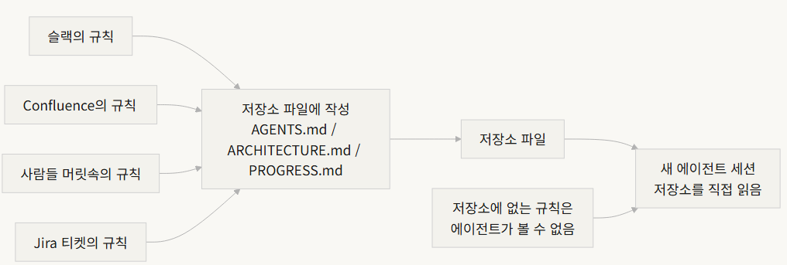
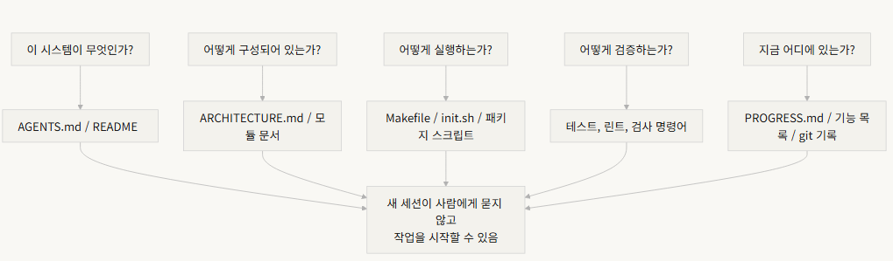

- 팀의 아키텍처 결정이 `Confluence`, `Slack`, `Jira`, 그리고 몇몇 시니어 엔지니어의 머릿속에 흩어져 있습니다. 
- 사람에게는 이것이 겨우 통합니다 — 동료에게 물어보고, 채팅 기록을 검색하고, 문서를 뒤지면 됩니다. 도저히 안 되면 휴게실에서 누군가를 붙잡을 수도 있습니다. 


- 그렇지만, AI 에이전트(agent)에게는, 저장소(repository)에 없는 정보는 존재하지 않습니다.

<hr>

> 에이전트의 입력이 실제로 무엇인지 생각해보십시오: 
>   - 시스템 프롬프트와 작업 설명, 저장소의 파일 내용, 그리고 도구 실행 결과. 그뿐입니다. 

- 
--------------


- 저장소 안에 갇힌 엔지니어 — 외부에 있는 것은 아무것도 모릅니다.

- 그렇다면 질문은 => 이 엔지니어에게 좋은 지도를 줄 건가요?

---------------

# 지도에 무엇이 있어야 하는가?

> OpenAI는 이를 명확히 말합니다: 
> - 저장소에 없는 정보는 에이전트에게 존재하지 않습니다. 
> - 그들은 이를 "저장소를 명세(spec)로" 원칙이라고 부릅니다 
> — 저장소 자체가 최고 권위의 명세 문서입니다.

<hr>

> Anthropic의 장기 실행 에이전트 문서도 이를 반향합니다: 
> - 영속적인 상태(state)는 장기 작업 연속성의 필요 조건입니다. 
> - 세션 간 지식 복구 가능성이 작업 성공률을 직접 결정합니다. 
> - 그리고 이 상태는 저장소에 존재해야 합니다 
> — 에이전트가 가진 유일하게 안정적이고 접근 가능한 저장소이기 때문입니다.

---------------

- 이는 "더 많은 문서를 작성하는 것"에 관한 것이 아닙니다. 
- "결정 정보를 올바른 장소에 두는 것"에 관한 것입니다. 
- `src/api/` 디렉터리의 50줄짜리 `ARCHITECTURE.md`는 아무도 유지보수하지 않는 *Confluence* 의 500페이지 설계 문서보다 만 배 유용합니다. 

> - 책상에 붙여 놓은 손으로 그린 사무실 지도와 파일 캐비닛에 잠겨 있는 아름다운 건축 청사진의 차이와 같습니다 
  — 전자는 필요할 때 바로 거기 있지만, 후자는 기술적으로 우수하더라도 현장에서는 쓸모가 없습니다

---------------

# 지식 가시성



---------------

## cold-start test



--------------

> - 답할 수 없다면 지도에 빈 곳이 있습니다. 
> - 지도에 빈 곳이 있으면 에이전트는 **추측** 합니다 
>> — 잘못된 추측은 버그가 되고, 과도한 추측은 컨텍스트(context)를 낭비합니다. 
>>> — 그리고 모든 새 세션에서 다시 추측합니다. 추측의 비용은 항상 처음부터 제대로 지도를 그리는 비용보다 높습니다.

---------------

# 핵심 개념

- **지식 가시성 격차(Knowledge Visibility Gap)**: 저장소에 없는 전체 프로젝트 지식의 비율. 격차가 클수록 에이전트의 실패율이 높습니다. 이 프로젝트에 대해 얼마나 많은 암묵적 지식이 머릿속에 있는지 헤아려보십시오. 그 중 얼마나 저장소에 들어갔는지 확인하십시오 — 그 차이가 여러분의 가시성 격차입니다.

- **시스템 오브 레코드(SoR, System of Record)**: 프로젝트 결정, 아키텍처 제약, 실행 상태, 검증 기준에 대한 권위 있는 출처로서의 코드 저장소. 저장소가 최종 발언권을 가지며, 다른 어느 곳도 인정되지 않습니다. "도로 폐쇄"를 표시한 지도처럼 — 그 길로 가지 않습니다. 하지만 그 정보가 장씨의 머릿속에만 있다면 매번 장씨에게 물어봐야 합니다.

- **콜드 스타트 테스트(Cold-Start Test)**: 위의 다섯 가지 질문. 몇 개나 답할 수 있는가가 지도가 얼마나 완전한가를 나타냅니다.

------------

- **발견 비용(Discovery Cost)**: 에이전트가 저장소에서 핵심 정보를 찾는 데 소비하는 컨텍스트 예산의 양. 정보가 숨어있을수록 발견 비용이 높아지고, 실제 작업에 남는 예산이 줄어듭니다. 중요한 정보를 열 개의 디렉터리 아래 README에 숨기는 것은 지하실 금고에 소화기를 잠그는 것과 같습니다 — 존재하지만 필요할 때 찾을 수 없습니다.

- **지식 부패율(Knowledge Decay Rate)**: 단위 시간당 낡아지는 지식 항목의 비율. 문서가 코드와 동기화되지 않는 것이 가장 큰 적입니다 — 문서가 없는 것보다 더 나쁩니다.

- **ACID 유추**: 데이터베이스 트랜잭션 원칙(원자성, 일관성, 격리성, 내구성)을 에이전트 상태 관리에 적용하는 것. 

-------------

# 좋은 지도를 그리는 방법

## 원칙 1: 지식은 코드 옆에 있어야 합니다. 
API 엔드포인트 인증에 관한 규칙은 거대한 전역 문서 안에 묻혀 있는 것이 아니라 API 코드 옆에 있어야 합니다. 각 모듈 디렉터리에 해당 모듈의 책임, 인터페이스, 특별 제약을 설명하는 짧은 문서를 두십시오. 도서관 선반 레이블처럼 — 역사책을 원하면 "역사" 표시 선반으로 바로 갑니다. 전체 도서관을 뒤질 필요가 없습니다.

-------------

## 원칙 2: 표준화된 진입 파일을 사용하십시오. 
AGENTS.md(또는 CLAUDE.md)는 에이전트의 "랜딩 페이지"입니다. 모든 정보를 담을 필요는 없지만 에이전트가 세 가지 질문에 빠르게 답할 수 있도록 해야 합니다: "이 프로젝트가 무엇인가", "어떻게 실행하는가", "어떻게 검증하는가". 50-100줄이면 충분합니다.


## 원칙 3: 최소하되 완전하게. 모든 지식은 명확한 사용 사례가 있어야 합니다.
규칙을 제거해도 에이전트의 결정 품질에 영향을 주지 않는다면 그 규칙은 존재하지 않아야 합니다. 하지만 콜드 스타트 테스트의 모든 질문에는 답이 있어야 합니다. 이것은 섬세한 균형입니다 — 너무 많지도, 너무 적지도 않게, 딱 적당하게.

-------------

## 원칙 4: 코드와 함께 업데이트하십시오. 
지식 업데이트를 코드 변경에 바인딩하십시오. 가장 간단한 방법: 아키텍처 문서를 해당 모듈 디렉터리에 두십시오. 코드를 수정할 때 자연스럽게 문서를 보게 됩니다. 코드 변경 후 CI에서 문서 업데이트가 필요한지 확인하도록 알릴 수 있습니다.

-------------

# 구체적인 저장소 구조:

```
project/
├── AGENTS.md              # 진입점: 프로젝트 개요, 실행 명령어, HARD 제약
├── src/
│   ├── api/
│   │   ├── ARCHITECTURE.md  # API 레이어 아키텍처 결정
│   │   └── ...
│   ├── db/
│   │   ├── CONSTRAINTS.md   # 데이터베이스 작업 HARD 제약
│   │   └── ...
│   └── ...
├── PROGRESS.md             # 현재 진행 상황: 완료, 진행 중, 차단됨
└── Makefile                # 표준화된 명령어: setup, test, lint, check
```

--------------

# ACID 원칙으로 에이전트 상태 관리하기

> ACID: 데이이터베이스 트랜잭션의 개념

- 원자성(Atomicity): 각 "논리적 작업"(예: "새 엔드포인트 추가 및 테스트 업데이트")은 하나의 git 커밋을 받습니다. 중간에 실패하면 git stash로 롤백합니다. 전부 아니면 아무것도 — "반쯤 완료된" 상태는 없습니다.

- 일관성(Consistency): "일관된 상태" 검증 조건을 정의하십시오 — 모든 테스트 통과, 린트 오류 없음. 에이전트는 각 작업 후 검증을 실행합니다. 일관성 없는 중간 상태는 커밋되지 않습니다. 은행 송금처럼 — 입금 없이 출금할 수 없습니다.

----------

- 격리성(Isolation): 여러 에이전트가 동시에 작업할 때 상태 파일이 경쟁 조건을 피하도록 설계하십시오. 간단한 방법: 각 에이전트가 자체 진행 파일을 사용하거나, 격리를 위해 git 브랜치를 사용하십시오. 두 명의 주방장이 같은 냄비를 동시에 간을 맞출 수 없습니다 — 짜게 되면 누가 책임을 지나요?

- 내구성(Durability): 중요한 프로젝트 지식은 git으로 추적되는 파일에 있습니다. 임시 상태는 세션 메모리에 있어도 되지만, 세션 간 지식은 파일로 영구저장 합니다. 머릿속에 있는 것은 인정되지 않습니다 — 종이에 있는 것만 인정됩니다.

-----------------

# 실제 변환 사례

- 약 30개의 마이크로서비스로 구성된 이커머스 플랫폼을 유지보수하는 팀
- AI 에이전트를 도입한 후 70%의 작업에 사람의 개입이 필요
- 거의 모든 실패에는 에이전트가 "모두가 알지만 아무도 적지 않은" 암묵적 제약을 위반하는 것이 포함
  - 아무도 "점심 주문은 단체 채팅에 올려야 해"라고 알려주지 않은 새 직원과 같습니다
  — 잘못 추측하고, 혼나지만, 혼난 후에도 아무도 규칙을 알려주지 않습니다.

---------

1. 저장소 루트에 AGENTS.md를 만들어 프로젝트 개요, 기술 스택 버전, 전역 HARD 제약 포함
2. 각 마이크로서비스 디렉터리에 책임, 인터페이스, 의존성을 설명하는 ARCHITECTURE.md 추가
3. 명시적인 "MUST/MUST NOT" 언어로 HARD 제약을 담은 중앙 집중식 CONSTRAINTS.md 생성
4. 각 서비스 디렉터리에 현재 작업 상태를 추적하는 PROGRESS.md 추가

- 변환 후: 같은 에이전트가 콜드 스타트에서 모든 주요 프로젝트 질문에 답할 수 있게 되었고, 작업 완료 품질이 크게 향상

----------
# 핵심 정리

- 저장소에 없는 지식은 에이전트에게 존재하지 않습니다. 중요한 결정을 저장소에 두는 것이 가장 기본적인 하네스 투자입니다 — 길을 잃지 않도록 좋은 지도를 그리십시오.

- "콜드 스타트 테스트"를 사용하여 저장소 품질을 평가하십시오: 새 세션이 저장소 내용만으로 다섯 가지 기본 질문에 답할 수 있는가?

- 지식은 코드 가까이에, 최소로하되 완전하게, *코드와 함께 업데이트* 되어야 합니다. 더 많은 문서를 작성하는 것이 아니라 정보를 올바른 장소에 두는 것입니다.

- ACID 원칙을 에이전트 상태에 사용하십시오: 원자적 커밋, 일관성 검증, 동시성 격리, 중요 지식의 내구성.

- 지식 부패가 가장 큰 적입니다. 코드와 동기화되지 않는 문서는 문서가 없는 것보다 더 위험합니다 — 에이전트를 맞는 방향이라고 생각하면서 잘못된 방향으로 보냅니다.