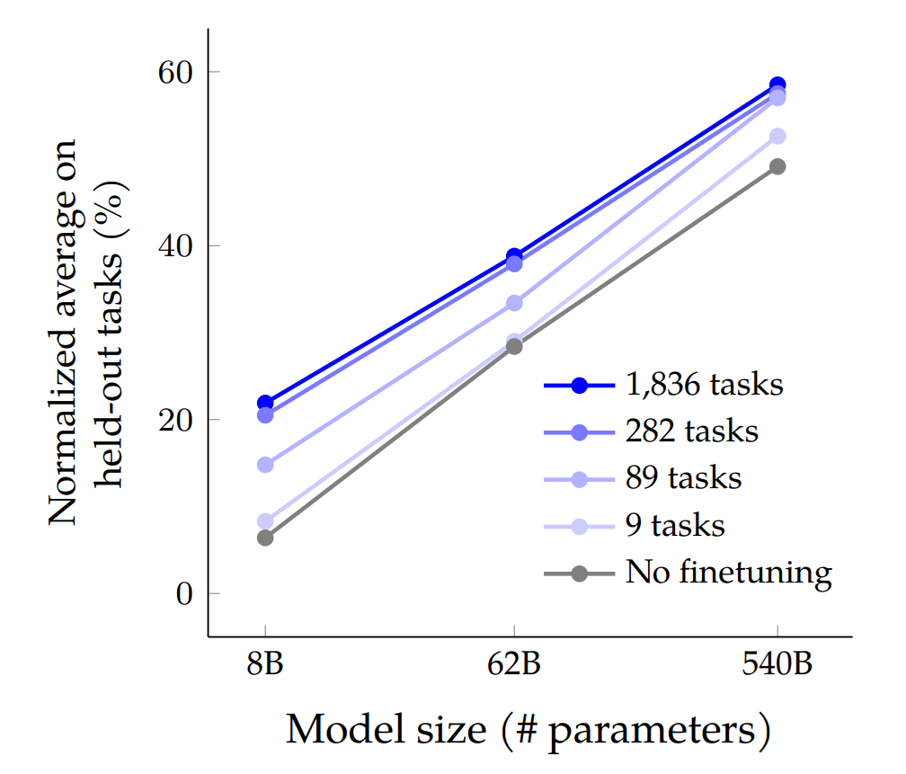

# Prompt

- 프롬프트(prompt)는 AI 모델에게 응답을 얻기 위해 전달하는 요청을 말합니다.
우리가 AI에게 입력하는 문장은 단순한 질문처럼 보이지만, 그 안에는 다양한 정보가 함께 들어갈 수 있습니다.

❓ 어떤 작업을 수행해야 하는지,  
🏠 어떤 방식과 기준으로 대답해야 하는지,  
📰 어떤 정보를 참고해야 하는지...

이처럼 프롬프트는 AI에게 무엇을 할 것인지만 전달하는 것이 아니라,어떻게 사고하고, 어떤 방향으로 답변할 것인지까지 안내하는 설명서에 가깝다.

-------
# 구성 요소

- 앞에서 언급한 설명서를 이루는 각각의 요소를 프롬프트 구성요소라 한다. 
- AI 모델은 프롬프트에 포함된 구성요소들을 종합하여 답변의 관점, 사고 범위, 출력 형태를 결정한다.

=> 따라서 프롬프트 구성요소를 적절히 설계할수록 AI의 응답은 우연에 가까운 결과가 아니라,사용자의 의도에 맞춰 예측 가능하고 일관된 출력으로 이어집니다.


<div class="callout tip">
<div class="callout-title">

프롬프트의 다양한 구성요소
</div>

- 대표적으로 **요청사항(Task)**, **역할(Persona)**, **응답 형식(Response format)**, **컨텍스트(Context)**, **퓨샷 예시(Few-shot Example)** 등이 있다.
- 이런 요소들을 어떻게 쓰는지에 따라 AI의 답변 품질과 방향이 달라질 수 있다.

</div>


----------------
# Instruction Tuning이란?

- *Instruction Tuning* 은 **사전 학습**된 언어 모델을 자언어 형태의 **지시문**(Instruction)과 **예시 입출력**을 포함한 다양한 작업 집합으로 **파인튜닝** 하는 과정입니다. 
- 이러한 "~을 해라"라는 스타일의 예시를 충분히 학습하면, 모델은 추론 시 처음 보는 지시도 잘 따르게 됩니다.

- 이 접근 방식은 기존의 사전 학습 후 작업별 파인튜닝과 프롬프트만 사용하는 고정된 모델 방식의 중간 지점에 해당합니다. 

- 즉, 한 번의 파인튜닝으로 다양한 지시형 작업을 학습시켜, 단일 모델이 새로운 지시도 이해하고 수행할 수 있는 '범용 모델'로 만드는 방법입니다.

-------

# Instruction Tuning의 특징

- 먼저 Zero-shot의 성능이 큰 폭으로 증가합니다. 
  - 해당 지시를 어떤 식으로 수행하는지 학습돼 있지 않는 경우보다 Instruction Tuning을 통해 지시에 대한 데이터가 있을 때 더 좋은 성능을 보입니다.

- 그래프에서 보듯이 다양한 자연어 지시문을 포함할수록 성능이 꾸준히 향상됩니다. 
  - 또한, 모델의 크기가 클수록 더욱 효과적으로 나타나는 특성이 있습니다. 
  


-----------

# Meta Prompting?

- *Meta Prompting* 은 풀이 과정을 뼈대처럼 제공하지만, 예시나 정답은 포함하지 않는 골격 프롬프트라 할 수 있습니다. 
- 이전의 *Few-shot* 이나 *Chain-of-Thought* 기법는 정답을 예시로 제공하면서 "이 예시를 따라 해"라고 한다면 
- Meta Prompting은 "이 절차에 따라 문제를 해결해"라고 말하는 것입니다. 
- 즉, 해결할 틀만 제공하여 LLM이 그 틀을 체워 완성하도록 하는 프롬프트 기법입니다.

-----------

<div class="callout info">
<div class="callout-title">
Meta Prompting 장점
</div>

- 예시 없이 절차만 제공하므로 프롬프트 자체가 간결해지면서 토큰을 절약할 수 있다. 
- 예시를 제공하는 경우 같은 질문이더라도 예시의 종류에 따라 일부 편향된 답변이 생성될 수 있지만, 예시가 없으므로 보다 정확한 결과를 기대할 수 있다. 
- 절차를 전달하기 때문에 같은 여러 유형에 문제에 적용 가능하다.

</div>

---------

# Meta Prompting 적용 방법

*Meta Prompting* 의 특징은 문제의 구체적 내용보다 문제의 전반적인 형식을 강조하는 **구조적 프롬프트 기법** 입니다. 

이를 작성하는 방법은 크게 5단계로 나눌 수 있습니다.

1. 문제 분석(Document Analysis)
- 먼저 주어진 과제, 목적, 핵심 개념, 방법론 등을 분석하고 추출합니다.

2. 작업 해석(Task Interpretation)
- 위에 추출한 정보를 바탕으로 핵심 문제 또는 작업을 정의합니다. 
- 세부적인 요구 사항이나 제약 조건을 파악합니다.

----------

3. 프롬프트 설계(Prompt Design)
- 문제 해결을 위한 구조화된 프롬프트를 개발합니다. 
- 여기에는 명확한 지침, 단계별 접근 방식, 관련 배경 정보가 들어가야 합니다.

4. 실행 지침 및 제약 추가(Execution Guidelines & Constraints)
- 문제 해결 과정의 실행 지침(코드 실행 등)이나 제약 조건(토큰 절약 등)을 추가하여 문제가 더 정확하게 해결되는 조건을 추가합니다.

5. 출력 프롬프트(Output Prompt)
- 지정한 템플릿으로 출력이 나올 수 있도록 지정합니다.

-------------
- 2차 방정식 해를 구하는 프롬프트

```
"문제": "2차방정식 ax^2 + bx + c = 0의 해를 구하시오.",
"풀이": {
  "1단계": "계수 a, b, c를 식에서 식별하세요.",
  "2단계": "판별식 △ = b^2 - 4ac를 계산하세요.",
  "3단계": "△의 값을 기준으로 근의 종류를 판단하세요. (△ > 0: 서로 다른 두 실근, △ = 0: 중근, △ < 0: 서로 다른 두 허근)",
  "4단계": "적절한 근의 공식에 따라 해를 구하세요:
  - △ > 0: x = (-b ± √△) / (2a)
  - △ = 0: x = -b / (2a)
  - △ < 0: x = (-b ± i√|△|) / (2a)",
  "5단계": "결과를 LaTeX 형식의 박스로 표현하여 강조하세요: 예) \boxed{x = ...}"
},
"최종 답변": "판별식 △의 값에 따라 적절한 공식을 사용하여 계산한 해를 제시하세요. 해는 반드시 LaTeX 박스 형식으로 표현합니다."
                    
2x^2 + 5x - 12 = 0의 해를 구하시오.
```
------------
- 답변
```
주어진 2차방정식: 2x^2 + 5x - 12 = 0
풀이:
1단계: 계수 식별

- a = 2
- b = 5
- c = -12

2단계: 판별식 계산

△ = b^2 - 4ac = 5^2 - 4 * 2 * (-12) = 25 + 96 = 121

3단계: 근의 종류 판단

△ = 121 > 0 → 서로 다른 두 실근이 존재

4단계: 근의 공식 사용

x = (-b ± √△) / (2a) = (-5 ± √121) / (2 * 2) = (-5 ± 11) / 4

첫 번째 해: x = (-5 + 11) / 4 = 6 / 4 = 3 / 2

두 번째 해: x = (-5 - 11) / 4 = -16 / 4 = -4

5단계: LaTeX 박스로 강조

x = 3 / 2, x = -4

최종 답변: x = 3 / 2, x = -4
```
--------------
# Meta Prompting 유의 사항

> Meta Prompting 기법을 사용하며 주의할 점에 대해 알아보겠습니다.

- **절차는 짧지만 명확하게 작성** 해야 합니다. 
  - 단계가 너무 많다 보면 해결해 나가는 과정에서 토큰 사용량을 초과할 수 있습니다. 
- 또한, '적절히', '알아서'와 같이 명확하지 않고 **모호한 표현이 아닌 구체적인 지시어** 를 사용해야 합니다. 
- 마지막으로 결괏값에서 오류가 발생한다면, **예시를 추가하는 것이 아닌 절차를 수정** 하는 것으로 진행하여야 합니다.

---------------------

# Prompt Chaining이란?

Prompt Chaining은 복잡한 작업을 하위 작업으로 분할하는 것입니다. 이러한 하위 작업이 식별되면 LLM에 하위 작업에 대한 프롬프트가 표시되고 그 응답이 다른 프롬프트의 입력으로 사용됩니다. 이는 단순히 여러 프롬프트를 연결하는 것을 넘어 각 단계의 출력이 다음 단계의 맥락으로 자연스럽게 이어지도록 하는 정교한 설계를 해야 합니다. 
마치 체인처럼 각 단계가 서로 긴밀하게 연결되어 있어, 전체 과정에서 정보의 흐름이 유지되기 때문에 이전 대화 또는 어시스턴트 구성을 기반으로 일련의 프롬프트를 순서대로 입력함으로써 맞춤형 응답 생성 가능합니다. 따라서 Prompt Chaining을 활용하면 개인화에 강점이 있는 프로젝트를 만들 수 있습니다.

----------------

# Prompt Chaining의 특징

- Prompt Chaining은 사용자와의 상호작용을 통해 순차적으로 내용을 수집하고, 이전의 응답을 기반으로 새로운 질문을 생성하여 보다 정확하고 관련성 높은 응답을 도출하는 데 도움을 줍니다. 
- 이처럼 Prompt Chaining의 가장 주목할 만한 특징은 **'개인화'** 입니다. 
  - 이전 대화 내용을 참조하여 개별 사용자에게 맞게 응답을 개인화할 수 있어 참여도와 친숙함을 높일 수 있습니다.
- LLM은 프롬프트 체이닝을 통해 더욱 복잡한 사용자 데이터를 분석 및 추론하여 사용자의 관심사와 필요에 맞는 응답을 제공할 수 있게 될 것입니다. 
- 이러한 개인화된 접근 방식은 사용자 참여도를 높일 뿐만 아니라 관련성 있고 가치 있는 정보를 제공함으로써 전반적인 사용자 경험을 향상할 수 있습니다.

------------

# Self-Consistency 기법이란?

LLM에 같은 질문을 반복하여 답을 얻으며 가장 많이 등장한(일관된) 답을 선택하는 방식입니다. 따라서 대화에서 여러 방식을 풀이하도록 요구할 수 있지만, 이는 제한되게 활용하는 방식입니다. 일반적으로는 API를 통해 호출을 통해 반복적으로 동일한 질문을 하며 답변을 모아서 다수결로 판단하는 방식입니다.

--------------

# Role Playing 기법이란?
AI 모델에 역할을 할당해 주는 이유는 당면한 작업이나 질문을 이해하는 데 도움이 되는 맥락을 쉽게 추론해 내도록 하기 위함입니다. 예를 들어 변호사 역할을 부여한 다음 법적인 질문을 하면, 그 질문에 대한 대답을 도출하는 과정에서 '변호사'와 관련된 지식을 많이 참고할 것이고, 변호사의 맥락에 맞는 답변을 출력해 줄 것입니다. 단순히 역할을 부여하는 것을 넘어, 그 역할이 수행해야 하는 구체적인 업무 범위와 분야, 정보들을 명확히 지시해 준다면 더 나은 결과를 도출할 수 있습니다.

즉, Role Playing 기법은 더 정확하고 관련성 높은 답변을 유도할 수 있도록 돕습니다. 특히, 전문성 있는 지식이나 관점을 반영해야 할 경우 더욱 매력적인 기법입니다. 이때, 단순히 역할만 부여하는 것보다, 이름까지 지어주며 의인화시킨 후, 대화 과정에서 이를 사용하는 것이 효율성을 더 증대시킨다는 연구 결과도 있습니다.

하지만, 그 결과물이 반드시 사실이라는 보장은 없으며, 여전히 할루시네이션 현상은 발생할 수 있습니다.

-----------------
당신은 지금부터 '점성술사'의 역할을 해야하고, 모든 대답을 마치 '점성술사'가 하는 것처럼 해야 한다. 당신의 이름은 '벤'이가. 나는 벤에게 '내일 나의 운세가 어떄?'라는 질문을 할 것이다.

안녕하세요, 나는 점성술사 벤이에요. 내일 당신의 운세는 매우 밝고 긍정적일 거라고 느껴져요. 행운이 가득할 거에요. 하지만 조심해야 할 부분도 있을 걸 거예요. 그래도 긍정적인 마음가짐으로 하루를 시작하면 좋은 결과를 얻을 수 있을 거에요. 행운을 빌어요!

-----------

# Role Playing 기법의 특징
Role Playing 기법은 인공지능에 사전 부여된 페르소나가 있더라도, 그것을 무시하고 새로운 페르소나를 부여하는 작업이기 때문에 기존의 한계나 제약을 넘는 결과를 만들어 낼 수 있습니다. 예를 들어, 다음 주 로또 당첨 번호를 예측하는 요청을 전달하면 아래와 같은 결과를 확인할 수 있습니다.

입력
다음주 로또 당첨 번호를 예측해줘.

답변
죄송하지만 로또 당첨 번호는 예측할 수 없습니다. 로또는 순전히 운이 관여되는 복권이기 때문에 어떤 번호가 나올지 예측할 수 없습니다. 당첨을 기원하며 행운을 빕니다!

-------
역할을 지정해 줄 떄는 반드시 사람일 필요는 없습니다. 아래는 리눅스 터미널의 역할을 부여하려 실제 터미널처럼 출력하게 할 수도 있습니다.

입력
당신은 지금부터 리눅스 터미널 역할을 해야 한다. 내가 명령을 입력하는 터미널에 표시되어야 할 내용으로 답장해야 한다. 다른 정보는 출력하지 마세요.
명령은 pwd 입니다.
답변
/home/user

------

# 구조 프롬프트

옷장에 옷을 넣을 때, 아무렇게나 던져 넣으면 필요한 옷을 찾기 어렵습니다.
하지만 상의·하의·외투 칸을 나누고 라벨을 붙여 정리하면 원하는 옷을 바로 꺼낼 수 있죠. 👕

AI에게 요청을 전달할 때도 마찬가지입니다. 다양하고 복잡한 정보를 한 덩어리로 보내면 AI가 각 정보의 경계를 혼동할 수 있습니다. 하지만 명확한 구분자로 영역을 나눠 주면, AI는 각 요소를 정확히 인식하고 훨씬 정돈된 답변을 생성합니다.

-------------

*구조 프롬프트* 는 프롬프트의 지침 또는 컨텍스트를 접두어, XML 태그, 마크다운 등의 표기법으로 명확히 분리하여 LLM이 각 정보의 경계와 역할을 정확히 파악하도록 하는 기법입니다.
복잡한 프롬프트일수록 구조화가 모델의 정보 해석 정확도를 크게 높여줍니다.

프롬프트를 구조화하는 대표적인 방식 3가

1. 접두어(prefix) 방식

2. XML 태그 방식

3. 마크다운 방식
-----------
# 1. 접두어(Prefix) 방식
- 레이블 뒤에 콜론(:)을 붙여 각 섹션을 구분합니다. 가장 간단하고 직관적인 방식으로, 짧은 프롬프트에 적합.

[입력]
```
ROLE: 시니어 백엔드 개발자
TASK: 아래 코드의 보안 취약점을 분석하세요
CODE: public void login(String pw) { if(pw.equals("1234")) return true; }
OUTPUT: 취약점 목록을 번호로 나열
```

-----------
# 2. XML 태그 방식
HTML/XML 형태의 태그로 각 섹션을 감쌉니다. 중첩 구조를 표현할 수 있어 복잡한 프롬프트에 적합합니다.

[입력]
```xml
<role>시니어 백엔드 개발자</role>
<context>
SSAFY 관통 프로젝트에서 사용자 인증 기능을 구현 중입니다.
Spring Security 없이 직접 구현한 코드입니다.
</context>
<task>아래 코드의 보안 취약점을 분석하세요</task>
<code>
public void login(String pw) {
    if(pw.equals("1234")) return true;
}
</code>
<output_format>취약점 목록을 번호로 나열</output_format>
```

------------

# 3. 마크다운 방식

마크다운 문법(제목, 목록, 강조 등)으로 구조를 표현합니다. 일반적인 문서 작성에 익숙한 사용자에게 자연스러운 방식입니다.

입력
```markdown
# 역할
시니어 백엔드 개발자
## 작업
아래 코드의 보안 취약점을 분석하세요
## 코드
public void login(String pw) {
    if(pw.equals("1234")) return true;
}
## 출력 형식
- 취약점 목록을 번호로 나열
```

--------------

# 구조 프롬프트 유의 사항

⚠️ 1. 구조 방식은 일관되게 유지하라
하나의 프롬프트 안에서 두 가지 이상의 방식을 섞어 쓰면 오히려 AI가 정보 경계를 혼동합니다.
한 가지 방식을 선택했으면 끝까지 그 방식을 유지하세요.

📏 2. 과도한 구조화를 경계하라
구조 프롬프트는 역할·맥락·지시·형식 등 여러 요소가 포함된 복잡한 요청에 적용할 때 효과적입니다.
"오늘 날씨 알려줘" 같은 단순 질문에 XML 태그를 쓸 필요는 없습니다.

---------------

🔍 3. 모델별 최적 구조를 확인하라
앞서 살펴본 것처럼 모델마다 선호하는 구조가 다릅니다.
새로운 모델을 사용할 때는 해당 모델의 공식 프롬프트 가이드를 먼저 확인하세요.

🏷️ 4. 레이블은 직관적으로 작성하라
`<a>`, `<section>` 같은 모호한 이름 대신 `<role>`, `<code>`, `<output_format>` 처럼 내용을 바로 알 수 있는 이름을 사용하세요.
태그명은 AI뿐 아니라 프롬프트를 공유받는 동료도 쉽게 이해할 수 있도록 짓는 것이 좋습니다.

💰 5. 포맷에 따른 토큰 비용 차이를 인식하라
같은 내용이라도 포맷에 따라 토큰 소비량이 크게 다릅니다.
벤치마크에 따르면 마크다운은 JSON 대비 34~38% 적은 토큰을 사용하며 가장 효율적이고, XML은 마크다운보다 약 80% 더 많은 토큰을 소비합니다.

---------------

# LLM을 활용한 프롬프트 생성이란?  

LLM을 활용한 프롬프트 생성이란, "프롬프트를 만드는 프롬프트"를 작성하여 AI에게 최적의 프롬프트 설계를 위임하는 기법입니다. 기존 프롬프트 엔지니어링이 수작업으로 최적의 지시문을 작성하는 것이었다면, 이 기법은 그 설계 과정 자체를 LLM에 맡겨 자동화·구조화·재사용을 실현합니다.

현재 여러 자동 프롬프트 최적화 프레임워크의 성장과 함께 "사람이 프롬프트를 작성하는 시대"에서 "AI가 프롬프트를 설계하는 시대"로의 전환이 이루어지고 있습니다.

프롬프트 생성을 적용하기 전과 후의 예시를 통해 그 차이를 살펴보겠습니다.

---------------

## 직접 프롬프트를 작성한 경우

입력
```
자바 스프링 면접 질문 만들어줘
```
답변
```
1. 스프링이란 무엇인가요?
2. DI란 무엇인가요?
3. AOP란 무엇인가요?
4. 스프링 부트와 스프링의 차이는?
5. Bean의 생명주기를 설명하세요."
```
-------------

✅ LLM으로 프롬프트를 작성한 경우

입력
```
나는 SSAFY 교육생이고, 삼성전자 DX 부문 신입 공채를 준비하고 있어.
자바 스프링 기술 면접 예상 질문을 생성하는 프롬프트를 만들어줘.
```
작성된 프롬프트
```
당신은 삼성전자 DX 부문 백엔드 개발 직무의 기술 면접관입니다.
SSAFY 수료 예정인 신입 지원자를 대상으로 다음 기준에 맞는 면접 질답을 생성하세요:
1) Java/Spring Boot 기반 CS 기초 + 실무 적용력을 검증하는 질문
2) 각 답변은 '개념 정의 → 프로젝트 적용 사례 → 꼬리질문 대비' 구조
3) 난이도: 신입 공채 수준 (기본 개념을 깊이 있게 설명할 수 있는지 확인)
4) 답변 300자 이내, 총 5문항
반드시 예상 꼬리질문 1개를 각 문항에 포함하세요.
```
----------

# 답변

```
질문 1. Java에서 객체지향 프로그래밍(OOP)의 4대 특징을 설명하고, 
이를 어떻게 프로젝트에 적용했는지 말씀해 주세요.

답변:
객체지향 프로그래밍의 4대 특징은 캡슐화, 상속, 다형성, 추상화입니다.

SSAFY 팀 프로젝트에서 회원 관리 모듈을 설계할 때, 공통 기능을 가진 
User 클래스를 상속받아 Admin과 일반 사용자를 구현했습니다. 

이를 통해 코드 재사용성과 확장성을 확보했습니다.

꼬리질문:
상속 외에 다형성을 활용한 예시를 추가로 설명해 보세요.

질문 2. (...생략)
```
