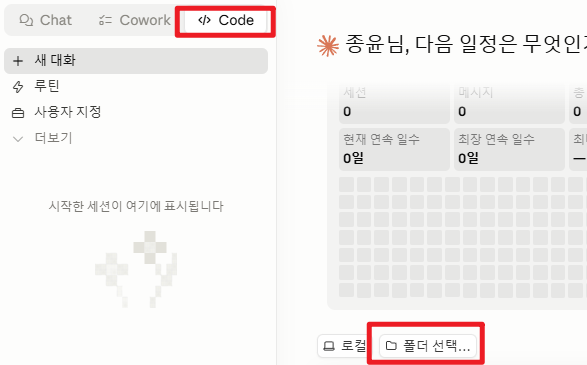
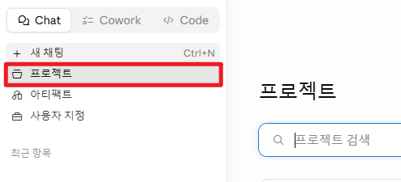
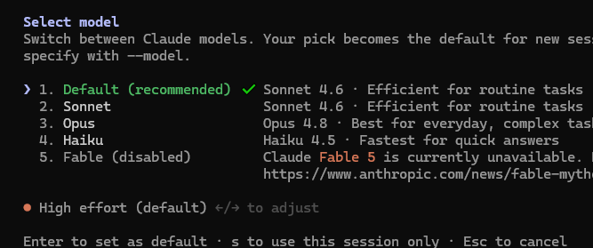
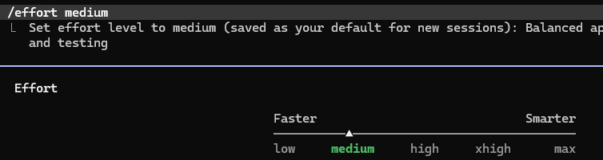
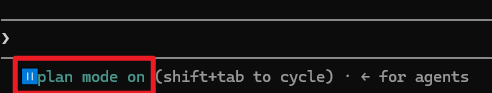
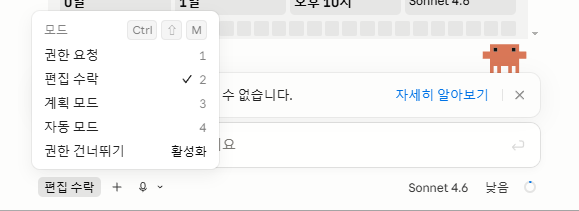
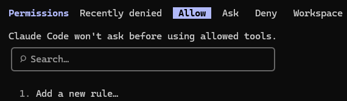
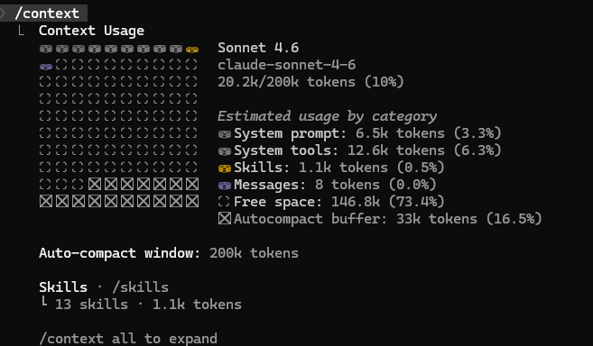

# Destktop APP  설치

<div class="cols-6040">
<div>

- [`데스크톱 앱`](https://claude.ai/download) 다운로드 후 실행
- **Anthrophic 계정**으로 로그인
- 상단에 `Chat`, `Corwork`, `Code` 탭 확인

> - **Chat** : 질문, 문서초안 등 일반 대화. 
> - **Cowork** : 긴 작업을 여러개의 작은 작업으로 나누어 진행. 앱을 닫아도 계속 진행. (클라우드 VM 환경)
> - **Code** : 프로젝트 폴더의 파일을 읽고 수정. 코드 작성 요청. (로컬 파일 직접 접근)

</div>
<div>



</div>
</div>

-----------------

# CLI 설치

- 터미널에서 `claude` 명령어로 **Claude**를 실행할 수 있도록 CLI 설치
```shell
# macOS / Linux
curl -fsSL https://claude.ai/install.sh | bash

# Windows PowerShell
irm https://claude.ai/install.ps1 | iex
```

- 설치 확인
```shell
claude --version
```
> 필요시 `path` 환경 변수에 등록
---------------

# 대화와 세션
- 대화 하기
<div class="cols">
<div>

```
# 대화형 세션 시작
claude

# 초기 프롬프트 넘기기
claude "프로젝트 구조를 설명해줘"
```

</div>
<div>

- 앱에서는 Code 탭을 선택하고 프로젝트 폴더를 지정하고 대화 시작



</div>
</div>

---------------

# 세션 이어하기

<div class="cols">
<div>

- 마지막 대화 이어하기
```shell
claude --continue

# 또는
claude -c
```

- 특정 세션 이어하기
```shell
claude --continue <세션ID>

# 또는
claude -c <세션ID>
```

</div>
<div>

- 세션에 이름 붙이기
```shell
claude --name "프로젝트 구조 설명"

# 대화중에 
/reaname "프로젝트 구조 설명"
```

- 세션 목록 보기
```shell  
claude --sessions

# 또는
/resume
```

</div>
</div>

---------------

# 파일 참조(`@`)


<div class="cols">
<div>

- 대화 중에 `@파일명`으로 프로젝트 내 파일 참조 가능
- `@` 입력하면 프로젝트 내 파일 목록이 나타남

</div>
<div>

| 명령어 | 	역할  |
| ---- | -----|
| `/help` | 	도움말  |
| `/exit` | 	세션 종료  |
| `/model` | 	모델 변경 (Opus, Sonnet, Haiku)  |
| `/voice` | 	음성 입력 모드 (스페이스바 길게 눌러 녹음)  |
| `/resume` | 	이전 세션 목록에서 선택하여 재개  |
| `/rename` | 	현재 세션에 이름 붙이기  |
| `/clear` | 	대화 이력 초기화  |
| `/compact` | 	대화를 핵심만 남기고 압축  |

</div>
</div>

-------------------------

# 체크 포인트
- 파일이 수정되면 자동으로 체크 포인트 생성
- 결과가 마음에 들지 않으면 `Esc` 키를 두번 눌러 이전 체크 포인트로 되돌릴 수 있음

> **되감기 메뉴**
> - **Restore code and conversation** - 코드와 대화를 모두 해당 시점으로 되돌림
> - **Restore code** - 파일만 되돌리고 대화 맥락은 유지 (가장 자주 사용)
> - **Restore conversation** - 대화만 되돌리고 파일은 그대로
> - **Summarize from here** - 해당 시점부터 대화를 요약으로 압축
> - **Never mind** - 취소


<div class="callout tip">
  <div class="callout-title">
    TIP
  </div>

  - 체크포인트는 세션 종료 후에도 30일간 유지됩니다. 장기적인 버전 관리는 Git 커밋을 사용합니다
  - 되돌리기는 Claude가 수정한 파일에만 적용됩니다. 사용자가 직접 수정한 내용은 별도로 관리합니다  

</div>

-------------------------

# Model과 Effort 레벨

- `Claude Code`에서는 모델과 사고 깊이(`effort`)를 선택할 수 있다.
- `/model` 명령어로 모델 변경 가능



- **Opus 4.8** : 복잡한 작업, 긴 문서, 코드 생성 (1M 토큰)
- **Sonnet 4.6** : 일상적인 작업
- **Haiku 4.5** : 빠른 응답, 간단한 질문, 짧은 문서

-------------------------

# Effort 레벨

- 모델의 사고 깊이(effort)를 조절하여 응답의 깊이와 창의성 조절 가능
  - **Low** : 빠른 응답, 간단한 작업
  - **Medium** : 균형 잡힌 사고 깊이와 응답 시간. 일반적인 코드 작성과 문서 작업에 적합
  - **High** : 깊이 있는 사고, 복잡한 문제 해결, 더 긴 응답 시간
  - **xxHigh** : 최대한의 사고 깊이, 매우 복잡한 문제 해결, 가장 긴 응답 시간
  - **max** : 모델이 허용하는 최대 사고 깊이, 가장 긴 응답 시간

- 명령어로 설정
```shell
/effort [low|medium|high|xxHigh|max|auto]
```

- `/model` 명령어로 모델 변경 시 Effort 레벨은 초기화되어 기본값인 `medium`으로 설정됩니다. 
-------------------------

- `/effort` 입력




<div class="callout info">
  <div class="callout-title">
 
  **ultrathink**
 
  </div>  

  - 한 번만 더 깊이 생각하게 하고 싶을 때는 메시지에 ultrathink를 포함
  - 문장 앞, 뒤, 중간 어디에 있어도 가능
  - 세션 effort 설정이 바뀌거나 API로 전송되는 effort 수준이 변경되는 것은 아님
  - "think", "think hard", "think more" 같은 문구는 키워드로 인식되지 않고 일반 텍스트로 처리됨
  
</div>

--------------------------

# 자율권과 안전

- **자율권(Autonomy)** : Claude가 스스로 판단하여 작업 수행
- **권한 모드** : Claude에게 주는 자율권을 조절

| 모드 | 	CLI |  플래그	설명 |
| -----|-----------------| -----------------|
| Plan        | 	`plan`          | 	코드 수정 불가, 분석과 계획만 수행 |
| Default     | 	`default`       | 	파일 읽기는 자동, 수정/명령 실행은 승인 필요 (기본값) |
| Auto-accept Edits | 	`acceptEdits` | 	파일 수정은 자동 허용, 명령 실행은 승인 필요 |
| Auto        | 	`auto`              | 	분류기가 백그라운드에서 안전 검사. 프롬프트 피로 없이 작업 (리서치 프리뷰, 모든 플랜 사용 가능. Opus 4.6 이상 또는 Sonnet 4.6. Anthropic API 전용 - Bedrock/ Vertex/Foundry 불가) |
| Don't Ask  | 	`dontAsk`            | 	`/permissions`이나 설정 파일에서 사전 승인된 것만 허용, 나머지는 자동 거부 |
| Bypass     |  `Permissions`        | 	bypassPermissions	모든 작업을 자동 실행 (위험) |

-----------------------

# 모드 변경

- 처음 시작하면 `default` 모드로 시작
- 원하는 모드로 변경하고 싶다면 `--permissions-mode` 플래그를 사용

```shell
claude --permissions-mode <모드>
```

<div class="cols">
<div>

- CLI에서는 `Shift + Tab`으로 3개 모드 순환
- Default -> Auto-accept Edits -> Plan -> Auto
- 모드는 입력창 옆에 표시. `defulat`는 표시 없음



</div>
<div>

- 데스크톱 앱에서는 code 탭 프롬프트 아래의 모드 선택기에서 클릭


</div>
</div>

------------------------

# Plan 모드

- Claude가 현재 상태를 분석하고, 어떤 순서로 무엇을 할지 정리해서 보여줍니다.
- 파일은 건드리지 않습니다. 
- 계획을 검토하고, 수정하고, 확정한 뒤에 실행하면 됩니다.


<div class="callout tip">
  <div class="callout-title">
 
  **이것이 왜 중요한가?**
 
  </div>  

  - AI와의 작업에서 가장 큰 비용은 코딩 시간이 아니라 방향 수정 시간이다. 
  - Claude Code 창시자 보리스도 "복잡한 작업은 항상 Plan 모드로 시작한다"고 합니다. 
  - 보리스에 따르면 실체는 컨텍스트에 `아직 코딩하지 마` 라는 지시 한 줄이 추가된다고 한다.
</div>

-------------------------

# 권한 규칙 설정

- 권한 모드와 별도로 `/permissions` 명령어로 Claude가 수행할 수 있는 작업을 세부적으로 설정 가능
- 매번 같은 명령에 대해 승인하는게 귀찮다면, 권한 규칙을 설정하여 자동 승인/거부 가능



<div class="cols">
<div>

- Allow: 승인 없이 자동 실행
- Ask: 매번 승인 필요
- Deny: 거부, 자동 실행 안됨
- Workspace: 현재 작업 공간에서만 허용

</div>
<div>

- 규칙은 `도구명`이나 `도구명(상세지정)` 형식으로 작성
  - `Bash(npm test)`
  - `Bash(npm run *)`
  - `Read(.env)` 

</div>
</div>

- 규칙이 겹치면 **Deny > Ask > Allow** 순으로 적용

----------------------

# 민감 정보 보호

<div class="cols-6040">
<div>

- `.env` 파일이나 중요 정보가 포함된 파일이 있다면 접근을 차단합니다.
```
.env 파일과 secrets/ 폴더를 Claude가 읽지 못하도록 권한 설정해줘
```

- 읽기(Read) / 수정(Edit) / 쉘 명령(Bash) 까지 차단해야 확실
- **Deny** 규칙은 1차 방어선
- 추가로 **Sandbox**와 **hooks**를 사용해서 다층방어(`defence-in-depth`)할 것을 권장함

</div>
<div>

- `.claude/settings.json` 에 규칙 추가
```json
{
  "permissions": {
    "deny": [
      "Read(.env)",
      "Read(.env.*)",
      "Read(**/.env.*)",
      "Edit(.env)",
      "Edit(.env.*)",      
      "Bash(cat:*.env*)",
      // ...
    ]
  }
}
```

</div>
</div>

----------------------

# 컨텍스트 관리

- Claude가 한 번에 처리할 수 있는 대화량을 **컨텍스트 윈도우**라고 부른다.
- 대화가 길어지면 처음에 한 얘기가 잘 기억나지 않는다.
- Claude도 대화가 길어지면 앞부분의 정확도가 떨어진다.


- 모델마다 컨텍스트 사이즈가 다르다.
- 그래서 대화가 길어지면 "아까 한국어로 쓰라고 했잖아"를 또 말해야 하고, 이미 고친 버그를 다시 만들기도 한다. 


<div class="callout tip">
  <div class="callout-title">
 
  **노트 시작 / 정리**
 
  </div>  

  `/clear`(새 노트로 시작)와 `/compact`(요약해서 공간 확보)로 이런 일을 막거나 줄일 수 있다.
  
</div>

------------------------

<div class="cols">
<div>

> 하나의 작업을 끝내고 새로운 작업을 시작할 때
```
/clear
```
- 명령 실행 후 이전 대화 내용은 알 수 없다.
- `/clear`는 같은 세션 안에서 컨텍스트를 비우는 것이다.
- 완전히 새로운 새로운 세션으로 시작하려면 `claude`를 다시 실행

> 요약해서 공간 확보
```
/compact 
/compact API 변경 사항에 집중해줘
```

</div>
<div>

> 데스트톱 앱에서 새 컨텍스트 시작
- Chat -> New Chat
- Cowork -> New Task
- Code -> New Session

</div>
</div>

- 압축이 실행 되면 대화 내용이 구조화된 요약으로 교체된다. 
- 이 과정에서 사라지는 것이 있다. `CLAUDE.md` 에 적어두면 압축후에도 사라지지 않는다.


-----------------------

# 컨텍스트 용량 확인


<div class="cols">
<div>

- `/context` 명령



</div>
<div>

| 항목 | 	들어가는 내용	로드 시점 |
|------|----------------------|
| System prompt | 	Claude의 기본 동작 지시	세션 시작 |
| System tools | 	도구 정의 (파일 읽기, 편집, 검색 등)	세션 시작 |
| Memory files | 	CLAUDE.md, Auto Memory	세션 시작 |
| Skills | 	스킬 이름과 설명 (전체 내용은 사용 시 로드)	세션 시작 |
| MCP servers | 	연결된 MCP 서버의 도구 정의와 스키마	세션 시작 |
| Messages | 	대화 내용, 파일 내용, 명령 실행 결과	대화 중 |
</div>
</div>

- **70%** 넘기면 `/compact` 고려한다.


-----------------------

# 압축 시점 조절
- 컨텍스트의 약 **95%**가 차면 자동 압축이 실행되어, Claude가 핵심만 요약하고 나머지를 정리
- 환경 변수로 기준을 설정할 수 있다.

> 50%에서 자동 압축 실행 (기본값: 95%)
```
export CLAUDE_AUTOCOMPACT_PCT_OVERRIDE=50
```

> 1M 모델에서 500K 기준으로 압축 (나머지 500K 구간의 비용 절감)

```
export CLAUDE_CODE_AUTO_COMPACT_WINDOW=500000
```
- `CLAUDE_AUTOCOMPACT_PCT_OVERRIDE`는 윈도우의 백분율로 적용
- 위 설정에서 50%로 지정하면 250K에서 압축이 실행됩니다.

-----------------------

# CLAUDE.md

- Claude Code에서 한 번의 대화는 "세션" 
- 세션을 종료하고 새로 시작하면 백지 상태
- 이전에 무슨 대화를 했는지, 어떤 규칙을 정했는지 기억하지 못함

> **CLAUDE.md**는 이 문제를 해결
> - 프로젝트 폴더에 두는 마크다운 파일
> - Claude는 세션이 시작될 때 이 파일을 컨텍스트에 자동으로 주입
> - 작업 규칙, 선호 사항, 프로젝트 정보 포함
> - 한 번만 적어두면 매 세션마다 반복할 필요 없음

-----------------------

## 1 단계

- 프로젝트 폴더에서 `/init` 입력

- Claude가 프로젝트의 파일 구조, package.json, README 등을 분석
- **CLAUDE.md** 초안을 생성
- 이미 CLAUDE.md 가 존재하면, 개선안을 제안

> 직접 작성하면 더 정확한 지침을 줄 수 잇다.

---------------
## 2 단계

```markdown
# 프로젝트 개요
할일 관리 REST API - 사용자별 할일 CRUD 및 카테고리 분류

## 기술 스택
- Node.js 20 + Express
- PostgreSQL + Prisma
- Jest + Supertest (테스트)

## 빌드/테스트 명령어
- 개발 서버: `npm run dev`
- 테스트 전체: `npm test`
- 단일 테스트: `npm test -- --testPathPattern=파일명`
- 린트: `npm run lint`

## 코드 규칙
- require 대신 import/export 사용 (ES Modules)
- 에러 핸들링은 express-async-errors 미들웨어 사용
- 환경변수는 dotenv로 관리, .env 파일은 커밋하지 않음
```

-------------------------

# 작성법

Claude Code 창시자 Boris Cherny는 팀에서 CLAUDE.md를 다음과 같이 운영
> "Claude가 실수할 때마다 CLAUDE.md에 추가한다. 그러면 다음에는 같은 실수를 하지 않는다." 

- Boris의 팀 CLAUDE.md에는 코딩 스타일 규칙이 없습니다. 
- 워크플로우 명령어와 순서만 있습니다. 
- Claude가 코드에서 추론할 수 있는 것은 빼는 것이 핵심입니다.

<div class="cols">
<div>

> 넣어야 할 것
> - Claude가 추측할 수 없는 명령어 (빌드, 테스트, 린트)
> - 기본값과 다른 코드 스타일 규칙
> - 저장소 관례 (브랜치 네이밍, PR 규칙)
> - 프로젝트 고유의 아키텍처 결정
> - 비개발 업무의 문서 형식, 톤, 반복 패턴

</div>
<div>

> 빼야 할 것
> - Claude가 코드를 읽으면 알 수 있는 것
> - 언어의 표준 관례 (Claude는 이미 알고 있음)
> - 자주 바뀌는 정보
> - 긴 설명이나 튜토리얼
> - 파일별 상세 설명
> - "깔끔하게 작성"처럼 자명한 지시

</div>
</div>

-----------------------------

- 파일당 200줄 이내를 권장합니다. 
- CLAUDE.md는 길이에 관계없이 전체가 로드됩니다. 
- 지시가 많아질수록 개별 지시에 대한 주의력이 분산되어, 정작 중요한 규칙을 놓칩니다. 
- 공식 문서에 따르면 "CLAUDE.md가 너무 길면 절반을 무시한다"고 경고합니다.

> 별도 파일로 분리하기
```markdown
# 프로젝트 개요
@README.md 참고

# Git 워크플로우
@docs/git-instructions.md

# 개인 설정 (Git에 포함되지 않음)
@~/.claude/my-project-instructions.md
```
- `.claude/rules/` 디렉토리에 규칙 파일을 나누어 둘 수도 있습니다. 
- 자주 쓰지 않는 전문 지침은 **스킬**로 분리하면 필요할 때만 로드됩니다.

------------------------------
## 3 단계 - 3가지 범위

- CLAUDE.md는 세 곳에 둘 수 있고, Claude는 세션 시작 시 세 곳을 모두 읽어서 합칩니다.

| 범위      | 	위치 | 	용도 |	Git 포함 |
|-----------|--------|------|----------|
| **프로젝트**   | 	`./CLAUDE.md` | 	팀 공유 규칙 |	포함 (팀원 모두 적용) |
| **사용자**     | 	`~/.claude/CLAUDE.md` | 	개인 선호 |	미포함 (나만 적용) |
| **관리 정책**  | 	시스템 경로 | 	조직 전체 정책 |	별도 관리 |

- **프로젝트 CLAUDE.md**는 Git에 커밋되어 팀원 모두에게 적
  - "테스트 없이 커밋하지 않기", "API 응답은 camelCase" 같은 팀 공통 규칙을 적습니다.

- **사용자 CLAUDE.md**는 내 컴퓨터에만 존재하며 모든 프로젝트에 적용
  - 개인 선호를 적기에 좋습니다. Claude에게 만들어달라고 하면 됩니다.

------------------------------

## 4 단계 - Auto Memory
- Claude 가 스스로 작성하는 내용

| 	   |  CLAUDE.md |  	Auto Memory |
|------|------------|----------------|
| 누가 |   작성	사람 | 	Claude |
| 내용 | 	지시와 규칙 | 	작업 중 발견한 패턴 |
| 범위 | 	프로젝트, 사용자, 조직 | 	프로젝트별 (내 컴퓨터에만) |
| 용도 | 	코딩 표준, 워크플로우, 아키텍처 | 	빌드 명령어, 디버깅 패턴, 선호사항 |

- Auto Memory는 기본으로 켜져 있음
- 세션 시작 시 MEMORY.md의 처음 200줄 또는 25KB(둘 중 먼저 도달하는 제한)만 로드
- `/memory` 명령으로 저장된 내용 확인, 편집, 삭제 가능

-----------------------------

## 5 단계 - 동작 확인

- Claude를 새로 실행하고 CLAUDE.md 내용을 질문

```
프로젝트의 작업 규칙이 뭐야?
```

- Claude가 CLAUDE.md에 적힌 내용을 인용하며 답하면 정상

-------------------------------

# 실습 - 폴더 정리

- CLI : 폴더를 생성하고 이동해서 Claude 실행
- 데스크톱 앱: Code 탭에서 다운로드 폴더를 선택

1. 연습용으로 파일 생성하기

```
연습용으로 뒤섞인 파일들을 만들어줘.
보고서, 이미지, 스프레드시트, 프레젠테이션 등 여러 종류로 10~15개 정도.
```

2. Plan 모드로 계획 작성
```
이 폴더의 파일들을 분석해서 정리 계획을 세워줘.
```


3. Default 모드에서 정리 실행
```
이 폴더의 파일들을 종류별로 정리해줘.
```
-------------

4. 결과 확인
```
정리 결과를 트리로 보여줘.
```
5. 필요 시 작업 취소
```
방금 정리한 거 원래대로 되돌려줘
```
- 이는 체크포인트가 아니라 Claude의 대화 기억에 의존하는 방법
- 같은 세션 안에서만 가능하고, 세션을 종료하거나 컨텍스트가 압축되면 되돌릴 수 없다. 
- 따라서, Plan 모드로 먼저 확인하는 것이 중요


<div class="callout warning">
  <div class="callout-title">

  토큰 사용량 주의

  </div>
  
  - 사진이 많으면 토큰을 많이 소비함. 수십 장 단위로 나누어 작업하는 것을 권장.
  - 중요한 폴더를 정리할 때는 Plan 모드로 먼저 확인하고, "삭제해줘"보다 "목록만 보여줘"를 먼저 사용

</div>