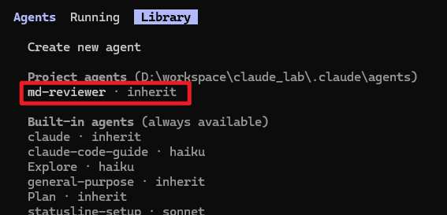
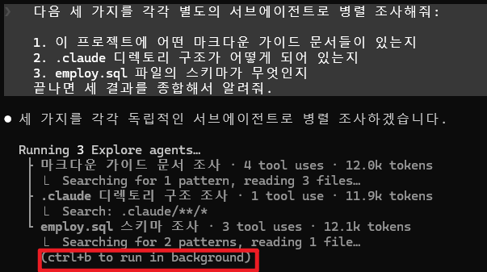
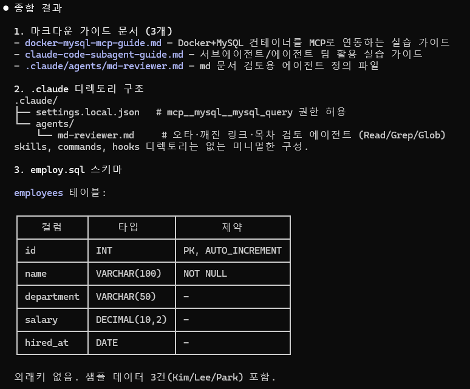

# 작업 분할

- **서브에이전트(Subagents)** : 
  - 메인 세션 안에서 실행되는 전문 에이전트 
  - 각자 독립된 컨텍스트 윈도우, 시스템 프롬프트, 도구 권한을 가지고 작업한 결과를 메인 에이전트로 반환
  - 서브에이전트 간 직접 통신은 불가

- **에이전트 팀(Agent Teams)**: 
  - 여러 *Claude Code 인스턴스* 가 독립 세션으로 병렬 실행
  - 공유 작업 목록과 메일박스 시스템으로 팀원 간 직접 메시지를 주고받으며 협업
  - 서브에이전트보다 토큰 비용이 높지만, 복잡한 작업에 훨씬 강력

--------
## 비교

| 방식 | 컨텍스트 | 통신 | 적합한 작업 | 비용 |
|---|---|---|---|---|
| **메인 대화에서 직접 처리** | 하나의 컨텍스트 윈도우 공유 | 즉시 양방향 | 짧고 상호작용이 잦은 작업 | 기본 |
| **서브에이전트** (`Agent` 도구) | 독립된 컨텍스트, 결과만 메인에 반환 | 호출자 → 서브에이전트 → 결과만 회신 (편도) | 탐색·검토·테스트처럼 "중간 출력이 크지만 결론만 필요한" 작업 | 낮음 (요약만 반환) |
| **에이전트 팀** (실험적) | 팀원마다 완전히 독립된 세션 | 팀원끼리 서로 직접 메시지, 공유 작업 목록 | 토론·분담이 필요한 복잡한 협업 작업 | 높음 (세션마다 별도 비용) |


<div class="callout tip">
  <div class="callout-title">
  
  참고

  </div>
  
  - 핵심 원리: **서브 에이전트는 무슨 일을 하든 메인 대화에는 결과 요약만 반환** 
  - 이 격리 덕분에 메인 대화의 컨텍스트 윈도우가 오염되지 않습니다.
  - 별도의 지시가 없어도 작업과 서브에이전트 description을 보고 적절한 시점에 자동으로 위임
  - "인증, DB, API 모듈을 병렬로 조사해줘"처럼 요청하면 여러 서브에이전트를 동시에 실행

</div>

---------------------

# 실습 - 내장 서브에이전트 사용

- 별도 설정 없이 바로 사용 가능한 빌트인 서브에이전트

| 이름 | 용도 | 특징 |
|---|---|---|
| `Explore` | 코드베이스에서 파일/심볼 빠르게 찾기 | 읽기 전용, 가볍고 빠름 |
| `Plan` | 계획 모드에서 코드베이스 조사 | 읽기 전용 |
| `general-purpose` | 탐색 + 수정이 함께 필요한 복잡한 작업 | 모든 도구 사용 가능 |


---------------------

## Explore 에이전트

- 대화창에 다음과 같이 요청

```
이 디렉토리에서 마크다운 파일이 몇 개 있는지, 각각 어떤 주제를 다루는지
Explore 서브에이전트로 조사해서 요약해줘.
```

- Claude가 내부적으로 `Agent` 도구를 `subagent_type: Explore`로 호출하고, 결과 요약만 대화에 표시되는 것을 관찰
- 도구 호출 자체가 보이지 않아도, 응답이 "여러 파일을 뒤져본 듯한" 종합 결과로 오는 것이 특징

<div class="callout warning">
  <div class="callout-title">

  주의 
  
  </div>

  - 내장된 `Explore`/`Plan`은 1회성
  - 작업이 끝나면 다시 불러서(resume) 이어갈 수 없다
  - 후속 대화가 필요한 작업은 `general-purpose`나 커스텀 서브에이전트를 사용

</div>

-----------------------

# 실습 - 커스텀 서브에이전트

- 직접 서브에이전트를 정의해보기
- 프로젝트 전용 서브에이전트는 `.claude/agents/` 폴더에 마크다운 파일로 생성

- 디렉토리 생성

  ```
  mkdir .claude/agents
  ```

-----------------------

- 서브에이전트 정의하기 (`.claude/agents/md-reviewer.md`)

  ```markdown
  ---
  name: md-reviewer
  description: 마크다운 문서의 오타, 깨진 링크, 목차 불일치를 검토하는 전문가. 마크다운 파일을 작성하거나 수정한 직후에 사용.
  tools: Read, Grep, Glob
  model: inherit
  color: blue
  ---

  당신은 마크다운 문서 검토 전문가입니다.

  검토 시 다음을 확인하세요:
  1. 목차(TOC)의 앵커 링크가 실제 헤더와 일치하는지
  2. 코드 블록의 언어 태그가 적절한지
  3. 오탈자나 비문이 있는지
  4. 섹션 번호가 순서대로 매겨져 있는지

  발견한 문제를 우선순위(치명적/권장/제안)로 나눠 구체적으로 보고하세요.

  ```
----------------------

## Frontmatter 필드

| 필드 | 필수 | 설명 |
|---|---|---|
| `name` | O | 소문자-하이픈 식별자 |
| `description` | O | Claude가 "언제 이 서브에이전트를 쓸지" 판단하는 핵심 근거. 구체적으로 쓸수록 자동 위임이 잘 됨 |
| `tools` | X | 허용 도구 목록 (생략 시 모두 상속) |
| `model` | X | `sonnet` / `opus` / `haiku` / `inherit` 등 |
| `background` | X | `true`면 항상 백그라운드로 실행 |
| `isolation` | X | `worktree`면 임시 git worktree에서 작업 |

> `description`을 "마크다운 검토기" 처럼 짧게만 쓰면 자동 위임 판단이 부정확해집니다. "언제 쓰는지"를 동사형으로 구체적으로 적는 것이 핵심입니다.

----------------------

- `/agents` 명령어로 확인




- 실행해보기

  ```
  .claude/agents/md-reviewer.md에 정의한 md-reviewer 서브에이전트로
  docker-mysql-mcp-guide.md를 검토해줘.
  ```

-------------------------


<div class="cols">
<div>

## 내장 도구 목록

| 도구 | 설명 | 권한 |
|---|---|---|
| **Read** | 파일 내용 읽기 | 읽기 전용 |
| **Write** | 새 파일 생성 | 쓰기 |
| **Edit** | 기존 파일 수정 | 쓰기 |
| **Bash** | 셸 명령 실행 | 실행 |
| **Glob** | 파일 패턴 매칭으로 파일 목록 조회 | 읽기 전용 |
| **Grep** | 파일 내 텍스트 검색 | 읽기 전용 |
| **WebFetch** | 특정 URL 페이지 내용 가져오기 | 네트워크 |
| **WebSearch** | 웹 검색 | 네트워크 |

</div>
<div>

## 역할별 권장 조합

- 에이전트 역할에 따라 도구 조합

  | 역할 | 권장 도구 조합 |
  |---|---|
  | 코드 리뷰/감사 | `Read, Grep, Glob` |
  | 리서치/분석 | `Read, Grep, Glob, WebFetch, WebSearch` |
  | 코드 작성/개발 | `Read, Write, Edit, Bash, Glob, Grep` |
  | 문서화 | `Read, Write, Edit, Glob, Grep,`  |
  |       | `WebFetch, WebSearch` |

</div>
</div>

------------------------

# 실습 - 병렬로 서브에이전트들 실행

- 독립적인 조사를 동시에 시켜서 시간 절약하기

  ```makrdown
  다음 세 가지를 각각 별도의 서브에이전트로 병렬 조사해줘:

  1. 이 프로젝트에 어떤 마크다운 가이드 문서들이 있는지
  2. .claude 디렉토리 구조가 어떻게 되어 있는지
  3. employ.sql 파일의 스키마가 무엇인지
  끝나면 세 결과를 종합해서 알려줘.
  ```

**관찰 포인트**: 
  - Claude는 서로 의존성이 없는 작업을 같은 응답 안에서 여러 `Agent` 도구 호출로 동시에 보낸다. 
  - 의존성이 있는 작업(예: "A의 결과를 보고 B를 조사")은 병렬화되지 않고 순차로 실행되는 것도 함께 관찰한다.

> 조사 결과가 매우 길어질 것 같으면, 서브에이전트 프롬프트에 "핵심만 200자 이내로 요약해서 보고해" 같은 제약을 걸어 메인 대화 컨텍스트를 보호한다.

-------------------------------

## 결과화면

<div class="cols">
<div>



</div>
<div>


</div>
</div>


-------------------------------

# 실습 - 백그라운드 실행과 모니터링

- 오래 걸리는 작업(테스트 스위트 전체 실행, 대규모 리서치 등)은 백그라운드로 돌리고 다른 작업을 계속 진행

  ```
  전체 마크다운 파일을 general-purpose 서브에이전트로 백그라운드에서
  점검하게 하고, 끝나면 알려줘. 그동안 나는 다른 질문을 계속할게.
  ```

- 진행 중인 작업을 직접 백그라운드로 전환하기
  - 작업 중 `Ctrl+B` → 현재 작업을 백그라운드로 전환

## 모니터링
- 실행중인 서브에이전틀과 백그라운드 작업 목록을 확인합니다.
  ```sh
  /agents      # 서브에이전트들과 상태
  /tasks       # 작업 목록
  ```

-------------------------------


--------------------------------

## 실습 - 도구/권한 제한하기

- 서브에이전트가 위험한 작업(파일 수정, 쓰기 등) 못하게 하기

**읽기 전용 서브에이전트**

- `.claude/agents/readonly-auditor.md`:

  ```markdown
  ---
  name: readonly-auditor
  description: 코드/문서를 읽기 전용으로 점검만 하는 감사자. 수정 없이 현황만 보고할 때 사용.
  tools: Read, Grep, Glob
  ---

  당신은 읽기 전용 감사자입니다. 파일을 수정하거나 명령을 실행하지 말고,
  관찰한 내용만 보고하세요.
  ```

- `tools`에 `Edit`, `Write`, `Bash`를 포함하지 않으면 해당 도구 자체가 차단

-----------------

## 프로젝트 설정으로 특정 서브에이전트 차단

- `.claude/settings.json`:

  ```json
  {
    "permissions": {
      "deny": ["Agent(general-purpose)"]
    }
  }
  ```

- 해당 프로젝트에서 `general-purpose` 서브에이전트 생성 자체를 막을 수 있다 
  - (예: 읽기 전용 작업만 허용하고 싶은 저장소에서 사용)

<div class="callout info">
  <div class="callout-title">
  
  TIP
  
  </div>

  - 변경 전 반드시 `update-config` 스킬이나 `/permissions` 명령으로 현재 설정을 확인
  - `settings.json`을 직접 편집할 때는 기존 설정을 덮어쓰지 않도록 주의

</div>

---

# 실습(실험적) - 에이전트 팀 체험

<div class="callout warning">
  <div class="callout-title">
  
  주의
  
  </div>
  
  - 에이전트 팀은 실험적 기능으로 기본 비활성화 상태
  - 세션마다 독립된 비용이 발생
  - 먼저 작은 범위로 테스트해보기

</div>

## 활성화

- `.claude/settings.json` 또는 환경 변수로 활성화합니다.

  ```json
  {
    "env": {
      "CLAUDE_CODE_EXPERIMENTAL_AGENT_TEAMS": "1"
    }
  }
  ```

-------------

## 체험해보기

```text
팀을 구성해서, 한 팀원은 마크다운 문서의 오류를 찾고
다른 팀원은 개선 아이디어를 제안하게 해줘. 두 팀원이 서로
발견한 내용을 공유하면서 작업하도록 해줘.
```

- 서브에이전트와 다른 점을 관찰하기
  - 팀원들은 서로 직접 메시지를 주고받는다 (서브에이전트는 호출자에게만 결과를 반환)
  - 작업 목록을 팀원들이 나눠서 "주장(claim)"한다
  - 팀 세션이 끝나면 팀 설정은 정리되지만, 작업 목록은 남아 재개 가능하다

## 비활성화 (실습 종료 후)

- 테스트가 끝나면 `CLAUDE_CODE_EXPERIMENTAL_AGENT_TEAMS` 값을 제거하거나 `"0"`으로 되돌려 불필요한 비용 발생을 막는다.

-------------------------

## 9. 언제 무엇을 쓸지 - 의사결정 가이드

```
짧고 상호작용이 잦은 작업?
 └─ Yes → 메인 대화에서 직접 처리

독립적인 조사/검토/테스트이고 결론만 필요한가?
 └─ Yes → 서브에이전트 (필요시 병렬로 여러 개)

같은 서브에이전트를 자주 재사용할 것인가?
 └─ Yes → .claude/agents/ 에 커스텀 서브에이전트로 정의

여러 에이전트가 "토론"하거나 작업을 자율적으로 나눠 맡아야 하는가?
 └─ Yes → 에이전트 팀 (실험적, 비용 고려)

수십~수백 개 파일에 동일 작업을 반복해야 하는가?
 └─ Yes → 워크플로우 (스크립트 기반 오케스트레이션, 별도 학습 필요)
```

**원칙**: 가장 단순한 방식부터 시작하고, 컨텍스트가 오염되거나 작업이 너무 커질 때만 한 단계씩 위로 올라갑니다. 서브에이전트 → 병렬 서브에이전트 → 에이전트 팀 → 워크플로우 순으로 복잡도와 비용이 증가합니다.

---

## 10. 명령어 요약

| 명령 | 설명 |
|---|---|
| `/agents` | 등록된/실행 중인 서브에이전트 관리 |
| `/tasks` | 백그라운드 작업 목록 확인 |
| `/permissions` | 권한 설정 확인/수정 |
| `Ctrl+B` | 현재 작업을 백그라운드로 전환 |

---

- 트러블슈팅

| 증상    |  원인  |   해결  |
|-----------|------|-------|
| 커스텀 서브에이전트가 자동으로 호출되지 않음 | `description`이 모호함 | "언제 사용하는지"를 구체적인 동사형 문장으로 다시 작성 |
| `/agents`에 정의한 서브에이전트가 안 보임 | 파일 위치가 `.claude/agents/`가 아니거나 frontmatter 형식 오류 | 경로와 YAML frontmatter 문법(`---`로 감싸기) 확인 |
| 서브에이전트가 파일을 수정하지 못함 | `tools`에 `Edit`/`Write`가 빠짐 | 필요한 도구를 `tools` 목록에 추가 |
| 같은 이름의 서브에이전트가 예상과 다르게 동작 | 프로젝트(`.claude/agents/`)와 사용자(`~/.claude/agents/`) 레벨에 동일 이름 존재 | 더 가까운 스코프(프로젝트)가 우선 적용됨을 인지하고 하나만 남기기 |
| 에이전트 팀이 활성화되지 않음 | 환경 변수 미설정 또는 오타 | `CLAUDE_CODE_EXPERIMENTAL_AGENT_TEAMS=1` 정확히 설정했는지 확인 후 Claude Code 재시작 |
| 백그라운드 서브에이전트가 권한 프롬프트에서 멈춤 | 권한이 필요한 도구 호출 발생 | 메인 세션에 표시되는 승인 요청을 확인하고 허용/거부 |

> 일부 동작(에이전트 팀, 백그라운드 권한)은 Claude Code 버전에 따라 다를 수 있다


--------------------
