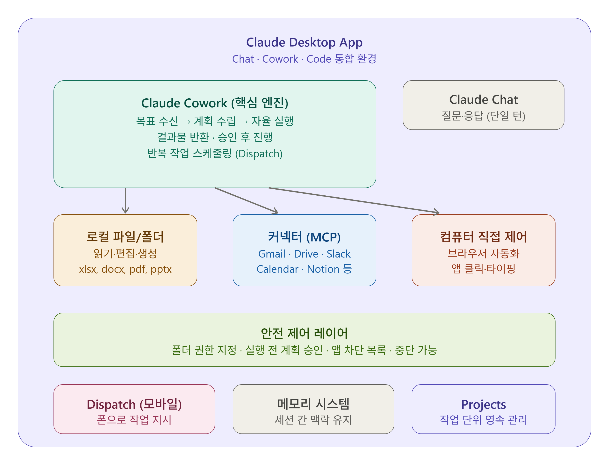

# Cowork란 무엇인가?

- *Claude Cowork* 는 비개발자를 위해 Claude Desktop 앱에 내장된 에이전트 도구로, 복잡하고 다단계 작업을 자동화한다.
- 일반 채팅과 달리, Cowork는 컴퓨터에서 작업을 자율적으로 계획하고 실행할 수 있다.

- Claude Code가 터미널에서 파일시스템 작업에 매우 뛰어난 나머지, 기술적으로 능숙한 비개발자들이 파일 정리·연구 취합·문서 작성 같은 비코딩 업무에 이를 활용하기 시작
- Anthropic이 이를 더 넓은 사용자층에 제공하기 위해 만든 것이 Cowork 
- 재미있게도, Anthropic 팀은 Cowork 자체를 Claude Code를 사용해 단 2주 만에 개발

------------------
## Claude Cowork


------------------

# 핵심 특징

#### Chat vs. Cowork 차이점

- 일반 Chat에서 Claude는 메시지에 응답하지만 파일에 직접 접근할 수 없다. 
- Cowork에서는 지정한 폴더의 파일을 읽고, 편집하고, 생성할 수 있는 권한이 부여
  - 방법을 설명하는 데 그치지 않고 실제로 작업을 완료할 수 있다.

#### 실행 우선순위 (Tool Priority)

- Cowork에서 작업을 지시하면 Claude는 가장 정밀한 도구부터 순서대로 시도
- 먼저 Gmail, Google Drive, Slack 등 커넥터가 있으면 이를 사용
- 커넥터가 없으면 브라우저 제어
- 그것도 불가능할 때만 마우스·키보드로 화면을 직접 제어

-------------

#### 컴퓨터 직접 제어 (Computer Use)

- Anthropic은 최근 Claude Code와 Cowork 모두에 컴퓨터 직접 제어 기능을 추가
- 이 기능은 Pro 및 Max 플랜 구독자를 위한 리서치 프리뷰로, macOS와 Windows에서 모두 사용 가능

#### Dispatch (모바일 연동)

- Dispatch는 사용자가 iPhone에서 작업을 지시하면, Mac이나 사무실 컴퓨터에서 Claude가 이를 실행하는 기능
- 출퇴근 중이나 카페에서 작업을 지시하고, 자리로 돌아왔을 때 완료된 결과를 받아볼 수 있다.

#### 안전 설계

- Cowork는 메모리 기능이 있어 세션 간 작업 방식을 학습하고 맥락을 유지
- 단, 비밀번호, 재무 정보, 건강 정보 같은 민감한 데이터는 메모리에서 제외
- 저장된 내용은 언제든지 확인·편집·삭제할 수 있다.

------------------------

## 이용 가능 플랜

- Claude Cowork는 Claude Desktop 앱을 통해 모든 유료 플랜에서 사용 가능 
- Cowork는 2026년 1월 16일 Pro 구독자에게 먼저 출시된 후 1월 23일 Team 및 Enterprise 플랜으로 확대


----------

# 단계별 실습 예시

- 실제로 사용할 수 있는 3가지 실습 시나리오

## 🗂️ 실습 1 — Downloads 폴더 자동 정리

**시나리오:** 수개월간 쌓인 Downloads 폴더를 체계적으로 정리

1. 폴더 권한 지정
  - `Settings > Folders`에서 정리할 폴더를 추가합니다 (예: `~/Downloads`).
  - Claude는 이 폴더 안에서만 파일을 읽고 편집한다.

-------------

2. 작업 지시 (프롬프트 예시)

  ```markdown
  *"Downloads 폴더를 정리해줘. 파일 내용을 스캔하고 다음을 제안해줘:*
  - *생성할 카테고리 폴더와 분류 기준*
  - *파일 이름 정리 규칙*
  - *검토·삭제가 필요한 파일*
  *변경 전에 반드시 계획을 먼저 보여줘."*
  ```

3. 계획 검토 및 승인

- Cowork는 중요한 작업 전에 계획을 보여주고 승인을 기다린다. 
- 언제든지 방향을 바꾸거나 수정하거나 다른 접근 방식을 선택할 수 있다.

- 제안된 폴더 구조를 확인하고 수정합니다.
- 승인하면 Claude가 파일을 실제로 이동합니다.

---------------

## 📊 실습 2 — 스프레드시트 분석 → Word 보고서 생성

- **시나리오:** 매출 Excel 파일을 분석해 형식화된 보고서 자동 생성

1. 파일 접근 설정
- 엑셀 파일이 있는 폴더를 Cowork 권한에 추가합니다.

2. 작업 지시

```markdown
*"이 폴더의 '2025_sales.xlsx'를 분석해서 Word 보고서를 만들어줘. 포함 내용:*
- *연간 총 매출 및 전년 대비 성장률*
- *카테고리별 매출 비중 (표 포함)*
- *상위 3개 제품군*
- *월별 추이 분석*
*보고서 상단에 임원용 요약 추가, 전문적인 형식으로 작성."*
```
3. 결과 확인

--------------

## 🔄 실습 3 — 반복 작업 자동화 (Scheduled Task)

- **시나리오:** 매주 금요일마다 분석 데이터를 보고서 템플릿에 자동 입력

1. 반복 작업 설정

- 스케줄 기능을 사용하면 Claude에게 매일 이메일을 확인하거나, 매주 지표를 수집하거나, Slack 다이제스트를 실행하는 주기를 지정할 수 있다. 
- 한 번만 설정하면 Claude가 이후를 처리

**프롬프트 예시:**
```markdown
*"매주 금요일마다 analytics_dashboard에서 지표를 가져와 weekly_report_template.docx에 입력해줘."*
```

2. Dispatch로 외부에서 지시

모바일 앱과 데스크톱 앱을 페어링하면, 폰에서 작업을 지시하고 Cowork에서 시작할 수 있습니다.

1. Claude 모바일 앱에서 데스크톱과 페어링
2. 외출 중 모바일로 작업 지시 → 귀가 후 완료된 결과 확인

