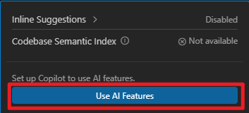
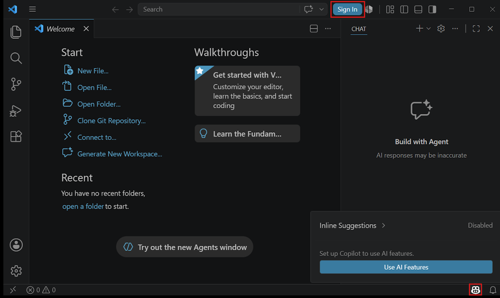
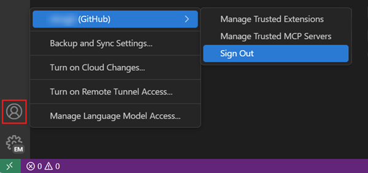
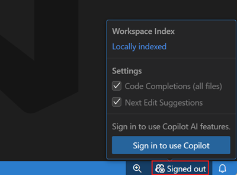
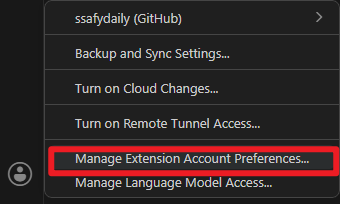
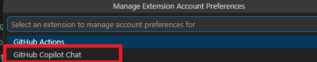
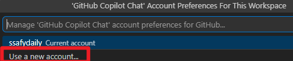

# VS Code에서 GitHub Copilot 설정하기

- VS Code에서 Copilot을 사용하려면 GitHub 계정으로 GitHub Copilot에 접근할 수 있어야 한다.

## VS Code에서 Copilot을 시작하기:

1. 상태 표시줄의 Copilot 아이콘 위에 마우스를 올리고 **AI 기능 사용**을 선택합니다.

-----------------------------------

**use ai feature**

-----------------------------------
2. 로그인 방법을 선택하고 안내에 따릅니다.
   - 이미 Copilot 구독이 있는 경우, VS Code가 해당 구독을 사용합니다.
   - 아직 구독이 없는 경우, Copilot 무료 플랜에 등록되어 월별 인라인 제안 및 AI 크레딧을 받을 수 있습니다.

3. VS Code에서 Copilot 사용을 시작합니다!

4. 채팅 세션에서 `/init`을 입력하여 AI를 위한 프로젝트를 설정합니다. `/init` 명령어는 코드베이스를 분석하고 AI가 코딩 방식에 맞는 코드를 생성할 수 있도록 커스텀 지침을 만들어 줍니다.

---------------------------

## 다른 GitHub 계정으로 Copilot 사용하기

- 현재 계정에서 로그아웃하고 다른 계정으로 로그인할 수 있습니다.

1. 활동 표시줄(Activity Bar)의 **계정** 메뉴(accounts)를 선택한 후, 현재 로그인된 계정의 **로그아웃(sign out)** 을 선택합니다.

2. 다음 방법 중 하나로 GitHub 계정에 로그인합니다:
   - 상태 표시줄의 Copilot 메뉴에서 **Copilot 사용을 위해 로그인** 선택
   - 활동 표시줄의 **계정** 메뉴에서 **GitHub Copilot 사용을 위해 GitHub로 로그인** 선택
   - 명령 팔레트에서 **GitHub Copilot: 로그인** 명령 실행

----------------------------

## 로그아웃 / 로그인

- sign out

- sign in

-----------------------------------

## 다른 계정 사용

- activi bar에서 **Manage Extension Account Preferences** 선택

- **Github copilto chat** 선택

- 등록된 다른 계정 선택하거나 **Use a new account** 선택

