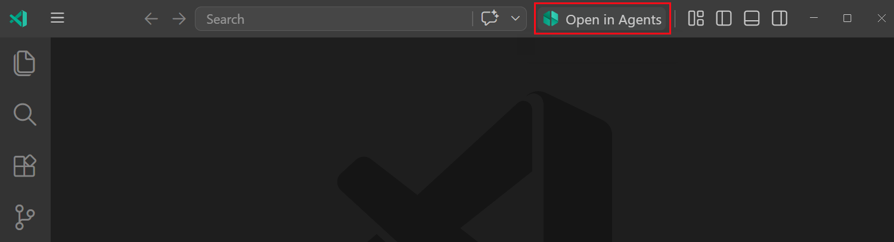
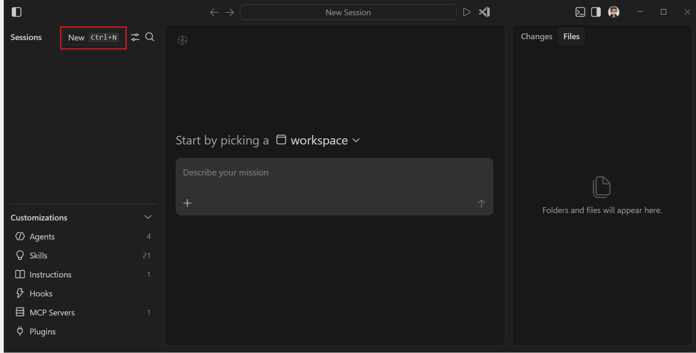
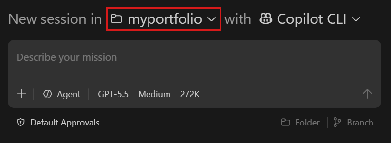

- Visual Studio Code에서 AI 에이전트를 활용해 개발하는 방법 배우기

  - 에이전트는 단 한 줄의 자연어 프롬프트만으로 솔루션을 기획하고, 여러 파일을 생성 및 수정하며, 명령어를 실행하고, 발생한 오류를 스스로 해결할 수 있다

> 1. 먼저 에이전트 중심의 워크플로우를 위해 마련된 전용 공간인 Agents(에이전트) 창에서 시작한다. 
> 2. 그다음, 에디터에서 작업하는 동안 에이전트의 도움을 받을 수 있는 Chat(채팅) 뷰로 전환
> 3. 이 과정에서 작업 공간(Workspace) 열기, 내장 브라우저 사용, 소스 제어를 통한 변경 사항 커밋 등 VS Code의 필수 기초 기능도 함께 학습한다

- HTML, CSS, JavaScript를 사용하여 간단한 개인 포트폴리오 페이지를 제작해봅시다. 

---------------------

# 프로젝트 폴더 생성

- 에이전트는 **폴더(다른 말로 작업 공간 또는 워크스페이스)** 단위로 작업을 수행한다. 
  - 먼저 프로젝트를 진행할 폴더를 생성한다. 

- 에이전트 창을 사용하면 각 프로젝트마다 별도의 창을 띄우지 않고도 하나의 창에서 여러 작업 공간을 넘나들며 작업할 수 있다.

- myportfolio라는 이름의 폴더를 생성한다
- 변경 사항을 추적할 수 있도록 폴더를 Git 버전 관리 상태로 만든다. 

  ```bash
  cd myportfolio
  git init
  ```

--------------------

## 에이전트 창에서 기능 구현하기

- 에이전트 창을 사용하여 VS Code의 단일 공간에서 여러 프로젝트의 에이전트 세션을 실행하고 모니터링하세요.

- `Open in Agents` 버튼을 클릭한다.



- 명령 팔레트(`Ctrl+Shift+P`)에서 **Chat: Open Agents Window** 명령을 실행해도 된다.
- 로그인 안내가 뜨면 로그인 방식을 선택하고 진행

---------------------------

# 에이전트 세션 시작하기

> 1. 왼쪽 사이드바 상단에 있는 **New(새 세션)**를 선택하여 새 세션을 시작



- 사이드바에는 현재 활성화된 에이전트 세션 목록이 작업 공간별로 묶여서 표시
- 이 세션 목록을 이용해 다른 세션으로 쉽게 전환할 수 있다
- 왼쪽 아래에서 에이전트의 작동 방식을 코딩 스타일에 맞게 수정할 수 있다

---------------------

> 2. 작업 공간(Workspace) 드롭다운에서 생성해 둔 `myportfolio` 폴더를 선택



- 폴더 신뢰 여부를 묻는 창이 뜨면 **예, 작성자를 신뢰합니다(Yes, I trust the authors)**를 선택

<div class="callout tip">
  <div class="callout-title">
  
  IMPORTANT

  </div>

  - **작업 공간 신뢰(Workspace Trust)** 는 프로젝트 폴더 내의 코드를 실행해도 안전한지 여부를 사용자가 결정하는 기능
  - 인터넷에서 다운로드한 코드라면 실행하기 전에 안전한지 먼저 검토해야 합니다. 
  
</div>

---------------

> 3. 에이전트 유형으로 **Copilot CLI** 가 선택되어 있는지 확인
- Copilot CLI가 로컬 컴퓨터에서 에이전트 세션을 실행함을 의미
- VS Code가 Copilot CLI를 자동으로 설치하고 구성

<br>

> 4. 그 외의 기본 설정 옵션들은 그대로 유지합니다:

- **Agent**: 작업을 수행할 일반 에이전트. 
  - 코드 리뷰나 테스트 등 특화된 작업의 경우, 전용 커스텀 에이전트를 생성하여 사용할 수도 있다.
- **Language model**: 구성에 따라 여러 언어 모델 중 하나를 선택하고 추가 설정
- **Default Approvals**: 에이전트가 안전한 작업은 자동으로 승인하지만, 위험할 수 있는 작업은 실행 전에 사용자의 승인을 요청
- **Folder & branch**: 에이전트가 폴더 내의 파일에서 직접 작업하고 현재 브랜치에 커밋

---------------

> 5. 채팅 입력창에 다음 프롬프트를 입력하고 `kbstyle(Enter)`를 누릅니다:

```
HTML, CSS, JavaScript 파일을 각각 분리하여 개인 포트폴리오 페이지를 만들어줘.

내 이름과 짧은 소개가 담긴 헤더, 카드 형태의 프로젝트 섹션, 그리고 문의하기(Contact) 섹션을 포함해줘. 

모던한 스타일을 적용하고 샘플 콘텐츠도 채워줘.
```
<br>

> 6. 에이전트가 요청을 분석하고, 작업 계획을 세운 뒤, 파일을 생성하고 수정하기 시작
- 도중에 오류를 만나면 스스로 수정하거나, 필요한 경우 명확한 확인을 위해 사용자에게 승인을 요청