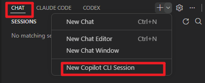
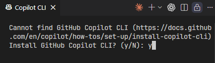
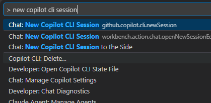

# Local Agent

- 로컬 에이전트는 사용자의 머신에 있는 Visual Studio Code 내에서 대화형으로 실행
- 현재 작업 공간에서 동작하며, VS Code에서 사용 가능한 모든 도구와 모델에 접근 가능
- 커스텀 에이전트를 생성하면 코드 리뷰어, 테스터, 문서 작성자 등 특정 역할이나 페르소나를 에이전트에게 부여할 수 있다.
- 로컬 에이전트는 VS Code의 채팅 인터페이스에서 동작
- 채팅 세션을 닫아도 로컬 에이전트는 활성 상태를 유지하며, 세션 뷰에서 확인 가능

--------------------

## 로컬 에이전트를 사용하는 이유

- 브레인스토밍, 계획 수립, 아직 완전히 정의되지 않은 작업 등 즉각적인 피드백이 필요한 대화형 작업
- 린트 오류, 스택 트레이스, 단위 테스트 결과 등 개발 환경의 컨텍스트가 필요한 작업
- VS Code 확장 프로그램이나 MCP 서버의 특정 도구가 필요하거나, BYOK 모델과 같은 특정 모델을 사용해야 하는 작업
- 다른 팀원과의 협업이 필요하지 않은 작업

---------------

## 내장 에이전트

#### Agent
- 터미널 명령 및 도구 실행이 필요할 수 있는 고수준 요구사항 기반의 복잡한 코딩 작업에 최적화
- AI가 자율적으로 관련 컨텍스트와 편집할 파일을 파악하고, 필요한 작업을 계획하며, 발생하는 문제를 반복적으로 해결

#### Plan

- 복잡한 코딩 작업을 위한 구조화된 구현 계획을 수립하는 데 최적화
- 구현 전에 복잡한 기능이나 변경 사항을 더 작고 관리하기 쉬운 단계로 분류

### Ask

- 코드베이스, 코딩, 일반 기술 개념에 관한 질문 답변에 가장 적합
- 무언가의 작동 방식을 이해하거나 아이디어를 탐색하거나 코딩 작업에 도움을 받고 싶을 때 Ask를 사용
- Ask는 에이전트 기능을 사용하여 코드베이스를 조사하고 관련 컨텍스트를 수집

---------------

# Copilot CLI
- VS Code는 GitHub Copilot CLI를 사용하여 백그라운드에서 에이전트 세션을 실행하는 것을 지원
- 채팅 뷰에서 Copilot CLI 세션을 시작, 모니터링 및 관리할 수 있다
- 에이전트는 편집기에서 다른 작업을 계속하는 동안 로컬 머신에서 자율적으로 실행
- 여러 Copilot CLI 세션을 병렬로 실행하여 독립적인 작업을 동시에 처리

-------

## Copilot CLI 세션이란?

- Copilot CLI 세션은 로컬 머신의 백그라운드에서 독립적으로 실행
- Copilot CLI 에이전트 하네스를 사용
- VS Code는 Copilot SDK를 사용하여 이러한 에이전트와 통합되어 백그라운드 세션의 시작, 중지 및 진행 상황을 모니터링
- VS Code는 Copilot CLI를 자동으로 설치하고 구성

- Copilot SDK 세션은 VS Code 외부에서 실행되며 VS Code 창을 닫아도 백그라운드에서 계속 실행
- Copilot CLI 세션은 백그라운드에서 실행되므로 범위가 명확하게 정의되고 필요한 컨텍스트가 모두 갖춰져 있으며 빈번한 사용자 상호작용이 필요 없는 작업에 적합
  - 계획에서 기능 구현, 개념 증명의 여러 변형 생성, 명확하게 정의된 수정 사항이나 기능 구현 등

- Copilot CLI는 채팅에서 슬래시 명령어를 지원

------------------------

## 권한 및 승인

- Copilot CLI 세션은 로컬 에이전트와 동일한 권한 수준을 지원
- 사용 가능한 권한 수준은 선택한 격리 모드에 따라 다르다.

**워크트리 격리**
- 권한 수준이 자동으로 승인을 건너뜀(Bypass Approvals) 으로 설정되며 변경할 수 없다. 
- 에이전트가 코드베이스의 격리된 복사본(Git 워크트리)에서 작동하므로 모든 도구 호출이 확인 없이 자동으로 승인

**폴더 격리**
- 로컬 에이전트 세션과 마찬가지로 기본 승인(Default Approvals), 승인 건너뜀(Bypass Approvals), 자동 조종(Autopilot) 의 세 가지 권한 수준 모두 사용
- 채팅 입력 영역의 권한 선택기에서 수준을 선택

----------------------
## Copilot CLI 세션 생성

1. 다음 옵션 중 하나를 사용하여 새 세션을 생성

- 채팅 뷰를 열고 세션 대상 드롭다운에서 Copilot CLI 선택

- 명령 팔레트에서 Chat: New Copilot CLI 명령 실행

--------------------------------------

2. 폴더 또는 워크트리 격리 모드 중 선택

- 워크트리 격리를 사용하는 경우: 에이전트는 각 턴이 끝날 때 자동으로 워크트리에 변경 사항을 커밋하므로 세션 기록이 커밋 기록과 일치

  

  TIP

  

  
  - 세션 목록에서 세션을 마우스 오른쪽 버튼으로 클릭하고 새 창에서 워크트리 열기를 선택하여 세션의 워크트리를 열 수 있다. 
  - 소스 제어 뷰 저장소 탐색기에서도 워크트리를 볼 수 있다.

3. 프롬프트를 제출하여 에이전트를 시작하세요. 
  - 컨텍스트를 추가하거나 특정 언어 모델과 커스텀 에이전트를 선택할 수 있다.

4. 채팅 뷰에서 세션 상태를 추적하시오.

-------------------

## 로컬 세션을 Copilot CLI로 핸드오프
- 로컬 에이전트와 상호작용하여 요구 사항을 명확히 한 다음 백그라운드에서 Copilot CLI로 작업을 핸드오프하는게 필요할 수 있다.

- 로컬 에이전트 대화를 Copilot CLI 세션으로 핸드오프하면 전체 대화 기록과 컨텍스트가 백그라운드 세션으로 전달

**핸드오프하기:**

1. 채팅 뷰를 여세요.
2. 핸드오프할 준비가 될 때까지 로컬 에이전트와 상호작용
3. Copilot CLI로 핸드오프하려면 다음 옵션 중 하나를 사용
  - 세션 대상 드롭다운을 열고 Copilot CLI 선택
  - 플랜 에이전트를 사용하는 경우, 구현 시작 드롭다운을 선택하고 Copilot CLI에서 계속 을 선택하여 Copilot CLI 세션에서 구현을 실행

---------------------

# 터미널에서 copilot CLI 사용

- 여러 가지 방법으로 Copilot CLI 터미널을 열 수 있다:

  - 터미널 패널의 + 버튼 옆 드롭다운을 선택하고 GitHub Copilot CLI 선택
  - 명령 팔레트에서 `Chat: New Copilot CLI Session` 명령을 실행
  - 또는 `Chat: New CLI Session to the Side` 를 실행하여 현재 편집기 옆 편집기 탭에 열기
  - 명령 팔레트에서 `Terminal: Create New Terminal (With Profile)` 명령을 실행하고 `GitHub Copilot CLI` 선택
  - VS Code 통합 터미널에서 `copilot`을 입력하여 Copilot CLI 직접 시작

----------------------

