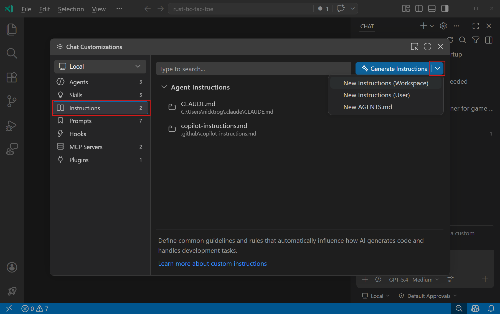

# Custom Instruction

**커스텀 지시사항**
- AI가 코드를 생성하고 다른 작업을 처리하는 방식에 영향을 주는 공통 가이드라인과 규칙을 정의 
- 매번 수동으로 컨텍스트를 포함시키는 대신, Markdown 파일에 커스텀 지시사항을 지정해 두면 코딩 관행과 프로젝트 요구사항에 맞는 일관된 AI 응답을 보장

- 모든 채팅 요청에 자동으로 적용되도록 설정하거나, 특정 파일에만 적용되도록 설정할 수 있다
- 특정 채팅 프롬프트에 수동으로 커스텀 지시사항을 첨부할 수도 있다.

-----------------------

- `/init` 을 사용해 프로젝트를 AI에 맞게 설정하면 프로젝트에 맞는 커스텀 
지시사항이 생성

**Agent Customizations 편집기**

- 모든 에이전트 커스터마이징을 한 곳에서 검색, 생성, 관리
- 에이전트 창이나 명령 팔레트에서 `Chat: Open Customizations` 실행


------------------------

# Instruction 파일 종류

- VS Code는 두 가지 범주의 커스텀 지시사항을 지원
- 여러 개의 지시사항 있으면, 이를 결합하여 채팅 컨텍스트에 추가하며, 특정한 순서는 보장되지 않음

## 상시 적용 지시사항 (Always-on instructions)

- 모든 채팅 요청에 자동으로 포함
- 프로젝트 전반의 코딩 표준, 아키텍처 결정, 그리고 모든 코드에 적용되는 관례에 사용

**단일 `.github/copilot-instructions.md` 파일**

- 워크스페이스의 모든 채팅 요청에 자동으로 적용
- 워크스페이스 내에 저장

------------

**하나 이상의 AGENTS.md 파일**

- 워크스페이스에서 여러 AI 에이전트를 함께 사용할 때 유용
- 워크스페이스의 모든 채팅 요청 또는 특정 하위 폴더(실험적)에 자동으로 적용
- 워크스페이스 루트 또는 하위 폴더(실험적)에 저장


**조직 수준 지시사항**

- GitHub 조직 내 여러 워크스페이스와 리포지토리에서 지시사항을 공유
- GitHub 조직 수준에서 정의됨


**CLAUDE.md 파일**

- Claude Code 및 기타 Claude 기반 도구와의 호환성을 위함
- 워크스페이스 루트, .claude 폴더, 또는 사용자 홈 디렉터리에 저장

-----------------

## 파일 기반 지시사항 (File-based instructions)

- 에이전트가 작업 중인 파일들이 지정된 패턴과 일치하거나 설명이 현재 작업과 일치할 때 적용
- 언어별 관례, 프레임워크 패턴, 또는 코드베이스의 특정 부분에만 적용되는 규칙에는 파일 기반 지시사항을 사용

**하나 이상의 .instructions.md 파일**

- **glob 패턴**을 사용하여 파일 유형이나 위치에 따라 조건적으로 지시사항을 적용
- 워크스페이스 또는 사용자 프로필에 저장됨
- 지시사항에서 파일이나 URL 같은 특정 컨텍스트를 참조하려면 Markdown 링크를 사용할 수 있다.

## 어떤 방식 사용? 

- 프로젝트 전반의 코딩 표준에는 단일 `.github/copilot-instructions.md` 파일로 시작
- 파일 유형이나 프레임워크별로 다른 규칙이 필요하면 `.instructions.md` 파일을 추가
- 워크스페이스에서 여러 AI 에이전트를 사용한다면 `AGENTS.md`를 사용

-----------------

# `.github/copilot-instructions.md` 파일 사용하기

- VS Code는 워크스페이스 루트에 있는 `.github/copilot-instructions.md` 파일을 자동 감지하여 이 파일의 지시사항을 해당 워크스페이스의 모든 채팅 요청에 적용

> 같은 경우에 사용하세요:
> - 프로젝트 전체에 적용되는 코딩 스타일 및 네이밍 규칙
> - 기술 스택 선언 및 선호하는 라이브러리
> - 따라야 하거나 피해야 할 아키텍처 패턴
> - 보안 요구사항 및 에러 처리 방식
> - 문서화 표준


<div class="callout tip">
  <div class="callout-title">
  
  NOTE 

  </div>  

  - VS Code는 상시 적용 지시사항으로 AGENTS.md 파일 사용도 지원

</div>

-------------------

- **일반적인 예시**

  ```markdown
  ---
  applyTo: "**"
  ---
  # 프로젝트 일반 코딩 표준

  ## 네이밍 규칙
  - 컴포넌트 이름, 인터페이스, 타입 별칭에는 PascalCase 사용
  - 변수, 함수, 메서드에는 camelCase 사용
  - private 클래스 멤버에는 언더스코어(_) 접두사 사용
  - 상수에는 ALL_CAPS 사용

  ## 에러 처리
  - 비동기 작업에는 try/catch 블록 사용
  - React 컴포넌트에 적절한 에러 바운더리 구현
  - 항상 컨텍스트 정보와 함께 에러 로깅
  ```

----------------------

## `.instructions.md` 파일 사용하기

- `*.instructions.md` 는 에이전트가 작업 중인 파일이나 작업에 따라 동적으로 적용되는 파일 기반 지시사항을 만들 수 있다.

- 에이전트는 지시사항 파일 헤더의 `applyTo` 속성에 지정된 파일 패턴 또는 현재 작업과 지시사항 설명의 의미적 일치를 기준으로 어떤 지시사항 파일을 적용할지 결정

- 다음과 경우에 사용하세요:
  - 프론트엔드와 백엔드 코드에 대한 서로 다른 관례
  - 모노레포에서 언어별 가이드라인
  - 특정 모듈에 대한 프레임워크별 패턴
  - 테스트 파일이나 문서에 대한 특수 규칙

---------------------

# 파일 위치

| 범위 | 기본 파일 위치 |
|-------|-----------------------|
| 워크스페이스 | `.github/instructions` 폴더 |
| 워크스페이스 (Claude 형식) | `.claude/rules` 폴더 |
| 사용자 프로필 | `~/.copilot/instructions`, `~/.claude/rules`, 또는 사용자 데이터(VS Code 프로필에 따라 다름) |

- VS Code는 이 폴더들을 재귀적으로 검색하므로 하위 디렉터리에 지시사항 파일을 구성할 수 있다. 
- 팀, 언어, 모듈별로 지시사항을 그룹화:

  ```
  .github/instructions/
    frontend/
      react.instructions.md
      accessibility.instructions.md
    backend/
      api-design.instructions.md
    testing/
      unit-tests.instructions.md
  ```
------------------------

- 워크스페이스 수준 지시사항만 허용하도록 지시사항 파일 위치를 구성하는 방법 예시

```json
"chat.instructionsFilesLocations": {
  ".github/instructions": true,
  ".claude/rules": true,
  "~/.copilot/instructions": false,
  "~/.claude/rules": false
}
```

-------------------------
# 지시사항 파일 형식

- 지시사항 파일은 `.instructions.md` 확장자를 가진 Markdown 파일
- 선택적인 YAML 프런트매터 헤더로 지시사항이 적용되는 시점을 제어

| 필드 | 필수 여부 | 설명 |
|-------|----------|-------------|
| `name` | 아니오 | UI에 표시되는 이름. 기본값은 파일 이름 |
| `description` | 아니오 | Chat 보기에서 호버 시 표시되는 간단한 설명 |
| `applyTo` | 아니오 | 워크스페이스 루트를 기준으로 지시사항이 자동으로 적용될 파일을 정의하는 glob 패턴 |
||| 모든 파일에 적용하려면 `**`를 사용| 
||| 지정하지 않으면 지시사항이 자동으로 적용되지 않지만 채팅 요청에 수동으로 추가 가능|

- 에이전트 도구를 참조하려면 `#tool:<tool-name>` 구문을 사용(예: `#tool:web/fetch`)

------------

## 예시
```markdown
---
name: 'Python Standards'
description: 'Python 파일에 대한 코딩 관례'
applyTo: '**/*.py'

---

# Python 코딩 표준

- PEP 8 스타일 가이드를 따르세요.
- 모든 함수 시그니처에 타입 힌트를 사용하세요.
- public 함수에는 docstring을 작성하세요.
- 들여쓰기에는 4개의 공백을 사용하세요.

```

------------------------------

# 지시사항 파일 생성

- 워크스페이스 또는 사용자 프로필 중 어디에 저장할지 선택

> [!TIP]
> 채팅 입력창에 `/instructions`를 입력-> **Configure Instructions and Rules** 메뉴를 빠르게 열 수 있다.


1. Chat 보기에서 **톱니바퀴 아이콘** 을 선택하여 **Agent Customizations**  열고 **Instructions** 탭 선택

2. 드롭다운에서 파일을 저장할 위치에 따라 **New Instructions (Workspace)** 또는 **New Instructions (User)**를 선택


3. 위치를 선택하고 파일 이름을 입력

4. Markdown 형식을 사용하여 커스텀 지시사항을 작성

    * 파일 상단의 YAML 프런트매터를 채워 지시사항의 설명, 이름, 적용 시점을 구성합니다.
    * 파일 본문에 지시사항을 추가

---------------------------

- **create instructions file**


--------------------------

# AI로 지시사항 파일 생성

- 채팅에 `/create-instruction` 입력하고, 적용하고 싶은 관례나 가이드라인을 설명한다.
  - (예): "이 프로젝트에서는 항상 탭과 단일 인용부호를 사용한다".
  - 에이전트가 명확화 질문을 한 후 적절한 `applyTo` 패턴과 내용을 가진 `.instructions.md` 파일을 생성합니다.

- 진행 중인 대화에서 지시사항을 추출할 수도 있다. 
  - 채팅 세션 중 에이전트의 import 스타일을 수정했다면, "이 내용에서 지시사항을 추출해줘"라고 요청


<div class="callout tip">
  <div class="callout-title">
  
  TIP

  </div>

  - **`/create-instruction`** 은 목표가 명확한 온디맨드 지시사항 파일을 생성
  - 워크스페이스 전체의 상시 적용 지시사항을 생성하려면 **`/init`** 명령

</div>


-------------------------------

<div class="cols">
<div>

<details>
<summary>예시: 언어별 코딩 가이드라인</summary>

지시사항을 여러 파일로 분리하여 정리하고 특정 주제에 초점을 맞출 수 있다.

```markdown
---
applyTo: "**/*.ts,**/*.tsx"
---
# TypeScript와 React에 대한 프로젝트 코딩 표준

모든 코드에 [일반 코딩 가이드라인](./general-coding.instructions.md)을 적용하세요.

## TypeScript 가이드라인
- 모든 새 코드에 TypeScript 사용
- 가능한 경우 함수형 프로그래밍 원칙을 따르기
- 데이터 구조와 타입 정의에는 interface 사용
- 불변 데이터(const, readonly) 선호
- optional chaining(?.) 및 nullish coalescing(??) 연산자 사용

## React 가이드라인
- 훅을 사용하는 함수형 컴포넌트 사용
- React 훅 규칙 준수(조건부 훅 사용 금지)
- children이 있는 컴포넌트에는 React.FC 타입 사용
- 컴포넌트를 작고 집중되게 유지
- 컴포넌트 스타일링에는 CSS 모듈 사용
```

</details>

</div>
<div>

<details>
<summary>예시: 문서 작성 가이드라인</summary>

문서 작성과 같은 다양한 유형의 비개발 작업에 대한 지시사항 파일을 만들 수 있다

```markdown
---
applyTo: "docs/**/*.md"
---
# 프로젝트 문서 작성 가이드라인

## 일반 가이드라인
- 명확하고 간결한 문서를 작성하세요.
- 일관된 용어와 스타일을 사용하세요.
- 해당되는 경우 코드 예제를 포함하세요.

## 문법
* 과거 시제(was, opened) 대신 현재 시제 동사(is, open)를 사용하세요.
* 사실에 기반한 문장과 직접적인 명령을 작성하세요. "could"나 "would" 같은 가정형 표현은 피하세요.
* 주체가 행동을 수행하는 능동태를 사용하세요.
* 독자에게 직접 말하듯 2인칭(you)으로 작성하세요.

## Markdown 가이드라인
- 콘텐츠를 정리하기 위해 제목을 사용하세요.
- 목록에는 글머리 기호를 사용하세요.
- 관련 리소스에 대한 링크를 포함하세요.
- 코드 스니펫에는 코드 블록을 사용하세요.
```

</details>

</div>
</div>

------------------------------

# `AGENTS.md` 파일 사용하기

- VS Code는 워크스페이스 루트에 있는 `AGENTS.md` Markdown 파일을 자동으로 감지
- 파일의 지시사항을 해당 워크스페이스의 모든 채팅 요청에 적용

> `AGENTS.md`는 다음과 같은 경우에 사용
>  - 여러 AI 코딩 에이전트를 사용하면서 모든 에이전트가 인식하는 단일 지시사항 세트를 원하는 경우
>  - 모노레포의 특정 부분에 적용되는 하위 폴더 수준 지시사항을 원하는 경우

- `AGENTS.md` 파일 지원을 활성화 또는 비활성화하려면 `setting(chat.useAgentsMdFile)` 설정을 구성

-----------------------

## 여러 `AGENTS.md` 파일 사용하기 (실험적)

- 하위 폴더에서 여러 `AGENTS.md` 파일을 사용하는 것은 프로젝트의 다른 부분에 다른 지시사항을 적용하고자 할 때 유용
- 예를 들어, **프론트엔드 코드** 용 `AGENTS.md` 와 **백엔드 코드용** 파일을 가질 수 있다

- 중첩된 `AGENTS.md` 파일 지원을 활성화 또는 비활성화하려면 실험적 설정인 `setting(chat.useNestedAgentsMdFiles)`를 사용

- 모든 하위 폴더에서 `AGENTS.md` 파일을 재귀적으로 검색하여 상대 경로를 채팅 컨텍스트에 추가
- 그러면 에이전트가 편집 중인 파일을 기준으로 어떤 지시사항을 사용할지 결정할 수 있다

> [!TIP]
> 폴더별 지시사항을 위해, 폴더 구조와 일치하는 서로 다른 `applyTo` 패턴을 가진 여러 [`.instructions.md`](#use-instructionsmd-files) 파일을 사용할 수도 있습니다.

----------------------

# `CLAUDE.md` 파일 사용하기

- VS Code는 `CLAUDE.md` 파일을 자동으로 감지하고 상시 적용 지시사항으로 적용
- Claude Code나 다른 Claude 기반 도구를 사용하면서 모두가 인식하는 단일 지시사항 세트를 원할 때 유용

> 다음 위치에서 `CLAUDE.md` 파일을 검색합니다:

| 위치 | 설명 |
|----------|-------------|
| 워크스페이스 루트 | 워크스페이스 루트의 `CLAUDE.md` |
| `.claude` 폴더 | 워크스페이스의 `.claude/CLAUDE.md` |
| 사용자 홈 | 모든 프로젝트에 대한 개인 지시사항을 위한 `~/.claude/CLAUDE.md` |
| 로컬 변형 | 로컬 전용 지시사항(버전 관리에 커밋되지 않음)을 위한 `CLAUDE.local.md` |


----------------------

## 효과적인 지시사항 작성을 위한 팁

- 각 지시사항은 단일하고 간단한 문장으로 작성 
  - 여러 정보를 제공해야 한다면 여러 개의 지시사항으로 나누세요.

- 규칙의 이유를 포함하시오. 
  - 지시사항이 관례가 존재하는 **이유** 를 설명하면 AI가 예외적인 상황에서 더 나은 판단을 내린다.
  - 예: `moment.js`는 더 이상 유지보수되지 않고(deprecated) 번들 크기만 증가하므로 `moment.js` 대신 `date-fns`를 사용하세요.

- 선호하는 패턴과 피해야 할 패턴을 구체적인 코드 예제와 함께 보여준다. 
  - AI는 추상적인 규칙보다 예제에 더 효과적으로 반응

- 명확하지 않은 규칙에 집중. 
  - 일반적인 린터나 포매터가 이미 강제하는 관례는 생략

----------------------------


- 작업별 또는 언어별 지시사항의 경우, 주제별로 여러 개의 `*.instructions.md` 파일을 사용
  - `applyTo` 속성으로 선택적으로 적용

- 프로젝트별 지시사항은 워크스페이스에 저장하여 다른 팀원과 공유하고 버전 관리에 포함

- *프롬프트 파일* 과 *커스텀 에이전트* 에서 지시사항 파일을 재사용
  - 중복 피하기

- 지시사항 사이의 공백은 무시되므로, 단일 단락, 별도의 줄, 또는 가독성을 위해 빈 줄로 구분하는 등 자유롭게 형식을 지정
