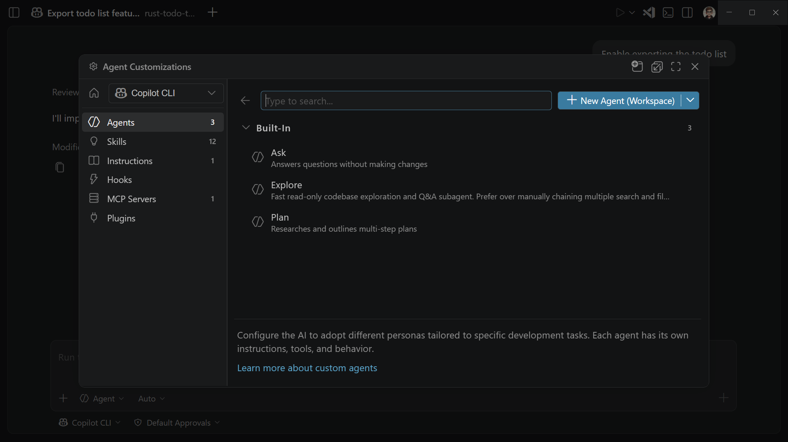

# Custom Instruction

**커스텀 지시사항**
- AI가 코드를 생성하고 다른 작업을 처리하는 방식에 영향을 주는 공통 가이드라인과 규칙을 정의 
- 매번 수동으로 컨텍스트를 포함시키는 대신, Markdown 파일에 커스텀 지시사항을 지정해 두면 코딩 관행과 프로젝트 요구사항에 맞는 일관된 AI 응답을 보장

- 모든 채팅 요청에 자동으로 적용되도록 설정하거나, 특정 파일에만 적용되도록 설정할 수 있다
- 특정 채팅 프롬프트에 수동으로 커스텀 지시사항을 첨부할 수도 있다.

-----------------------

- `/init` 을 사용해 프로젝트를 AI에 맞게 설정하면 프로젝트에 맞는 커스텀 
지시사항이 생성

**Agent Customizations 편집기**

- 모든 에이전트 커스터마이징을 한 곳에서 검색, 생성, 관리
- 에이전트 창이나 명령 팔레트에서 `Chat: Open Customizations` 실행



------------------------

# Instruction 파일 종류

- VS Code는 두 가지 범주의 커스텀 지시사항을 지원
- 여러 개의 지시사항 있으면, 이를 결합하여 채팅 컨텍스트에 추가하며, 특정한 순서는 보장되지 않음

## 상시 적용 지시사항 (Always-on instructions)

- 모든 채팅 요청에 자동으로 포함
- 프로젝트 전반의 코딩 표준, 아키텍처 결정, 그리고 모든 코드에 적용되는 관례에 사용

**단일 `.github/copilot-instructions.md` 파일**

- 워크스페이스의 모든 채팅 요청에 자동으로 적용
- 워크스페이스 내에 저장

------------

**하나 이상의 AGENTS.md 파일**

- 워크스페이스에서 여러 AI 에이전트를 함께 사용할 때 유용
- 워크스페이스의 모든 채팅 요청 또는 특정 하위 폴더(실험적)에 자동으로 적용
- 워크스페이스 루트 또는 하위 폴더(실험적)에 저장


**조직 수준 지시사항**

- GitHub 조직 내 여러 워크스페이스와 리포지토리에서 지시사항을 공유
- GitHub 조직 수준에서 정의됨


**CLAUDE.md 파일**

- Claude Code 및 기타 Claude 기반 도구와의 호환성을 위함
- 워크스페이스 루트, .claude 폴더, 또는 사용자 홈 디렉터리에 저장

-----------------

## 파일 기반 지시사항 (File-based instructions)

- 에이전트가 작업 중인 파일들이 지정된 패턴과 일치하거나 설명이 현재 작업과 일치할 때 적용
- 언어별 관례, 프레임워크 패턴, 또는 코드베이스의 특정 부분에만 적용되는 규칙에는 파일 기반 지시사항을 사용

**하나 이상의 .instructions.md 파일**

- **glob 패턴**을 사용하여 파일 유형이나 위치에 따라 조건적으로 지시사항을 적용
- 워크스페이스 또는 사용자 프로필에 저장됨
- 지시사항에서 파일이나 URL 같은 특정 컨텍스트를 참조하려면 Markdown 링크를 사용할 수 있다.

## 어떤 방식 사용? 

- 프로젝트 전반의 코딩 표준에는 단일 `.github/copilot-instructions.md` 파일로 시작
- 파일 유형이나 프레임워크별로 다른 규칙이 필요하면 `.instructions.md` 파일을 추가
- 워크스페이스에서 여러 AI 에이전트를 사용한다면 `AGENTS.md`를 사용

-----------------

# `.github/copilot-instructions.md` 파일 사용하기

- VS Code는 워크스페이스 루트에 있는 `.github/copilot-instructions.md` 파일을 자동 감지하여 이 파일의 지시사항을 해당 워크스페이스의 모든 채팅 요청에 적용

> 같은 경우에 사용하세요:
> - 프로젝트 전체에 적용되는 코딩 스타일 및 네이밍 규칙
> - 기술 스택 선언 및 선호하는 라이브러리
> - 따라야 하거나 피해야 할 아키텍처 패턴
> - 보안 요구사항 및 에러 처리 방식
> - 문서화 표준


<div class="callout tip">
  <div class="callout-title">
  
  NOTE 

  </div>  

  - VS Code는 상시 적용 지시사항으로 AGENTS.md 파일 사용도 지원

</div>

-------------------

- **일반적인 예시**

  ```markdown
  ---
  applyTo: "**"
  ---
  # 프로젝트 일반 코딩 표준

  ## 네이밍 규칙
  - 컴포넌트 이름, 인터페이스, 타입 별칭에는 PascalCase 사용
  - 변수, 함수, 메서드에는 camelCase 사용
  - private 클래스 멤버에는 언더스코어(_) 접두사 사용
  - 상수에는 ALL_CAPS 사용

  ## 에러 처리
  - 비동기 작업에는 try/catch 블록 사용
  - React 컴포넌트에 적절한 에러 바운더리 구현
  - 항상 컨텍스트 정보와 함께 에러 로깅
  ```

----------------------

## `.instructions.md` 파일 사용하기

- `*.instructions.md` 는 에이전트가 작업 중인 파일이나 작업에 따라 동적으로 적용되는 파일 기반 지시사항을 만들 수 있다.

- 에이전트는 지시사항 파일 헤더의 `applyTo` 속성에 지정된 파일 패턴 또는 현재 작업과 지시사항 설명의 의미적 일치를 기준으로 어떤 지시사항 파일을 적용할지 결정

- 다음과 경우에 사용하세요:
  - 프론트엔드와 백엔드 코드에 대한 서로 다른 관례
  - 모노레포에서 언어별 가이드라인
  - 특정 모듈에 대한 프레임워크별 패턴
  - 테스트 파일이나 문서에 대한 특수 규칙

---------------------

# 파일 위치

| 범위 | 기본 파일 위치 |
|-------|-----------------------|
| 워크스페이스 | `.github/instructions` 폴더 |
| 워크스페이스 (Claude 형식) | `.claude/rules` 폴더 |
| 사용자 프로필 | `~/.copilot/instructions`, `~/.claude/rules`, 또는 사용자 데이터(VS Code 프로필에 따라 다름) |

- VS Code는 이 폴더들을 재귀적으로 검색하므로 하위 디렉터리에 지시사항 파일을 구성할 수 있다. 
- 팀, 언어, 모듈별로 지시사항을 그룹화:

  ```
  .github/instructions/
    frontend/
      react.instructions.md
      accessibility.instructions.md
    backend/
      api-design.instructions.md
    testing/
      unit-tests.instructions.md
  ```
------------------------

- 워크스페이스 수준 지시사항만 허용하도록 지시사항 파일 위치를 구성하는 방법 예시

```json
"chat.instructionsFilesLocations": {
  ".github/instructions": true,
  ".claude/rules": true,
  "~/.copilot/instructions": false,
  "~/.claude/rules": false
}
```


