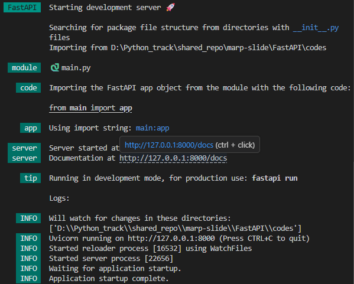
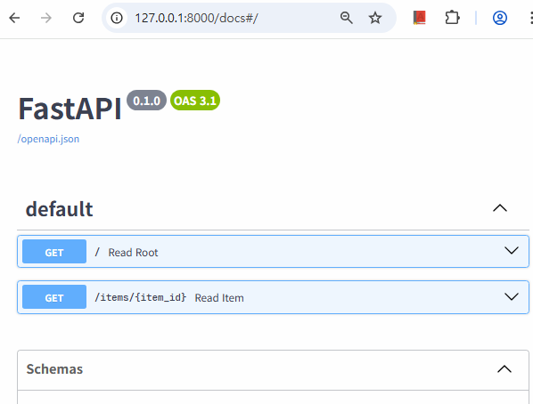
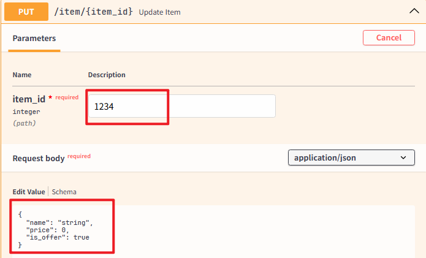
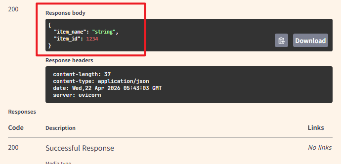

# FastAPI

- **FastAPI** 는 현대적이고, 빠르며(고성능), 파이썬 표준 타입 힌트에 기초한 API를 빌드하기 위한 웹 프레임워크

## 특징

- 빠름: (Starlette과 Pydantic 덕분에) NodeJS 및 Go와 대등할 정도로 매우 높은 성능. 사용 가능한 가장 빠른 파이썬 프레임워크 중 하나.
- 빠른 코드 작성: 약 200%에서 300%까지 기능 개발 속도 증가. *
- 적은 버그: 사람(개발자)에 의한 에러 약 40% 감소. *

---

## 특징 

- 직관적: 훌륭한 편집기 지원. 자동완성이 모든 곳에서 동작. 적은 디버깅 시간.
- 쉬움: 쉽게 사용하고 배우도록 설계. 적은 문서 읽기 시간.
- 짧음: 코드 중복 최소화. 각 매개변수 선언의 여러 기능. 적은 버그.
- 견고함: 준비된 프로덕션 용 코드를 얻으십시오. 자동 대화형 문서와 함께.
- 표준 기반: API에 대한 (완전히 호환되는) 개방형 표준 기반: OpenAPI (이전에 Swagger로 알려졌던) 및 JSON Schema.

---

## FastAPI 에 대한 의견들

> "[...] 저는 요즘 FastAPI를 많이 사용하고 있습니다. [...] 사실 우리 팀의 마이크로소프트 ML 서비스 전부를 바꿀 계획입니다. 그중 일부는 핵심 Windows와 몇몇의 Office 제품들이 통합되고 있습니다." -- Kabir Khan(마이크로소프트)

> "Netflix는 우리의 오픈 소스 배포판인 위기 관리 오케스트레이션 프레임워크를 발표할 수 있어 기쁩니다: 바로 Dispatch입니다! [FastAPI로 빌드]" -- Kevin Glisson, Marc Vilanova, Forest Monsen(넷플릭스)

[의견 더 보기](https://fastapi.tiangolo.com/ko/#opinions)

---

## 요구 사항

> *FastAPI* 는 거인들의 어깨 위에 서 있습니다
>
> - `Starlette` — 웹 부분을 담당
> - `Pydantic` — 데이터 부분을 담당

### Starlette
**`Starlette`** 는 파이썬으로 비동기 웹 서비스를 구축하는 데 이상적인 경량 `ASGI` 프레임워크/툴킷

### Pydantic
`Pydantic`은 파이썬에서 가장 널리 사용되는 데이터 유효성 검사 라이브러리


--- 

## 설치

- 가상 환경 생성
```bash
python -m venv venv
```

- 가상 환경 활성화
```bash
source venv/Scripts/activate
```

- `pip`로 설치하기

```bash
pip install "fastapi[standard]"
```


---

### 간단한 예제 
- `main.py` 파일 작성

```python
from fastapi import FastAPI

app = FastAPI()


@app.get("/")
def read_root():
    return {"Hello": "World"}


@app.get("/items/{item_id}")
def read_item(item_id: int, q: str | None = None):
    return {"item_id": item_id, "q": q}
```
---

## 실행

- 실행 명령어

```bash
fastapi dev
```


- 브라우저로 다음 JSON 내용을 확인
- `http://127.0.0.1:8000/items/5?q=somequery`

```json
{"item_id": 5, "q": "somequery"}
```

---

## API Docs
- API 문서 보기([Swagger UI](https://github.com/swagger-api/swagger-ui))
- http://127.0.0.1:8000/docs
- http://127.0.0.1:8000/redoc



---

## 예제 추가
```python
from pydantic import BaseModel

class Item(BaseModel):
    name: str
    price: float
    is_offer: bool | None = None


@app.put("/item/{item_id}")
def update_item(item_id: int, item: Item):
    return { "item_name": item.name, "item_id": item_id}
```

---

# 대화형 API Doc으로 테스트


