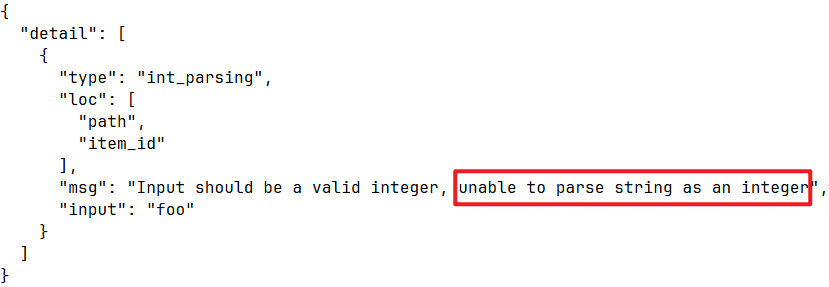
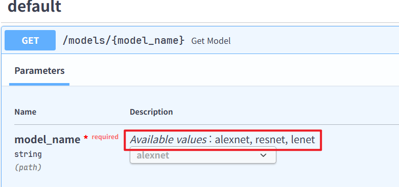

# 경로 매개 변수

```python
from fastapi import FastAPI

app = FastAPI()


@app.get("/items/{item_id}")
async def read_item(item_id):
    return {"item_id": item_id}
```

- 경로 매개변수 `item_id` 의 값은 함수의 `item_id` 의 인자로 전달

- 실행 결과:
```
{"item_id":"foo"}
```
--------------
# 타입 힌트가 있는 경로 매개변수

```python
from fastapi import FastAPI

app = FastAPI()


@app.get("/items/{item_id}")
async def read_item(item_id: int):
    return {"item_id": item_id}
```

> - 타입 힌트는 함수 내에서 오류 검사, 자동완성 등의 편집기 기능을 활용할 수 있게 해줍니다.
> - 함수가 받은(반환도 하는) 값은 문자열 "3"이 아니라 `int` 형인 3입니다.

---------------
# 데이터 검증

- `http://127.0.0.1:8000/items/foo` 로 요청을 보낸 경우



> - 타입 선언을 하면 FastAPI는 데이터 검증을 수행
> - 오류에는 검증을 통과하지 못한 지점이 정확히 명시
> - API와 상호 작용하는 코드의 개발과 디버깅에 유용

--------------
# 순서 문제

- 다음 두가지 경로가 있다.
  - `/users/me` : **현재 사용자** 의 데이터 가져오기
  - `/users/{user_id}`: **사용자 ID** 로 특정 사용자의 정보 가져오기

- 경로 처리는 순차적으로 평가되므로 `/users/me` 가 `/users/{user_id}` 보다 먼저 선언

-----------
# 순서 문제 예시

```python
from fastapi import FastAPI
app = FastAPI()

@app.get("/users/{user_id}")
async def read_user(user_id: str):
    return {"user_id": user_id}

@app.get("/users/me")
async def read_user_me():
    return {"user_id": "the current user"}
```
- 위 코드의 문제점:
  - `/users/{user_id}` 에 대한 경로가 `/users/me` 에도 매칭되어, 매개변수 `user_id` 에 **`me`** 값이 적용
-----------

# 사전 정의 값 - Enum

- 유효한 경로 매개변수 값들을 미리 정의하고 싶다면 파이썬 표준 `Enum` 을 사용
  - **Python 3.10+** 

- `Enum`을 임포트하고 `str`과 `Enum`을 상속하는 서브 클래스 정의
- `str`을 상속함으로써 API 문서는 값이 `str`형인 것을 알게 되고 문서에 표시
- 가능한 값들에 해당하는 클래스 속성을 정의

> - 생성한 `Enum` 클래스(`ModelName`)를 사용하는 타입 어노테이션으로 경로 매개변수를 생성:
--------------
## Enum 예시
```python
from enum import Enum
from fastapi import FastAPI

class ModelName(str, Enum):
    alexnet = "alexnet"
    resnet = "resnet"
    lenet = "lenet"


app = FastAPI()

@app.get("/models/{model_name}")
async def get_model(model_name: ModelName):
    if model_name is ModelName.alexnet:
        return {"model_name": model_name, "message": "Deep Learning FTW!"}

    if model_name.value == "lenet":
        return {"model_name": model_name, "message": "LeCNN all the images"}

    return {"model_name": model_name, "message": "Have some residuals"}
```
--------------
# Enum 사용하기

### 열거형 멤버 비교
- `ModelName`의 열거형 멤버와 비교하기
```python
if model_name is ModelName.alexnet:
```


### 열거형 값 가져오기
- `model_name.value` 또는 일반적으로 `your_enum_member.value` 를 이용하여 실제 값 가져오기
```python
if model_name.value == "lenet":
```

----------------

### 열거형 멤버 반환
- 경로 처리에서 `enum` 멤버를 반환할 수 있음. 이는 JSON 본문(예: dict) 내에 중첩된 형태로도 가능
- 클라이언트에 반환하기 전에 해당 **값** (예시에서는 문자열)으로 변환

```python
return {"model_name": model_name, "message": "Deep Learning FTW!"}
```

--------------

# Enum API 문서 확인



--------------
# 경로를 포함하는 경로 매개변수

- 경로 `/files/{file_path}` 를 가진 경로 처리가 있다
- `file_path` 자체가 `home/johndoe/myfile.txt` 와 같은 경로를 포함해야 한다.
- 해당 파일의 URL은 다음과 같이 표현할 수 있다: `/files/home/johndoe/myfile.txt.`

```python
from fastapi import FastAPI

app = FastAPI()

@app.get("/files/{file_path:path}")
async def read_file(file_path: str):
    return {"file_path": file_path}
```

- 매개변수가 선행 슬래시(`/`)가 있는 `/home/johndoe/myfile.txt`를 포함되면 `files` 와 `home` 사이에 이중 슬래시(`//`)가 포함될 수 있다.