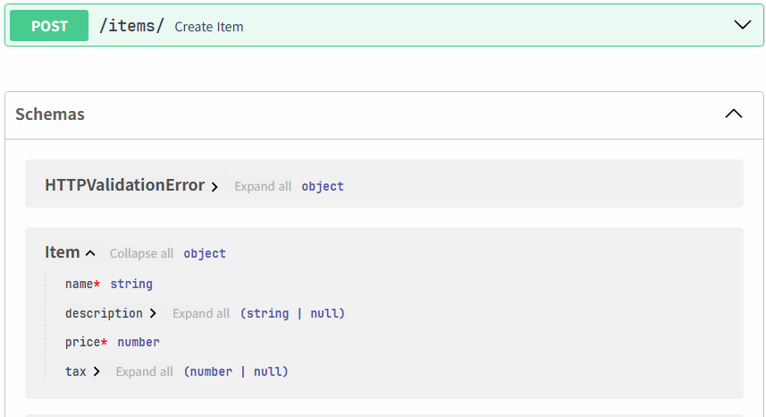

# 요청 본문 Request Body

- **요청 본문**은 클라이언트에서 API로 보내지는 데이터
- **응답 본문**은 API가 클라이언트로 보내는 데이터

- 요청 본문을 선언하기 위해서 **Pydantic 모델** 을 사용


> [참고]
> - 데이터를 보내기 위해, POST, PUT, DELETE 혹은 PATCH 중 하나를 사용
> - GET 요청에 본문을 담아 보내는 것은 명세서에 정의되지 않은 행동
>   - 이 방식은 아주 복잡한/극한의 상황에서만 FastAPI에 의해 지원
>   - GET 요청에 본문을 담는 것은 권장되지 않음

----------------
<style scoped>
section {
  display: flex;
  flex-direction: row;
  justify-content: space-between;
  align-items: center;
}
.col {
  flex: 1;
}
</style>

# Pydantic(`BaseModel`) 데이터 모델

<div class="col">

- `BaseModel`을 상속받은 클래스로 데이터 모델을 선언
```python
from pydantic import BaseModel

class Item(BaseModel):
    name: str
    description: str | None = None
    price: float
    tax: float | None = None
```
</div>

<div class="col">

- JSON "object" (또는 dict)를 선언
```json
{
    "name": "Foo",
    "description": "An optional description",
    "price": 45.2,
    "tax": 3.5
}
```
- description과 tax 가 없어도 유효
```json
{
    "name": "Foo",
    "price": 45.2,
}
```
</div>

---------------------

# 매개변수로 선언하기

- 경로 처리에 추가하기 위해, 경로 매개변수 그리고 쿼리 매개변수에서  선언했던 것과 같은 방식으로 선언

```python
from fastapi import FastAPI

app = FastAPI()

@app.post("/items/")
async def create_item(item: Item):
    return item
```

-----------------------

# 실행 결과

> 파이썬 타입 선언으로, FastAPI는 다음과 같이 동작합니다:

- 요청의 본문을 **JSON**으로 읽어온다.
  - 필요시 대응하는 타입으로 변환
- 데이터를 검증한다.
  - 만약 유효하지 않다면, 그 이유에 대한 명확한 에러를 반환
- 매개변수 item에 포함된 수신 데이터를 제공
  - 매개변수를 Item 타입으로 선언했기 때문에, 모든 어트리뷰트와 그에 대한 타입에 대한 편집기 지원(완성)을 받는다.
- 모델에 대한 **JSON Schema** 정의를 생성
  - 생성된 OpenAPI 스키마 일부가 되고, 자동 문서화 UIs에 사용.

-------------------------

# 문서화 - schema 확인



--------------------------

# 모델 사용 하기
<br>
- 모델 객체의 모든 어트리뷰트에 직접 접근 가능

```python
class Item(BaseModel):
    name: str
    description: str | None = None
    price: float
    tax: float | None = None

@app.post("/items/")
async def create_item(item: Item):

    item_dict = item.model_dump()

    if item.tax is not None:
        price_with_tax = item.price + item.tax
        item_dict.update({"price_with_tax": price_with_tax})

    return item_dict
```

------------------------


# 요청 본문 + 경로 매개 변수

- 경로 매개변수와 요청 본문을 동시에 선언할 수 있다.
- **FastAPI** 는 경로 매개변수와 일치하는 함수 매개변수는 경로에서 가져온다.
- **Pydantic 모델** 로 선언된 매개변수는 요청 본문에서 가져온다.

```python
@app.put("/items/{item_id}")
async def update_item(item_id: int, item: Item):
    return {"item_id": item_id, **item.model_dump()}
```

----------------

# 요청 본문 + 경로 + 쿼리 매개변수

```python
@app.put("/items/{item_id}")
async def update_item(item_id: int, item: Item, q: str | None = None):
    result = {"item_id": item_id, **item.model_dump()}
    if q:
        result.update({"q": q})
    return result
```

- 매개변수가 경로에도 선언되어 있다면, 이는 **경로 매개변수** 로 사용
- 매개변수가 (int, float, str, bool 등과 같은) 유일한 타입이면, **쿼리 매개변수** 로 해석
- 매개변수가 **Pydantic 모델 타입** 으로 선언되어 있으면, **요청 본문** 으로 해석

--------------------

