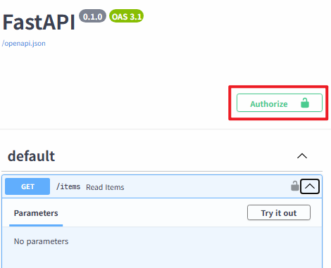

# 보안

- **FastAPI**와 함께 **OAuth2**를 사용해서 구현
- 예시코드:
```python
from typing import Annotated
from fastapi import FastAPI, Depends
from fastapi.security import OAuth2PasswordBearer

app = FastAPI()

oauth2_scheme = OAuth2PasswordBearer(tokenUrl='token')

@app.get('/items')
async def read_items(token: Annotated[str, Depends(oauth2_scheme)]):
    return { 'token': token }
```

--------------

> [참고]
> - OAuth2가 username과 password를 보내기 위해 "form data"를 사용
> - *python-multipart* 패키지는 `pip install "fastapi[standard]"` 명령으로 **FastAPI** 와 함게 자동 설치
> - `pip install fastapi` 에는 *python-multipart* 가 포함되지 않는 패키지 설치
> - `pip install python-multipart` 로 따로 설치 가능

--------------

# 코드 실행 

```
fast api main.py
```
- `http://127.0.0.1:8000/docs` 
- *Authorize* 버튼 클릭



-------------

# Password Flow

- password "flow"는 보안과 인증을 처리하기 위해 OAuth2에서 정의한 여러 방식("flows") 중 하나
- OAuth2는 backend 또는 API가 사용자를 인증하는 서버와 독립적이도록 설계
- 여기서는 FastAPI 애플리케이션이 API와 인증을 모두 처리

------------

> 시나리오:
- 사용자가 frontend에서 username/password를 입력 후 Enter
- frontend는 해당 username과 password를 API의 특정 URL로 전송(tokenUrl="token"로 선언됨).
- API는 username과 password를 확인하고 "token"으로 응답(미구현)
- "token"은 사용자를 검증하는 데 사용되는 문자열
- token은 일정 시간이 지나면 만료
- frontend는 token을 임시로 어딘가에 저장
- API에 인증하기 위해 Authorization 헤더에, Bearer에 token을 더한 형태로 전송
- token이 `foobar`라면 Authorization 헤더의 내용은 `Bearer foobar`가 됩니다.

------------

# OAuth2PasswordBearer
- FastAPI에 보안 기능을 위해 서로 다른 추상화 수준에서 여러 도구를 제공
- `OAuth2PasswordBearer` 클래스의 인스턴스를 만들 때 `tokenUrl` 파라미터를 전달
- 클라이언트가 token을 받기 위해 username과 password를 보낼 URL

<br>
<br>

> [참고]
- `tokenUrl="token"`은 아직 만들지 않은 상대 URL을 가리킨다
- 상대 URL이므로 `./token`과 동일
- 예를 들어 API가 `https://example.com/` 이면 `https://example.com/token`을 가리킨다. 

-----------------

```python
oauth2_scheme = OAuth2PasswordBearer(tokenUrl='token')

@app.get('/items')
async def read_items(token: Annotated[str, Depends(oauth2_scheme)]):
    return { 'token': token }
```

- `auth2_scheme` 변수는 OAuth2PasswordBearer의 인스턴스이고 **callable** 이므로, 호출이 가능하다.
```python
oauth2_scheme(some, parameters)
```
- Depends와 함께 사용할 수 있다
- 이 의존성은 `str`을 제공하고, 값은 경로 처리 함수의 파라미터 `token`에 할당

--------------------
