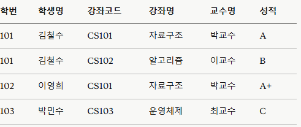
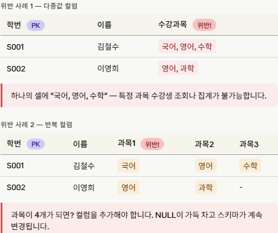
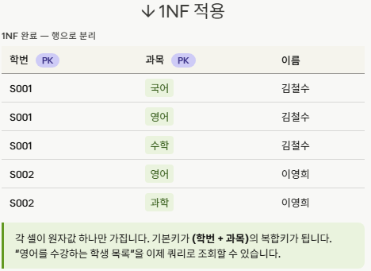
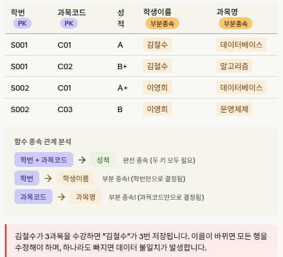
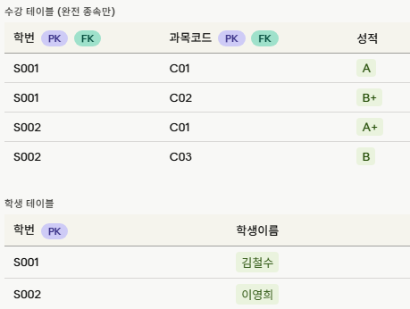
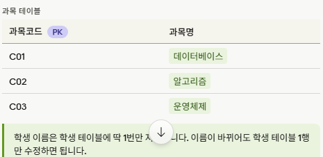
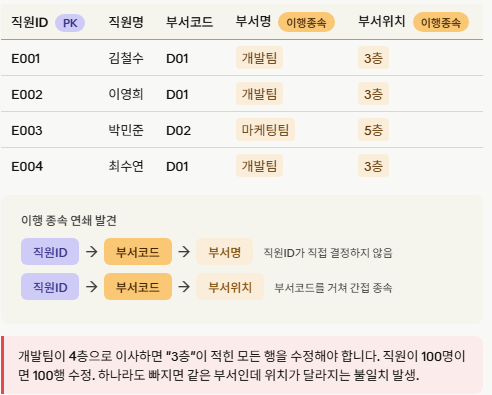
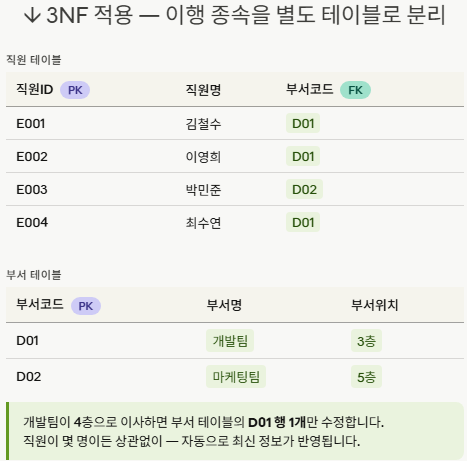
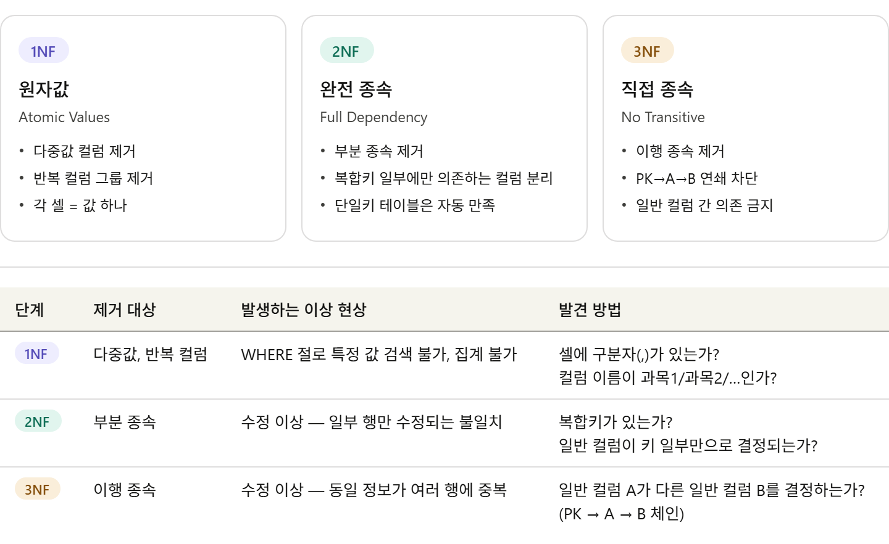

# 데이터베니스 모델링

- 현실 세계의 데이터를 테이블 구조로 설계하는 과정
> 주요 개념:
> - 엔티티(Entity): 저장할 대상 (고객, 상품, 주문)
> - 속성(Attribute): 엔티티의 특징 (고객명, 가격, 날짜)
> - 관계(Relationship): 엔티티 간의 연결 (고객이 주문을 함)
> - 기본키(PK): 각 행을 유일하게 식별하는 값
> - 외래키(FK): 다른 테이블을 참조하는 값


---------------

# 정규화 - 이상 현상
- 이상현상이란 정규화가 제대로 되지 않은 테이블에서 데이터를 삽입·수정·삭제할 때 발생하는 부작용

## 3가지 이상 현상

1. 삽입 이상 (Insertion Anomaly)
2. 삭제 이상 (Deletion Anomaly)
3. 갱신 이상 (Update Anomaly)

---------------
# 삽입 이상 (Insertion Anomaly)

- 데이터 삽입시 불필요한 데이터가 함께 삽입되거나, 삽입 자체가 불가능한 현상
- 예시: 새 강좌 CS104 - 네트워크 / 김교수가 개설됐지만 아직 수강 학생이 없는 경우

- 학번, 학생명, 성적이 없으면 행 자체를 삽입할 수 없음
- 기본키(학번 + 강좌코드)가 NULL이 되기 때문

→ 수강생이 없으면 강좌 정보를 저장할 수 없는 구조적 문제



---------------

# 삭제 이상 (Deletion Anomaly)

- 특정 데이터를 삭제하면 의도하지 않은 다른 데이터도 삭제되는 현상
- 예시: 학번 103 박민수가 수강 취소해서 해당 행을 삭제
- CS103 - 운영체제 / 최교수 강좌 정보 자체가 완전히 사라짐
- 학생 정보를 삭제했는데 강좌 정보까지 손실

→ 연쇄적·의도치 않은 정보 손실 발생


---------------
# 갱신 이상 (Update Anomaly)

- 중복된 데이터 중 일부만 수정되어 데이터 불일치가 발생하는 현상
- 예시: 박교수 → 정교수로 담당 교수가 변경되는 경우
- 학번강좌코드교수명101CS101정교수 ← 수정됨102CS101박교수 ← 수정 안 됨 ❌

- CS101의 교수명이 행마다 달라져 데이터 일관성 파괴
모든 행을 빠짐없이 수정해야 하는 부담

→ 중복 저장이 근본 원인


---------------
# 이상 현상의 원인
```
하나의 테이블에 서로 다른 엔티티(학생, 강좌, 수강)의
정보가 혼재 → 함수적 종속성 위반
```

| 원인 | 설명 |
|------|------|
| **부분 함수 종속** | 기본키 일부에만 종속된 속성 존재 (2NF 위반) |
| **이행 함수 종속** | A→B→C 형태의 간접 종속 (3NF 위반) |
| **데이터 중복** | 동일 정보가 여러 행에 반복 저장 |

---------------
# 해결책
## 테이블 분리(정규화)
```
학생 테이블     (학번, 학생명)
강좌 테이블     (강좌코드, 강좌명, 교수명)
수강 테이블     (학번, 강좌코드, 성적)
```

> 테이블을 분리하면 세 가지 이상현상이 모두 해소
> - 강좌는 수강생 없이도 저장 가능 → 삽입 이상 해결
> - 학생 삭제 시 강좌 정보 유지 → 삭제 이상 해결
> -교수명은 강좌 테이블에서 1회만 수정 → 갱신 이상 해결

---------------

# 정규화

- 데이터의 중복을 줄이고 데이터 무결성을 높이기 위해 테이블을 체계적으로 분리하는 과정
- 1NF → 2NF → 3NF 단계로 진행

## 정규화의 핵심 개념: 함수 종속성
- `A → B` 는 "A를 알면 B가 결정된다"는 의미
- 예를 들어 학번 → 학생이름 — 학번을 알면 학생 이름이 딱 하나로 결정
- 이때 A를 **결정자**, B를 **종속자** 라 부른다.
- 정규화는 이 종속 관계를 정리해서 테이블 구조를 올바르게 만드는 과정

------------------

# 1NF — 제1정규형 (First Normal Form)

- 규칙: 모든 컬럼의 값은 원자값(Atomic Value)이어야 한다. 
- 즉, 하나의 셀에 하나의 값만 가져야 합니다.
- 위반하는 경우는 
  - 하나의 셀에 여러 값이 포함된 경우("국어, 영어, 수학")
  - 같은 의미의 컬럼이 반복되는 경우(과목1, 과목2, 과목3)

> 1NF 규칙: 각 컬럼은 하나의 원자값만 가져야 한다. 다중값, 반복 컬럼 금지

------------------
# 1NF 예시

<br>




------------------

# 2NF - 제2정규형

- 규칙: **1NF** 를 만족하고, 기본키가 아닌 모든 컬럼이 기본키 전체에 완전 함수 종속이어야 한다.
- 이는 복합키(두 개 이상의 컬럼으로 구성된 PK)가 있을 때 의미가 있다. 
- 복합키의 일부 컬럼에만 종속되는 것을 부분 종속(Partial Dependency) 이라 하며, 2NF는 이를 제거한다.

> 2NF 규칙: 부분 종속 제거. 기본키가 복합키일 때, 일반 컬럼이 복합키의 일부에만 종속되면 안 된다.

------------------
# 2NF - 예시
<br>



------------------
# 2NF 적용 - 부분종속을 별도 테이블로 분리



------------------

# 3NF — 제3정규형 (Third Normal Form)

- 규칙: **2NF** 를 만족하고, 기본키가 아닌 컬럼이 다른 비-키 컬럼에 의존해서는 안 된다.

- 이것을 이행 종속(Transitive Dependency) 이라고 합니다. 
- 기본키 → A → B 형태로 B가 기본키를 거쳐 간접적으로 종속되는 경우

<br>
<br>

> 3NF 규칙: 이행 종속 제거. 일반 컬럼이 다른 일반 컬럼에 의존하는 PK → A → B 연쇄를 끊는다.

------------------




------------------



------------------

# 빠른 체크리스트 
<br>

테이블을 설계하거나 기존 테이블을 점검할 때 순서대로 확인

##### 1NF 체크
- 컬럼 값에 콤마나 구분자가 포함되었나? 과목1, 과목2처럼 숫자가 붙은 반복 컬럼은 없는가?

##### 2NF 체크: 
- 복합키가 있다면, 일반 컬럼들이 복합키 전체가 아니라 일부에만 의존하는가? (단일 PK 테이블은 자동으로 2NF 충족)

##### 3NF 체크: 
- 일반 컬럼 A를 알면 다른 일반 컬럼 B가 결정되는가? 즉, PK → A → B 연쇄가 있는가?

> 2NF와 3NF 모두 결국 같은 답으로 귀결됩니다. 중복이 발생하는 컬럼 묶음을 새 테이블로 분리하고, 원래 테이블에는 외래키(FK)만 남긴다.

------------------

# 함수 종속성 (Functional Dependency)

- 함수 종속성이란 "어떤 속성 A의 값을 알면, 다른 속성 B의 값을 유일하게 결정할 수 있는 관계"를 의미. 
- 수학의 함수 $y = f(x)$에서 $x$값이 정해지면 $y$값이 정해지는 것과 같습니다.표기법: $A \rightarrow B$ ($A$는 결정자, $B$는 종속자)예시: [학번]을 알면 그 학생의 [이름]을 알 수 있습니다. 이때 [이름]은 [학번]에 함수적으로 종속되어 있다고 합