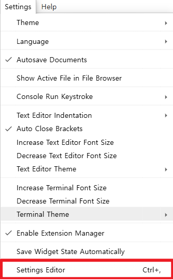
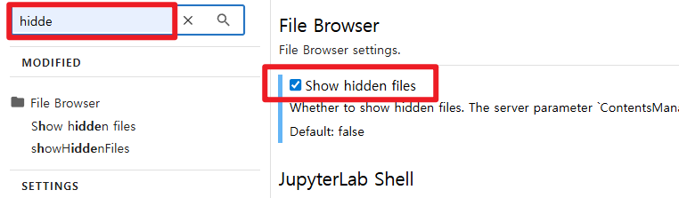
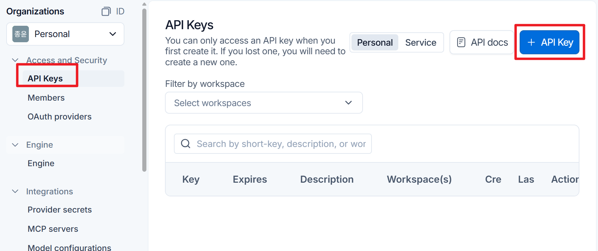
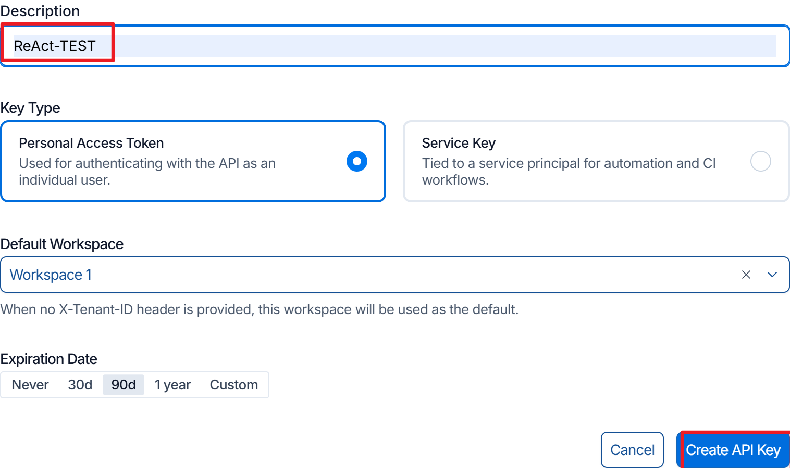
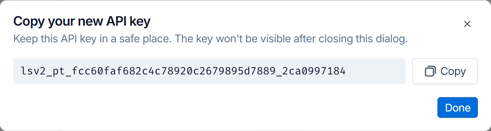
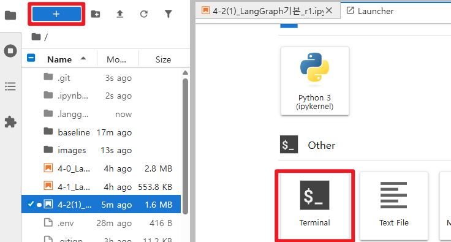
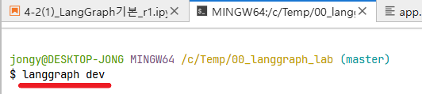

# LangSmith 환경 설정

## 가상 환경 

- 가상 환경 생성

```bash
python -m venv .venv
```
- 가상 환경 활성화
```bash
source .venv/Scripts/activate
```

- 가상환경 생성후 터미널에 `(.venv)` 표시 확인하기

------------------

## requirements.txt 설치하기
```
pip install -r requirements.txt
```
[requirements.txt 가져오기](https://gist.github.com/ssafydaily/d32ead48b13cb3ec31738775ae1570d9)

## Easy 교안 4-2와 충돌 문제 해결
- langgraph cli와 chroma db 동시 설치시 의존성 문제 발생
- `opentelemetry` 강제 설치

```
pip install --upgrade --force-reinstall \
"opentelemetry-api==1.37.0" \
"opentelemetry-sdk==1.37.0" \
"opentelemetry-proto==1.37.0" \
"opentelemetry-exporter-otlp-proto-common==1.37.0" \
"opentelemetry-exporter-otlp-proto-grpc==1.37.0" \
"opentelemetry-exporter-otlp-proto-http==1.37.0"
```
-----------------

## 패키지 설치

### `pip` 업데이트

```bash
python -m pip install -U pip
```

### `jupyter` 설치하기

```bash
pip install jupyter ipykernel ipywidgets
```


### 필요 패키지 설치하기

```bash
pip install -U "langgraph-cli[inmem]"
pip install -qU langgraph langchain langsmith langchain-openai python-dotenv
# 설치 패키지 버전 확인
pip list | grep -E "langgraph |langchain |langchain-openai |langchain-upstage |langsmith"
```
-----------------

## `jupyter` 서버 실행하기

```bash
python -m jupyter lab --ContentsManager.allow_hidden=True
```
> 숨김 파일 설정
- **settings > Settings Editor** 메뉴 선택하고, **hidden** 검색

<div class="cols">
<div>


</div>
<div>

- `Show Hiddens Files` 선택

{width=500px}

</div>
</div>


-----------------
## LangSmith API key 발급
- [LangSmith 가입하기](https://smith.langchain.com/)
- 로그인 후 `settings` > `API keys` > `+API key` 버튼 클릭



-----------------

### Key 생성하고 복사
<div class="cols">
<div>



</div>
<div>



- key를 복사해서 저장하기

</div>
</div>


-----------------

## `.env` 파일 작성하기

```
GMS_KEY="your-key"
OPENAI_BASE_URL=https://gms.ssafy.io/gmsapi/api.openai.com/v1

# required
LANGSMITH_TRACING=true
LANGSMITH_API_KEY="your-key"

# optional
LANGSMITH_ENDPOINT="https://api.smith.langchain.com"
LANGSMITH_PROJECT="my-first-project"
```
- [중요] `git` 저장소 사용한다면 `.gitignore` file 작성합니다.
-------------------------------

**필수 환경 변수**

- `LANGSMITH_TRACING`: 트레이싱 기능 on/off 스위치, `true`여야 LangSmith로 데이터가 전송됨 
-  `LANGSMITH_API_KEY`: LangSmith 계정 인증용 API 키 (`"lsv2_..."`)

**선택 환경 변수**
- `LANGSMITH_ENDPOINT`: 트레이스 전송 대상 서버 주소. 
  - 미국 리전이면 기본값이라 생략 가능 `"https://api.smith.langchain.com"`
  - 유럽 리전이면 `eu.api.smith.langchain.com`으로 변경 필수 
- `LANGSMITH_PROJECT`: 트레이스가 저장될 프로젝트명. 미설정 시 `default`로 저장 
  - `"my-project"`

<div class="callout info">
<div class="callout-title">
  환경변수 접두사
</div>

  - 26년 기준 `LANGCHAIN_*` 접두사는 예전 방식이고, 최근에는 `LANGSMITH_* 접두사`(LANGSMITH_TRACING, LANGSMITH_API_KEY, LANGSMITH_ENDPOINT, LANGSMITH_PROJECT)가 LangSmith 트레이싱을 활성화할 수 있는 공식 권장 방식
  - 둘 다 동작하지만 새로 시작하는 프로젝트라면 `LANGSMITH_*` 를 쓰는 게 좋습니다. 

</div>

-----------------

## Jupyter Notebook 셀에서 실행하기

- **환경변수**만 설정되어 있으면, 별도 콜백 없이 그래프를 그냥 실행해도 자동으로 추적된다.

```python
from langgraph.graph import StateGraph

# ... 그래프 정의 ...
graph = builder.compile()
result = graph.invoke({"input": "hello"})
```

- 실행 후 [smith.langchain.com](https://smith.langchain.com) 에 들어가서 설정한 프로젝트를 클릭
  - 노드별 실행 경로, 입출력, 지연시간, 토큰 사용량 등을 시각적으로 확인

----------------------
## [참고] jupyter notebook 설정 유지하기

- **compose 파일이 있는 위치 기준 상대 경로**로 `./jupyter_config` 설정

```yaml
services:
  jupyter:
    image: your-image
    ports:
      - "8888:8888"
    volumes:
      - ./jupyter_config:/root/.jupyter   # <-----------
      - ./notebooks:/home/notebooks
```

- `docker-compose up` 실행 시 `docker-compose.yml`이 있는 폴더에 `jupyter_config` 폴더가 없으면 Docker가 자동으로 생성 

> ⚠️ 주의: Windows에서 바인드 마운트 시 파일 공유(File Sharing) 설정이 안 되어 있으면 오류가 날 수 있습니다. Docker Desktop → Settings → Resources → File Sharing에서 해당 드라이브가 공유되어 있는지 확인하세요.

--------------------

# 코드에서 프로젝트 이름 설정하기
## 방법 1: `tracing_v2_enabled` 컨텍스트 매니저 (가장 많이 사용)

```python
from langchain_core.tracers.context import tracing_v2_enabled

with tracing_v2_enabled(project_name="my-other-project"):
    result = graph.invoke({"input": "hello"})
```

- 블록 안에서 실행된 트레이스만 `my-other-project`로 기록되고, 블록 밖에서는 다시 `LANGCHAIN_PROJECT` 환경변수 값(또는 `default`)을 따른다.

----------------------

## 방법 2: `langsmith.trace`
- 특정 호출에만 다른 프로젝트 지정하기

```python
import langsmith

with langsmith.trace(
    name="KFC 메뉴 추천",                 # run_name 역할
    project_name="food-recommendation",
    tags=["food"],
    metadata={"user_id": "user_42"},
) as run:
    response = llm.responses.create(model=model, input=prompt)
    print(response.output_text)
```

----------------------

## 참고: 두 방식을 섞어 쓰는 경우

- **LangGraph** 안에서 `ChatOpenAI`가 아니라 raw `openai` 클라이언트를 노드 함수 내부에서 직접 호출한다면, 그 부분만 wrapper가 필요

```python
from openai import OpenAI
from langsmith.wrappers import wrap_openai

client = wrap_openai(OpenAI())  # 이 노드 함수 내부 호출을 위해 필요

def my_node(state):
    response = client.chat.completions.create(...)  # raw 호출 → wrapper 필요
    return {"result": response}

# 반면 다른 노드에서 ChatOpenAI를 쓰면 그쪽은 wrapper 불필요
def other_node(state):
    llm = ChatOpenAI(model="gpt-5-nano")
    return {"result": llm.invoke(state["input"])}
```


----------------------------


## 참고: 프로젝트 이름은 `config`의 `run_name`과는 다름

```python
result = graph.invoke(
    {"input": "hello"},
    config={"run_name": "my-run-label"}
)
```

`run_name`은 **개별 실행에 붙는 라벨**일 뿐, 프로젝트(어느 대시보드 탭에 저장될지)를 바꾸는 건 아나다. 
- 프로젝트를 바꾸려면 위의 두 방법 중 하나를 쓰셔야 합니다.

--------------------------------

# LLM API 호출 추적
> 언제 추적이 필요한가

| 상황 | 이유 |
|---|---|
| **비용/토큰 관리** | 얼마나 많은 토큰을 쓰는지, 어떤 호출이 비용을 많이 필요한지 |
| **디버깅** | 여러 단계(체인, 에이전트, 노드) 로직에서 잘못된 응답을 추적시 |
| **프롬프트 개선** | 실제 입력/출력을 눈으로 보면서 프롬프트를 반복 튜닝할 때 |
| **지연시간(latency) 분석** | 어느 노드/호출이 병목인지 찾을 때 |
| **멀티 에이전트/LangGraph** | 노드 간 상태 전달, 분기, 병렬 실행 흐름을 시각적으로 확인할 때 |
| **프로덕션 모니터링** | 실서비스에서 에러율, 응답 품질, 이상 패턴을 지속적으로 감시할 때 |
| **A/B 테스트 / 평가(eval)** | 프롬프트 버전별 성능을 비교하거나 데이터셋 기반 정량 평가를 할 때 |
| **재현/공유** | 특정 버그를 재현하거나 팀원에게 "이 호출에서 이런 일이 있었다"를 공유할 때 |

--------------------------------


## ✅ Wrapper 필요한 경우

**`openai`, `anthropic` 등 벤더 SDK를 그대로(raw) 호출하는 경우**

- **LangChain** 을 거치지 않기 때문에 **LangSmith** 가 알아서 감지하지 못합니다. 클라이언트를 감싸줘야 한다.

```python
from openai import OpenAI
from langsmith.wrappers import wrap_openai

client = wrap_openai(OpenAI())  # 이 감싸는 과정이 필요

response = client.chat.completions.create(
    model="gpt-5-nano",
    messages=[{"role": "user", "content": "안녕"}]
)
```

-----------------

```python
from anthropic import Anthropic
from langsmith.wrappers import wrap_anthropic

client = wrap_anthropic(Anthropic())  # Anthropic도 동일
```

| 사용 중인 것 | Wrapper 필요? |
|---|---|
| `openai.OpenAI()` (raw SDK) | ✅ 필요 (`wrap_openai`) |
| `anthropic.Anthropic()` (raw SDK) | ✅ 필요 (`wrap_anthropic`) |
| 직접 `requests.post()`로 API 호출 | ✅ 필요 (수동으로 `@traceable` 처리) |

<div class="callout tip">
<div class="callout-title">

  판별 법

</div>

  - 내가 만든 함수 안에서 client.chat.completions.create(...) 처럼 "OpenAI/Anthropic 패키지 이름"이 직접 보이면 → wrapper 필요
  - llm.invoke(...) 처럼 "LangChain 클래스"를 쓰면 → wrapper 불필요
</div>

--------------------

#  LangGraph Studio 활용

- Jupyter notebook 안에서 바로 실행되는 게 아니라, 노트북 코드를 별도 `.py` 파일/프로젝트로 옮긴 뒤 **로컬 서버를 띄우고 브라우저로 접속** 하는 방식입니다.

## 1. CLI 설치

```bash
pip install --upgrade "langgraph-cli[inmem]"
```
- Python 3.11 이상이 필요합니다. (이미 설치했다면 skip)

-------------------

## 2. 프로젝트 구조 만들기

- 노트북에 있던 그래프 코드를 `.py` 파일로 복사

```
my_project/
├── my_agent.py        # 그래프 정의 코드
├── langgraph.json      # 설정 파일
└── .env                 # API 키
```

---------------------
### Langgraph.json 파일 작성

**langgraph.json**
```json
{
  "dependencies": ["."],
  "graphs": {
    "my_graph": "./my_agent.py:graph"
  },
  "env": "./.env"
}
```
- `dependencies` : 그래프를 실행하는 데 필요한 Python 패키지 목록입니다.
- `graphs` : 노출할 그래프(또는 에이전트)를 이름과 함께 매핑하는 부분
  - key: *Studio UI* 드롭다운이나 API 호출 시 사용할 그래프 이름
  - value: `파일경로:변수명`
- `env`: 환경변수 파일 경로입니다.

--------------------

## 3. 로컬 서버 실행

```bash
cd my_project
langgraph dev
```

- 실행하면 이런 출력이 나옵니다:
```
- 🚀 API: http://127.0.0.1:2024
- 🎨 Studio UI: https://smith.langchain.com/studio/?baseUrl=http://127.0.0.1:2024
- 📚 API Docs: http://127.0.0.1:2024/docs
```
-------------

## 4. 브라우저에서 확인

- 출력된 **Studio UI 링크**를 클릭하면 `smith.langchain.com/studio` 로 이동하면서 로컬 서버(`baseUrl`)에 연결된 그래프가 시각적으로 표시된다.

  - 노드/엣지 그래프 구조를 시각적으로 확인
  - 상태(state)를 직접 입력해서 실행
  - 각 노드 실행 결과, 중간 상태값을 스텝별로 확인
  - 이전 실행을 스레드(Thread)로 관리하며 디버깅

<div class="callout tip">
<div class="callout-title">

  Safari/Brave 브라우저 이슈

</div>
  - 로컬 HTTP를 차단하는 브라우저(Safari, Brave 등)를 쓰면 `--tunnel` 옵션이 필요합니다.
  
  ```bash
  langgraph dev --tunnel
  ```

</div>

-------------------------

## JupyterLab 터미널에서 실행하기

<div class="cols">
<div>

- 터미널 실행하기



</div>
<div>

- langgraph 실행
```bash
lagngraph dev
```



</div>
</div>

<div class="callout tip">
<div class="callout-title">
  TIP - 인코딩 문제 발생 시 실행 하기 (.evn 파일에 한글 포함된 경우)
</div>

  ```
  python -X utf8 -m langgraph_cli dev
  ```
</div>

---------------------

## LangSmith trance vs. LangGraph Studio

| | LangSmith (트레이스) | LangGraph Studio |
|---|---|---|
| 목적 | 실행 완료 후 로그/트레이스 조회 | 그래프를 **실시간으로 실행하며** 시각적 디버깅 |
| 실행 위치 | 어디서 실행하든 (노트북 포함) 자동 기록 | `langgraph dev`로 로컬 서버를 띄워야 함 |
| 노트북에서 바로? | ✅ 가능 (환경변수만 설정) | ❌ 불가, `.py` + `langgraph.json` 필요 |

