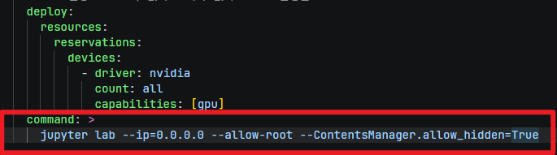

# LangSmith 환경 설정

## 가상 환경 

- 가상 환경 생성

```bash
python -m venv baseline
```
- 가상 환경 활성화
```bash
source baseline/Scripts/activate
```

- 가상환경 생성후 터미널에 `(baseline)` 표시 확인하기

-----------------
## 패키지 설치

### `pip` 업데이트

```bash
python -m pip install -U pip
```


### `jupyter` 설치하기

```bash
pip install jupyter ipykernel ipywidgets
```

### 패키지 설치
```
pip install -r requirements.txt
```

-----------------

## `jupyter` 서버 실행하기

```bash
python -m jupyter lab --ContentsManager.allow_hidden=True
```
> 숨김 파일 설정
- **settings > Settings Editor** 메뉴 선택하고, **hidden** 검색

<div class="cols">
<div>


</div>
<div>

- `Show Hiddens Files` 선택

{width=500px}

</div>
</div>


-----------------
## LangSmith API key 발급
- [LangSmith 가입하기](https://smith.langchain.com/)
- 로그인 후 `settings` > `API keys` > `+API key` 버튼 클릭


-----------------

### Key 생성하고 복사
<div class="cols">
<div>


</div>
<div>


- key를 복사해서 저장하기

</div>
</div>


-----------------

## `.env` 파일 작성하기

```
GMS_KEY="your-key"
OPENAI_BASE_URL=https://gms.ssafy.io/gmsapi/api.openai.com/v1

# 필수
LANGSMITH_TRACING=true
LANGSMITH_API_KEY="your-key"

# 선택 - 리전이 US가 아니면 필수
LANGSMITH_ENDPOINT="https://api.smith.langchain.com"
LANGSMITH_PROJECT="my-first-project"
```
- [중요] `git` 저장소 사용한다면 `.gitignore` file 작성합니다.

-------------------------------

#### [참고] docker의 jupyter lab에서 숨김 파일 다루기
> - `docker-compose.yml` 파일에 다음 내용 추가
```
command: > 
      jupyter lab --ip=0.0.0.0 --allow-root --ContentsManager.allow_hidden=True
```

- 이미지 첨부>

{width=500px}


#### 

> - 무한루프가 돌거나, 이전 실행결과만 나오는 경우

```
taskkill /F /IM python.exe
```

-----------------

#  LangGraph Studio 활용

- Jupyter notebook 안에서 바로 실행되는 게 아니라, 노트북 코드를 별도 `.py` 파일/프로젝트로 옮긴 뒤 **로컬 서버를 띄우고 브라우저로 접속** 하는 방식입니다.

## 1. CLI 설치

```bash
pip install --upgrade "langgraph-cli[inmem]"
```
- Python 3.11 이상이 필요합니다. (이미 설치했다면 skip)

-------------------

## 2. 프로젝트 구조 만들기

- 노트북에 있던 그래프 코드를 `.py` 파일로 복사

```
my_project/
├── my_agent.py        # 그래프 정의 코드
├── langgraph.json      # 설정 파일
└── .env                 # API 키
```

---------------------
### Langgraph.json 파일 작성

**langgraph.json**
```json
{
  "dependencies": ["."],
  "graphs": {
    "my_graph": "./my_agent.py:graph"
  },
  "env": "./.env"
}
```
- `dependencies` : 그래프를 실행하는 데 필요한 Python 패키지 목록입니다.
- `graphs` : 노출할 그래프(또는 에이전트)를 이름과 함께 매핑하는 부분
  - key: *Studio UI* 드롭다운이나 API 호출 시 사용할 그래프 이름
  - value: `파일경로:변수명`
- `env`: 환경변수 파일 경로입니다.

--------------------

## 3. 로컬 서버 실행

```bash
cd my_project
langgraph dev
```

<div class="callout tip">
<div class="callout-title">
  TIP - 인코딩 문제 발생 시 실행 하기 (.evn 파일에 한글 포함된 경우)
</div>

  ```
  python -X utf8 -m langgraph_cli dev
  ```
</div>


- 실행하면 이런 출력이 나옵니다:
```
- 🚀 API: http://127.0.0.1:2024
- 🎨 Studio UI: https://smith.langchain.com/studio/?baseUrl=http://127.0.0.1:2024
- 📚 API Docs: http://127.0.0.1:2024/docs
```
-------------

## 4. 브라우저에서 확인

- 출력된 **Studio UI 링크**를 클릭하면 `smith.langchain.com/studio` 로 이동하면서 로컬 서버(`baseUrl`)에 연결된 그래프가 시각적으로 표시된다.

  - 노드/엣지 그래프 구조를 시각적으로 확인
  - 상태(state)를 직접 입력해서 실행
  - 각 노드 실행 결과, 중간 상태값을 스텝별로 확인
  - 이전 실행을 스레드(Thread)로 관리하며 디버깅

<div class="callout tip">
<div class="callout-title">

  Safari/Brave 브라우저 이슈

</div>
  - 로컬 HTTP를 차단하는 브라우저(Safari, Brave 등)를 쓰면 `--tunnel` 옵션이 필요합니다.
  
  ```bash
  langgraph dev --tunnel
  ```

</div>

-------------------------

## JupyterLab 터미널에서 실행하기

<div class="cols">
<div>

- 터미널 실행하기


</div>
<div>

- langgraph 실행
```bash
lagngraph dev
```


</div>
</div>

---------------------

# jupyter 노트북 터미널 실행

