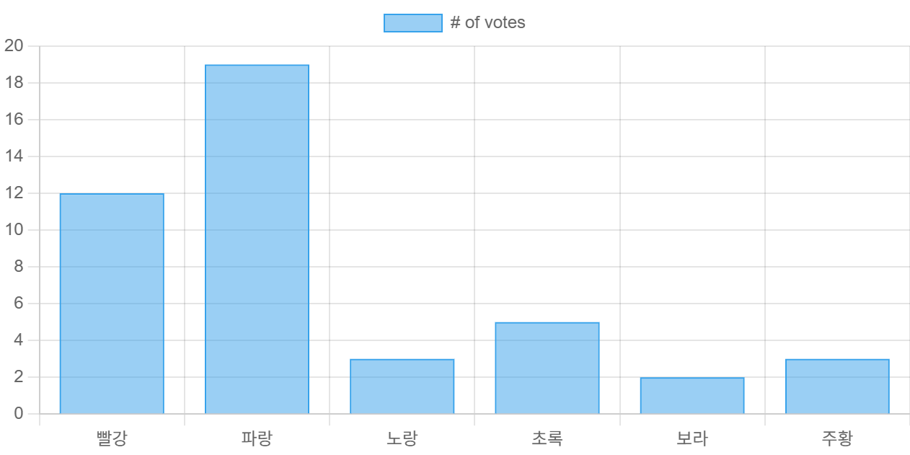
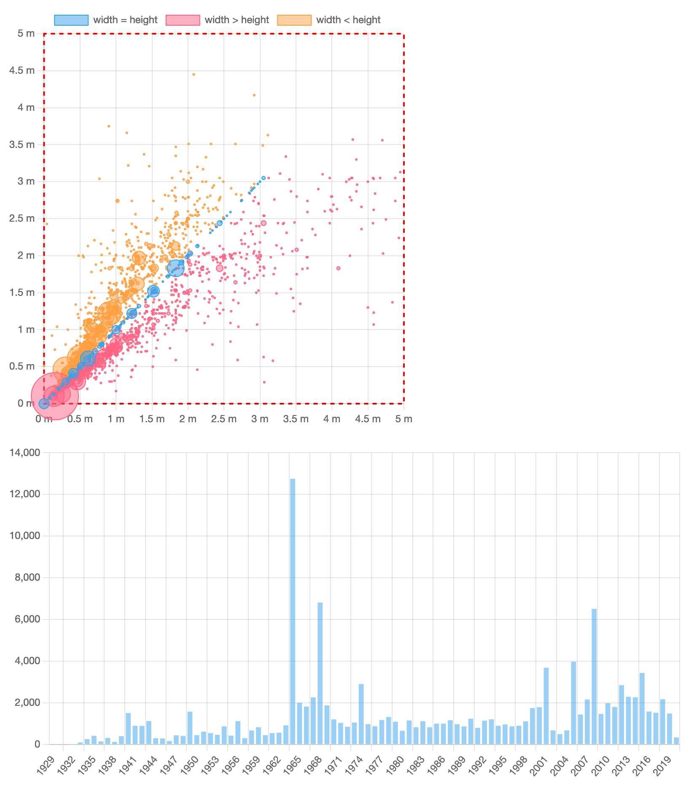

# Getting Started 

## Installation

### npm
```
npm install chart.js
```

### CDN 
- [CDNJS](https://cdnjs.com/libraries/Chart.js)
- [jsDeliver](https://www.jsdelivr.com/package/npm/chart.js?path=dist)


----------------

# 간단한 Bar Char 예제 



-----------------

# Canvas 

- `반응성(responsiveness)` 을 위해서 *chart* 가 자신의 *container*를 가지도록 하는게 권장된다


```html
<div>
    <canvas id="myChart"></canvas>
</div>
<script src="https://cdn.jsdelivr.net/npm/chart.js"></script>

```
- `<canvas>`
- CDN 포함

----------------
- `<script> 추가하기`
```js
<script>
  const ctx = document.getElementById('myChart');

  new Chart(ctx, {
    type: 'bar',
    data: {
      labels: ['Red', 'Blue', 'Yellow', 'Green', 'Purple', 'Orange'],
      datasets: [{
        label: '# of Votes',
        data: [12, 19, 3, 5, 2, 3],
        borderWidth: 1
      }]
    },
    options: {
      scales: {
        y: {
          beginAtZero: true
        }
      }
    }
  });
</script>
```

--------------
## step-by-stop 가이드
> [charjs 가이드 문서 참고](https://www.chartjs.org/docs/latest/getting-started/usage.html
)

- 예시 


-----------------


## `package.json` 파일 작성
```json
{
  "name": "chartjs-example",
  "version": "1.0.0",
  "license": "MIT",
  "scripts": {
    "dev": "parcel src/index.html",
    "build": "parcel build src/index.html"
  },
  "devDependencies": {
    "parcel": "^2.6.2"
  },
  "dependencies": {
    "@cubejs-client/core": "^0.31.0",
    "chart.js": "^4.0.0"
  }
}
```
- 설정이 필요없는 간편한 빌드도구인 **Parcle** 선택
- 실제 데이터를 가져오기 위해서 **Cube**의 클라이언트 설치

------------------

- `npm install`, `yarn install`, 또는 `pnpm install` 실행해서 패키지 설치
- `src` 폴더 생성
- 폴더 내부에 `index.html` 작성
```html
<!doctype html>
<html lang="en">
  <head>
    <title>Chart.js example</title>
  </head>
  <body>
    <!-- <div style="width: 500px;"><canvas id="dimensions"></canvas></div><br/> -->
    <div style="width: 800px;">
      <canvas id="acquisitions"></canvas>
    </div>

    <!-- <script type="module" src="dimensions.js"></script> -->
    <script type="module" src="acquisitions.js"></script>
  </body>
</html>

```

-------------


- *Chart.js* 는 최소한 `<canvas>` 라는 태그가 필요하다.  
  - 참조를 위해 `id` 속성을 포함해야 한다.
- *Chart.js* 의 차트들은 기본적으로 반응형이고 전체 컨테이너 영역을 차지한다.

----------------

<style>
.cols-4060 {
  display: grid;
  grid-template-columns: 4fr 6fr;
  gap: 1.5rem;
}
</style>

<div class="cols-4060">
<div>

- `src/acquisitions.js` 작성
```js
import Chart from 'chart.js/auto'

(async function() {
  const data = [
    { year: 2010, count: 10 },
    { year: 2011, count: 20 },
    { year: 2012, count: 15 },
    { year: 2013, count: 25 },
    { year: 2014, count: 22 },
    { year: 2015, count: 30 },
    { year: 2016, count: 28 },
  ];

  new Chart(
    document.getElementById('acquisitions'),
    {
      type: 'bar',
      data: {
        labels: data.map(row => row.year),
        datasets: [
          {
            label: 'Acquisitions by year',
            data: data.map(row => row.count)
          }
        ]
      }
    }
  );
})();

```
</div>
<div>

- `chart.js/auto` 라는 특별한 경로에서 `Chart.js`의 메인 클래스를 가져오기
- 모든 Chart.js 컴포넌트를 로드하므로 매우 편리하나, 트리 셰이킹은 지원하지 않는다.
- `Chart`인스턴스 생성. 차트가 렌더링될 캔버스 요소와 옵션 객체 두 가지 인수를 제공
- 차트 유형(`bar`)과 데이터(label과 dataset) 제공

- 실행: `npm run dev`, `yarn dev`, `pnpm dev`
- 브라우저에서 `localhost:1234` 열기

</div>
</div>

-------------------

- 결과


-------------------

<style>
.cols-4060 {
  display: grid;
  grid-template-columns: 5fr 5fr;
  gap: 1.5rem;
}
</style>

<div class="cols-4060">
<div>


- 차트에 사용자 정의 적용해보기
1. 차트가 즉시 나타나도록 애니메이 끄기
2. 범례와 툴팁을 숨기기

```js
new Chart(
  document.getElementById('acquisitions'),
  {
    type: 'bar',
    options: {
      animation: false,              // <---
      plugins: {
        legend: { display: false },  // <---
        tooltip: { enabled: false }  // <---
      }
    },
    data: {
      labels: data.map(row => row.year),
      datasets: [{
          label: 'Acquisitions by year',
          data: data.map(row => row.count)
        }
      ]
    }});
```
</div>
<div>


- `options` 두 번째 인수에 속성을 추가
- 이 방법으로 다양한 사용자 지정 옵션을 설정
- 애니메이션은 `animation` 플래그를 통해 제공
- 대부분 차트 관련 옵션(예:반응형, 장치 픽셀 비율등)은 이와 같은 방식으로 구성
- 범례와 툴팁은 `plugins` 로 지정
- 일부 기능은 플러그인으로 분리되어 있으며, 플러그인은 독립적인 코드 조각

</div>
</div>

------------------
