환경 설정은 크게 세 파트로 나뉩니다. 먼저 전체 구조를 보여드린 다음 각각 상세히 설명드리겠습니다.---



## 1. Python 환경 준비

가상환경을 쓰면 프로젝트별로 패키지 버전을 따로 관리할 수 있어서, 여러 스크래핑 프로젝트가 서로 충돌하지 않습니다.

```bash
# Python 버전 확인 (3.8 이상이어야 함)
python --version

# 프로젝트 폴더 생성 및 이동
mkdir stock_scraper
cd stock_scraper

# 가상환경 생성 및 활성화
python -m venv venv

# Windows
venv\Scripts\activate

# macOS / Linux
source venv/bin/activate

# 활성화 확인 — 프롬프트 앞에 (venv)가 붙으면 성공
(venv) $
```

---

## 2. 라이브러리 설치

```bash
pip install selenium webdriver-manager
```

`requirements.txt`로 관리하면 팀원과 환경을 공유하기 편합니다:

```txt
# requirements.txt
selenium==4.18.1
webdriver-manager==4.0.1
```

```bash
pip install -r requirements.txt
```

**두 패키지의 역할 차이:**

| 패키지 | 역할 |
|--------|------|
| `selenium` | 브라우저 제어 핵심 라이브러리 |
| `webdriver-manager` | ChromeDriver 자동 다운로드/버전 매칭 |

`webdriver-manager` 없이 쓰려면 ChromeDriver를 수동으로 다운받아야 하고, Chrome 업데이트 때마다 다시 받아야 해서 번거롭습니다.

---

## 3. WebDriver 설정 — 기본 실행

```python
from selenium import webdriver
from selenium.webdriver.chrome.service import Service
from webdriver_manager.chrome import ChromeDriverManager

# 드라이버 자동 설치 및 브라우저 열기
driver = webdriver.Chrome(service=Service(ChromeDriverManager().install()))

# 페이지 이동
driver.get("https://finance.naver.com")

# 기본 정보 확인
print("페이지 제목:", driver.title)
print("현재 URL:", driver.current_url)

# 창 크기 설정
driver.set_window_size(1280, 900)

# 종료 (반드시 해줘야 메모리 누수 없음)
driver.quit()
```

처음 실행 시 ChromeDriver가 자동으로 다운로드되고 `~/.wdm/` 폴더에 캐시됩니다. 두 번째 실행부터는 캐시를 사용해서 빠릅니다.

---

## 4. Chrome Options — 실전 필수 설정

```python
from selenium import webdriver
from selenium.webdriver.chrome.service import Service
from selenium.webdriver.chrome.options import Options
from webdriver_manager.chrome import ChromeDriverManager

def create_driver(headless=False):
    options = Options()

    # --- 기본 안정성 옵션 ---
    options.add_argument("--no-sandbox")          # 리눅스 서버 필수
    options.add_argument("--disable-dev-shm-usage")  # 공유 메모리 부족 방지
    options.add_argument("--disable-gpu")         # 헤드리스 모드에서 GPU 비활성화

    # --- 헤드리스 모드 (화면 없이 실행) ---
    if headless:
        options.add_argument("--headless=new")    # Chrome 112+ 권장 방식

    # --- 봇 탐지 우회 ---
    options.add_argument("--disable-blink-features=AutomationControlled")
    options.add_experimental_option("excludeSwitches", ["enable-automation"])
    options.add_experimental_option("useAutomationExtension", False)

    # --- User-Agent 설정 (실제 브라우저처럼 보이게) ---
    options.add_argument(
        "user-agent=Mozilla/5.0 (Windows NT 10.0; Win64; x64) "
        "AppleWebKit/537.36 (KHTML, like Gecko) "
        "Chrome/120.0.0.0 Safari/537.36"
    )

    # --- 불필요한 리소스 차단 (속도 향상) ---
    prefs = {
        "profile.managed_default_content_settings.images": 2,  # 이미지 차단
        "profile.default_content_setting_values.notifications": 2,  # 알림 차단
    }
    options.add_experimental_option("prefs", prefs)

    driver = webdriver.Chrome(
        service=Service(ChromeDriverManager().install()),
        options=options
    )

    # navigator.webdriver 속성 숨기기 (봇 탐지 추가 우회)
    driver.execute_script(
        "Object.defineProperty(navigator, 'webdriver', {get: () => undefined})"
    )

    return driver


# 사용 예시
driver = create_driver(headless=False)  # 개발 중엔 False로 눈으로 확인
driver.get("https://finance.naver.com")
print(driver.title)
driver.quit()
```

---

## 5. 프로젝트 폴더 구조 권장안

```
stock_scraper/
├── venv/                  # 가상환경 (git에 올리지 않음)
├── data/                  # 수집된 데이터 저장
│   └── samsung_posts.csv
├── logs/                  # 실행 로그
├── driver_setup.py        # WebDriver 설정 모듈 (위의 create_driver 함수)
├── scraper.py             # 실제 스크래핑 로직
├── main.py                # 실행 진입점
├── requirements.txt
└── .gitignore             # venv/, data/, logs/ 제외
```

`driver_setup.py`를 별도 모듈로 분리해두면 `create_driver()`를 여러 스크립트에서 재사용할 수 있습니다.

---

## 6. 자주 겪는 설치 오류와 해결

| 오류 메시지 | 원인 | 해결 |
|------------|------|------|
| `SessionNotCreatedException` | Chrome 버전과 ChromeDriver 불일치 | `webdriver-manager` 사용하면 자동 해결 |
| `WebDriverException: chromedriver not in PATH` | 드라이버 경로 문제 | `Service(ChromeDriverManager().install())` 방식으로 변경 |
| `DevToolsActivePort file doesn't exist` | 리눅스에서 샌드박스 오류 | `--no-sandbox` 옵션 추가 |
| `Message: unknown error: cannot find Chrome binary` | Chrome 미설치 or 경로 불명 | Chrome 설치 후 `options.binary_location` 명시 |

Chrome 경로를 직접 지정해야 할 때:

```python
options.binary_location = "/usr/bin/google-chrome"  # Linux
# 또는
options.binary_location = r"C:\Program Files\Google\Chrome\Application\chrome.exe"  # Windows
```

---

