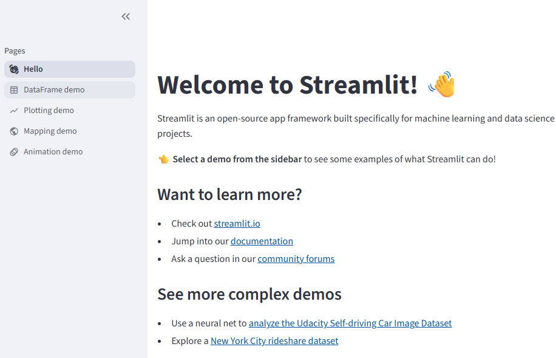

# Streamit

> Streamlit은 파이썬 코드 몇 줄만으로도 멋진 웹 애플리케이션을 만들 수 있는 강력한 도구입니다. 특히 데이터 사이언티스트와 머신러닝 엔지니어들이 많이 사용합니다.

<br>
<br>


> "파이썬 만으로 데이터, 인공지능 앱을 만들기 위한 가장 빠른 방법!"


[Streamit 링크](https://streamlit.io/)

---

# 특징

## 장점
- 백엔드 개발이나 별도의 API 호출이 필요 없다.
- 다양한 입력 위젯을 제공한다.
- 자체 클라우드 서비스 제공, 배포도 가능
- 빠른 시간에 학습 가능하고 쉽다

## 한계

- 웹 프레임워크(Djanog 등)를 완전히 대체할 수 없다.
- 기본 제공 기능을 벗어나기 어렵다.
- 실행 효율성이 낮다

---

# 사용 사례

## 1. 데이터 분석 대시보드 및 시각화
## 2. 머신 러닝 모델 데모 및 프로토타이핑
## 3. 내부 업무 자동화 도구

---

# 환경 설정

- python 가상 환경을 설치하고, streamlit을 설치하는 방식으로 진행

#### 사전 준비
- python 3.9 에서 3.13 까지 지원
- Visual Studio code

#### 가상 환경 설정 및 streamlit 설치
```bash
python -m venv venv

# 가상환경 활성화(bash 터미널)
source venv/Scripts/activate

# 설치
pip install streamlit
```
---

# 실행 확인

```bash
# hello 데모앱 실행
streamlit hello
```

- http://localhost/8501




---

# 스크립트 실행

- `firstapp.py` 파일 작성
```python
import streamlit as st

st.title('Hello World')
```

- 스크립트 실행하기

```bash
streamlit run firstapp.py

# 업데이트시 실시간 반영
streamlit run your_script.py --server.runOnSave true
```

- 브라우저로 확인하기

---


