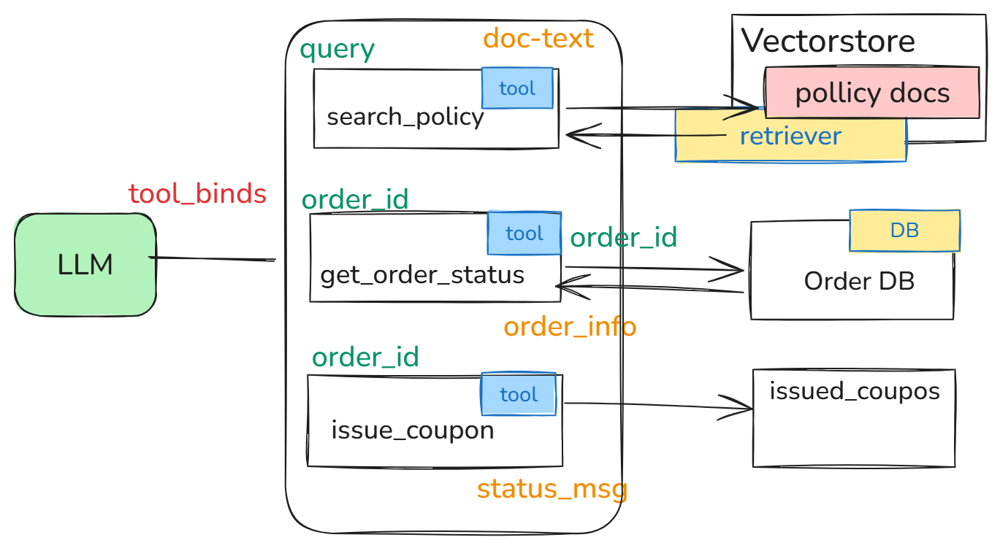
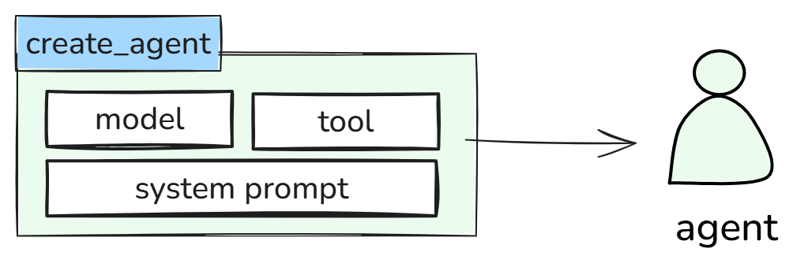
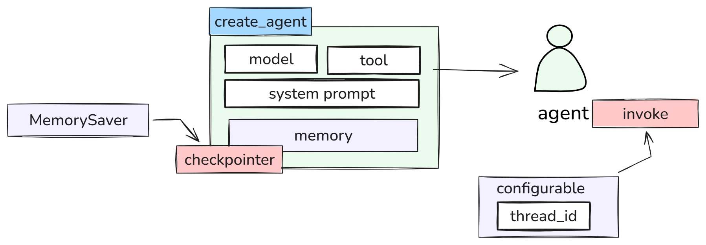
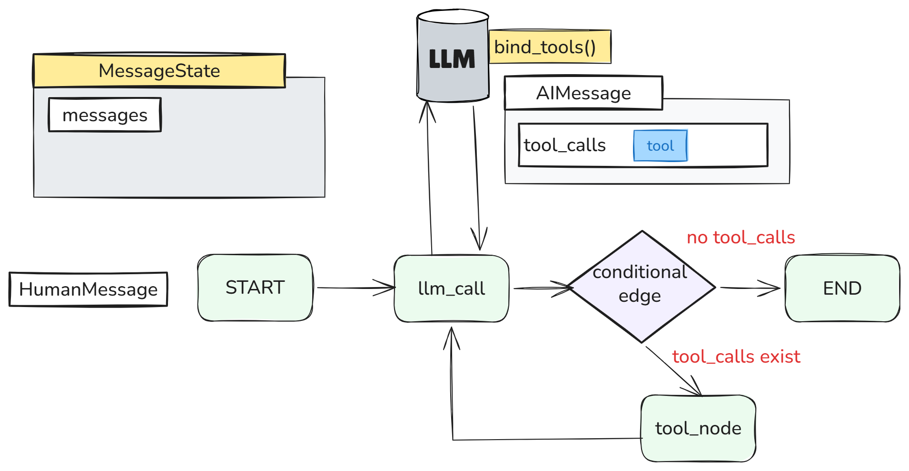
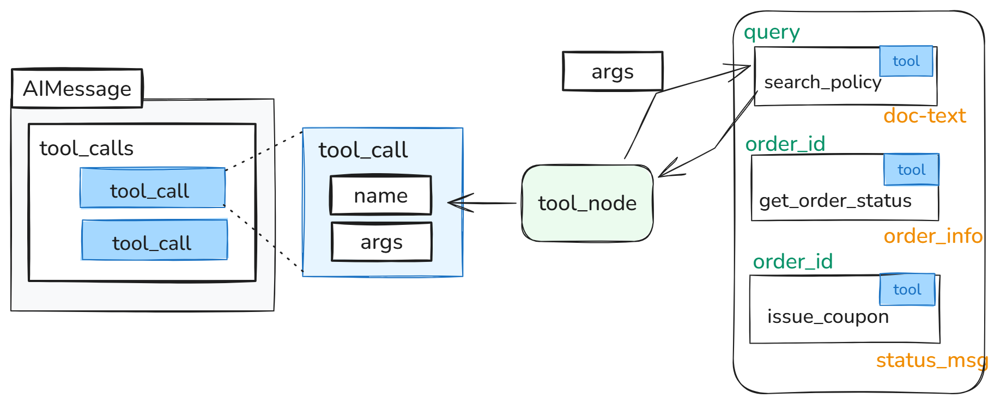

## Easy 4-2(1) 가드레일 

-------------------
## LLM + Tool

-------------------

## LLM + Tool + Memory

-------------------

## LLM + Tool + Memory

-------------------

## create_react_agent / create_agent
| | `create_react_agent` | `create_agent` |
|---|---|---|
| 소속 패키지 | `langgraph.prebuilt` | `langchain.agents` |
| 상태 | **v1부터 deprecated** (구버전) | **신규 표준** (LangGraph v1 / LangChain v1부터) |
| 내부 동작 | LangGraph의 `StateGraph` 위에서 동작 | 마찬가지로 LangGraph 위에서 동작 (내부적으로 `create_react_agent`의 후속 구현) |
| 확장 방식 | 제한적인 hook (`pre_model_hook`, `post_model_hook` 등) | **미들웨어(middleware) 시스템**으로 확장 |

- 두 함수 모두 **ReAct 패턴**을 자동으로 그래프로 구성

-------------------

## ReAcT

-------------------

## Call Tools

