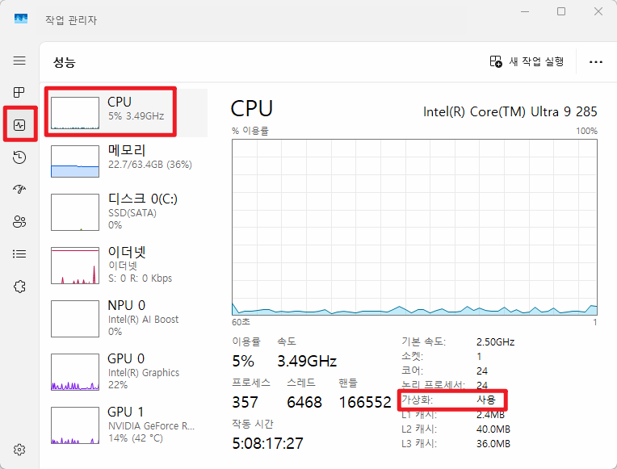

# (Windows) Python / Jupyter

## Python 3.12 설치
- 기존에 `python 3.11` 버전이 설치되었다면 생략

## python 설치 확인
- *powershell* 실행 후 python 버전 확인
```
python --version
```
--------------

## Jupyter Notebook 설치 및 실행

- **Jupyter** 환경과 필수 확장 도구들 설치
```
pip install jupyter ipykernel ipywidgets
```
- 설치 종료 후, *Jupyter Notebook* 실행
```
python -m notebook
```
  - 명령어 실행 하면 기본 웹브라우저가 자동으로 실행
  - 창이 열리지 않으며 http://localhost:8888/tree?token=... 형태의 **URL** 확인

---------------

<!-- _class:lead -->

# WSL 설치 가이드

---------------

## Linux용 Windows 하위 시스템 사용

- 관리자 권한으로 **Poswershell** 을 `관리자 권한`으로 실행
- 다음 명령어를 실행: *Windows* 에서 WSL 활성화
```
dism.exe /online /enable-feature /featurename:Microsoft-Windows-Subsystem-Linux /all /norestart
```

### >> 실행 후 컴퓨터 재시작

---------------

## Virtual Machine 기능 사용
- Powershell `관리자` 권한으로 실행
- 다음 명령어 실행: **가상화 기반 플랫폼 기능** 활성화
```
dism.exe /online /enable-feature /featurename:VirtualMachinePlatform /all /norestart
```

### >> 실행 후 컴퓨터 재시작

--------------

## Window 기능 켜기

- **윈도우 기능 켜기** 검색해서 실행

- 세가지 기능 체크
> 1. Linux용 Windows 하위 시스템 (Windows Subsystem for Linux)
> 2. 가상 머신 플랫폼 (Virtual Machine Platform)
> 3. Windoes 하이퍼바이저 플랫폼 (Windows Hypervisor Platform)
> [참고] Hyper-V


### >> 완료 후 컴퓨터 재시작

--------------
## Linux 커널 업데이트 패키지 다운로드

- Powersell 관리자 권한으로 실행
- `C:\WINDOWS\system32>` 에서 다음 명령 실행
  - WSL 설치/기능 활성화배포판 설치
  ```
  wsl.exe --install
  ```
- **Ubuntu** 가 자동으로 실행 -> User 아이디와 비밀번호 입력
  - 비번 입력 시, 보안상 화면에 표시되지 않음
  ```
  유저 이름: ssafy
  시스템 비밀번호: ssafy
  ```
--------------
- 관리자 권한으로 Powershell 새 창을 연다.
- WSL 엔진/커널 최신화, 기본 실행 버전을 WSL 2로 설정
```
wsl.exe --update
wsl --set-default-version 2
```
- 이미 업데이트 되었다면 `wsl.exe --update` 실행 시, 최신 버전이 이미 설치 되었다고 출력

--------------
## 자동 설치 안된 경우: Ubuntu 24.04 LTS 설치

- 설치 가능 목록 확인
```
wsl --list --online
```
- 22.04 버전 설치
```
wsl --install -d Ubuntu-24.04
```
- 완료 되면 Ubuntu 자동 실행
---------
## nvidia cuda driver 확인

- **Powersell** 에서 다음 명령어 실행

```
nvidia-smi
```
- GPU / cuda 버전 확인

-----------


<!-- _class:lead -->

# Docker 설치 및 접속(Jupyter lab)

------------

## 설치 전 체크
- 작업관리자(Ctrl + Shift + ESC) -> 성능 -> CPU 항목에서 `가상화: 사용` 확인




-------------

## Docker Desktop 설치

- [Docker Desktop for Windows를 다운로드](https://www.docker.com/products/docker-desktop/)

- 설치 파일 실행 시 사용자 계정 컨트롤이 보이면 **변경 허용**

--------------

- 안내에 따라 설치를 진행합니다. 
- 설치 중간에 Configuration이 나타납니다. 체크하고 설치를 진행합니다. 
(항목 예시1) Use WSL 2 instead of Hyper-V : Docker가 WSL2 기반으로 동작하게 설정합니다. (필수 체크) 
(항목 예시2) Allow Windows Containers : Windows 전용 컨테이너 사용 여부를 설정합니다. 
(항목 예시3) Add shortcut to desktop : 바탕화면에 Docker 아이콘을 추가합니다. (필수 체크)

------------------

## Docker Desktop 설정


-------------------

## 실습 폴더 준비 및 필수 파일 확인

- Powershell 에서 다음 명령 실행
```
wsl -l -v
```
- 도커 환경 설정 파일 압축 해제
  - 권장 위치: `C:\Users\SSAFY`
  - 폴더명: `ssafy_ai_2`

-------------------

- 폴더 구조
```
ssafy_ai_2/
├── Dockerfile #압축파일로 제공
├── docker-compose.yaml #압축파일로 제공
├── requirements.txt #압축파일로 제공
├── scripts/ #압축파일로 제공
└── verify_env.sh #압축파일로 제공
├── ....# 온라인 실습실에서 실습,과제 파일들을 다운로드 받은 후, 해당 폴더에 업로드합니다.
├── (실습-문제) 4-1_RAG_기반_Customer_Service_AI_에이전트_개발
├── (과제-문제) 4-1_RAG_기반_Customer_Service_AI_에이전트_개발
(3)
```

-------------
- 온라인 실습실에서 다운로드 받은 파일을 생성한 폴더(`ssafy_ai_2`) 로 이동
- 필수 파일 확인
  -  `docker-compose.yml`
  -  `Dockerfile`
  -  `requirements.txt`
  - `scripts/` 폴더

-------------
## Docker image 빌드

- 최초 1회는 Dockerfile과 requirements.txt를 기준으로 이미지를 빌드하므로 시간이 다소 소요
> **반드시 Docker Desktop 프로그램이 실행된 상태에서 작업을 진행**

```
docker compose up --build
```

## Jupyter lab 접속
- [방법1] 터미널 출력 화면 하단에서 http://localhost:8888/tree?token=... 형태의 URL을 확인한

- JupyterLab 로그인 화면이 나오면 아래 토큰을 입력 후,LOG IN을 클릭
  - Token: `lab`

-------------

## GPU 검증

#### 1. 서비스 상태 확인
```
docker compose ps
```
#### 2. 컨테이너 내부 접속
```
docker compose exec lab bash
```
#### 3. GPU 인식 확인
- NVIDIA GPU 정보가 출력되면 정상 인식
```
nvidia-smi
```

----------------

#### 4. pytorch CUDA 사용 가능 여부

- 아래 명령어를 입력하여 `cuda available: True` 로 출력이 나타난다면, 정상 출력

```
python - << 'PY'
import torch
print("torch:", torch.__version__)
print("cuda available:", torch.cuda.is_available())
print("torch cuda:", torch.version.cuda)
if torch.cuda.is_available():
print("device:", torch.cuda.get_device_name(0))
PY
```

- 검증 완료 후 컨테이너 내부에서 나오기
```
exit
```

------------------
## 실습 종료/재시작
```
docker compose down
```
- 재시작시 다음 명령어 실행
```
docker compose up -d
```