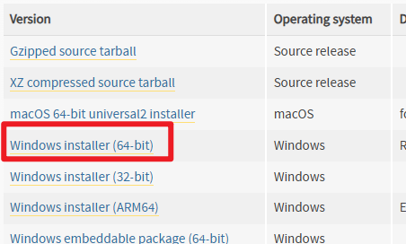
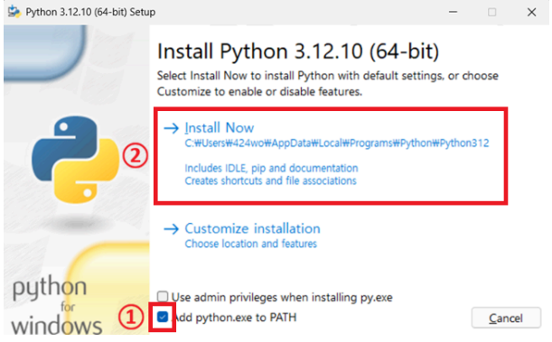
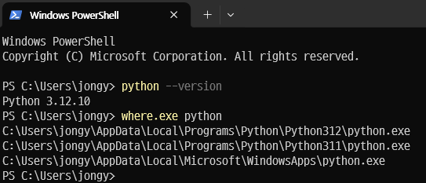
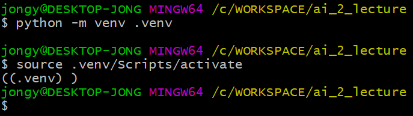
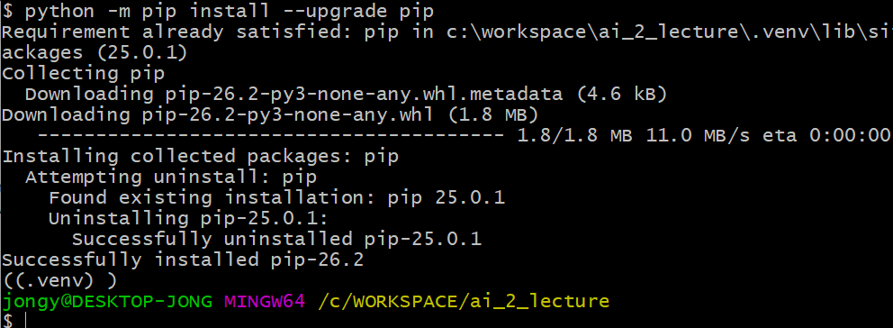
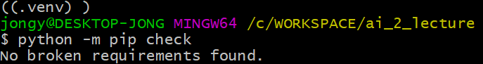
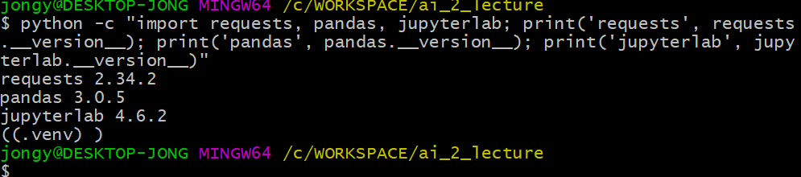
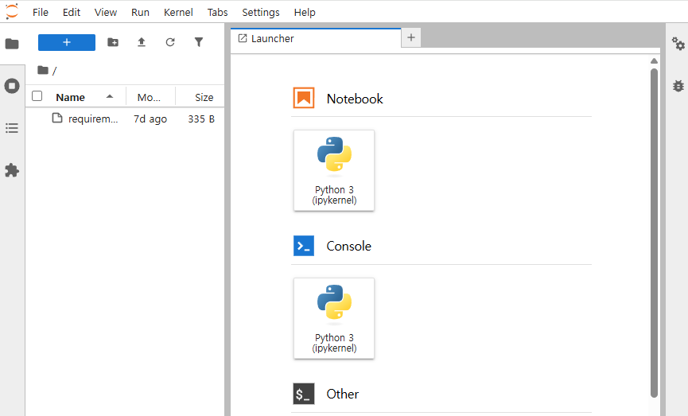

# 환경 설정

## 1. Python 설치

- [Python 다운로드 페이지](https://www.python.org/downloads/release/python-31210/) 에서 **Python 3.12.10** 설치 파일 받기


<div class="cols">
<div>



</div>
<div>


- 설치 시 `add pyhton.exe to PATH` 체크

</div>
</div>

------------
### 설치 후 확인

```
python --version
```




-------------

## 2. 가상 환경

- `git bash` 로 진행

<hr>

- 파일 탐색기로 실습 폴더(빈 폴더)생성한다. 
- 해당 폴더를 열고 마우스 오른쪽 버튼으로 `Git Bash here` 클릭


<div class="cols">
<div>

- 가상 환경 설치
```
python -m venv .venv
```

- 가상 환경 활성화
```
source .venv/Scripts/activate
```
</div>
<div>

<br>



</div>
</div>

-------------

## 3. 패키지 설치

- 먼저 `pip` 버전 업그레이드
```
python -m pip install --upgrade pip
```


--------------

- `requirements.txt` 현재 폴더에 복사해서 설치 

```
pip install -r requirements.txt
```

- 설치 후 확인
```
python -m pip check
```
> 예상 출력은 `No broken requirements found.`



---------------

- 패키지 버전 확인

```sh
python -c "import requests, pandas, jupyterlab; 
print('requests', requests.__version__); 
print('pandas', pandas.__version__); 
print('jupyterlab', jupyterlab.__version__)"
```


---------------------

## 4. Jupyter Lab 실행

```
python -m jupyter lab

# 또는 현재 폴더가 아닌 특정 폴더 열기
python -m jupyter lab Day01/배포용
```

<div class="cols">
<div>



</div>
<div>

- 빈 폴더에서 실행한 경우 노트북 파일 또는 실습 폴더를 복사한다.

</div>
</div>
