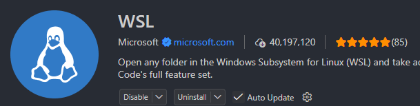
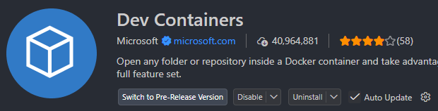
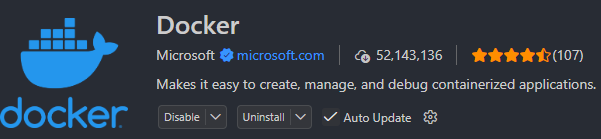

## 방법 1: VSCode를 컨테이너 내부에 "Attach"

- VSCode 창 자체가 컨테이너 안에서 실행되는 것처럼 동작
- 파일 탐색기, 터미널, 노트북 커널이 모두 컨테이너 안의 것을 사용


**1) WSL Ubuntu 안에서 작업 시작**

- 탐색기로 `ssafy_ai_2` 폴더로 가서 마우스 오른쪽 팝업에서 **VSCode** 실행

- 혹은 터미널에서 다음 실행
```bash
# WSL Ubuntu 터미널에서
cd ~/ssafy_ai_2
code .
```

-----------------

<div class="cols">
<div>

**2) VSCode에 확장 설치**
- Windows에 VSCode 설치 (이미 있다면 생략)
- 확장 설치 (Windows 쪽 VSCode에):
  - `WSL` (Remote - WSL)
  - `Dev Containers`
  - `Docker`

</div>
<div>





</div>
</div>


--------------------


**3) 컨테이너 실행 (터미널에서 직접, 혹은 docker-compose)**

- Docker 데스크톱을 실행하고 `ssafy_ai_2` 폴더에서 컨테이너 실행
```
docker compose up
```
- 혹은 다음과 같이 실행
```bash
docker run -it -d --name ml-dev \
  -v $(pwd):/workspace \
  -p 8888:8888 \
  your-ml-image
```

--------------------

**4) VSCode에서 컨테이너에 Attach**

- `F1` → `Dev Containers: Attach to Running Container...` → `ml-dev` 선택
- 새 VSCode 창이 열리며, 이제 이 창은 **컨테이너 내부**를 보는 상태
- 이 창에서 `File > Open Folder`로 `/workspace` 열기


**5) 필요한 확장을 컨테이너 안에도 설치**
Attach된 창에서 확장 탭 열고:
- `Python`
- `Jupyter`

컨테이너 안에 설치되는 것이므로 컨테이너를 재생성하면 다시 설치해야 할 수 있음(아래 devcontainer.json으로 해결 가능).

**6) 노트북 열고 커널 선택**
- `.ipynb` 파일 열기
- 우측 상단 `Select Kernel` → 컨테이너 안의 Python 인터프리터(가상환경/conda env) 선택
- 이제 코드 실행 시 컨테이너 안에서 바로 실행됨

---

## 방법 2: 컨테이너에서 Jupyter 서버만 띄우고 VSCode에서 원격 연결

- `jupyter lab`을 컨테이너에서 계속 띄워두고, VSCode Jupyter 확장이 그 서버에 붙기만 하는 방식
- 설정이 훨씬 적고 간단하다.

**1) 컨테이너에서 Jupyter 실행**
- `ssafy_ai_2` 폴더 위치에서 컨테이너 실행
```
docker compose up
```

```bash
jupyter lab --ip=0.0.0.0 --port=8888 --no-browser --NotebookApp.token='mytoken'
```
포트가 `-p 8888:8888`로 호스트에 매핑되어 있어야 함.

-------------

**2) VSCode (WSL 창)에서 노트북 열기**
- `.ipynb` 파일 열기
- `Select Kernel` → `Select Another Kernel` → `Existing Jupyter Server`
- URL 입력: `http://localhost:8888/?token=mytoken`

> 이 방식은 파일 시스템 편집은 WSL(호스트)에서 하고, 커널 실행만 컨테이너에서 하는 구조라 훨씬 가볍다.

---------------

## 어느 쪽을 선택할지

| 상황 | 추천 방법 |
|---|---|
| 컨테이너 안의 라이브러리로 자동완성/디버깅까지 완벽하게 받고 싶다 | 방법 1 (Attach) |
| 그냥 지금처럼 편하게 커널만 컨테이너 걸로 쓰고 싶다, 설정 최소화 | 방법 2 (Remote Jupyter Server) |

## 추가 팁: devcontainer.json으로 자동화

방법 1을 자주 쓸 거라면 프로젝트에 `.devcontainer/devcontainer.json`을 만들어두면, 확장 자동 설치·포트 포워딩·볼륨 마운트가 매번 자동으로 됩니다.

```json
{
  "name": "ml-dev",
  "image": "your-ml-image",
  "workspaceFolder": "/workspace",
  "mounts": [
    "source=${localWorkspaceFolder},target=/workspace,type=bind"
  ],
  "forwardPorts": [8888],
  "customizations": {
    "vscode": {
      "extensions": ["ms-python.python", "ms-toolsai.jupyter"]
    }
  }
}
```
이후 `F1 → Dev Containers: Reopen in Container`만 누르면 됩니다.

---

지금 쓰고 계신 Dockerfile이나 docker run 명령어를 알려주시면, 그대로 devcontainer.json으로 변환해드릴 수도 있어요. 원하시나요?