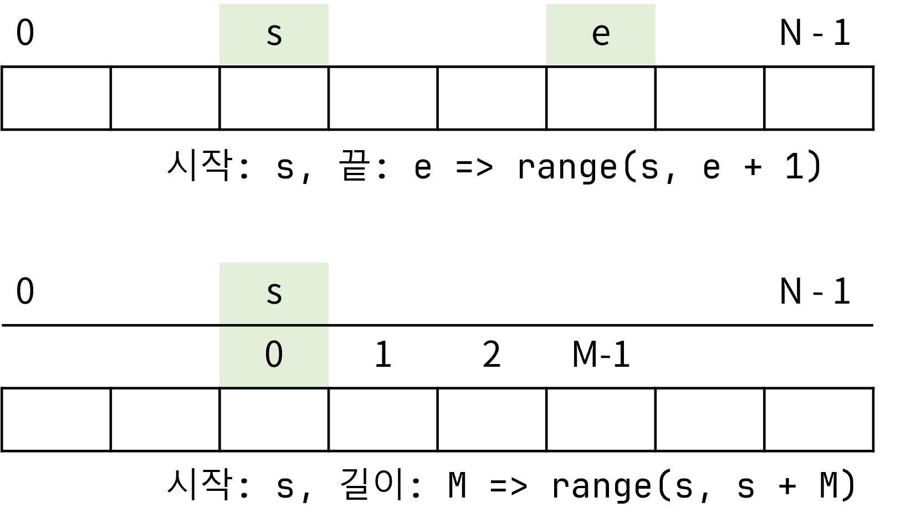
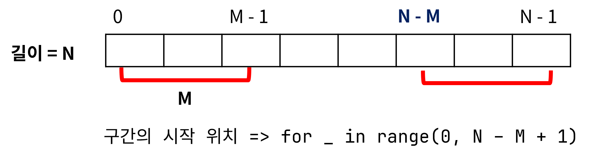
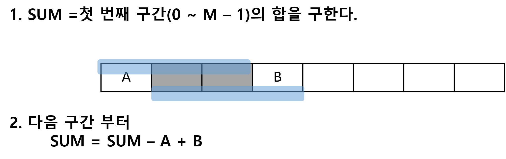

# 구간합 

## 구간 표현

## 모든 구간들의 합 계산하기

### 1. 구간의 요소들을 순회하면서 합 계싼
- 시간 복잡도: $O(n^2)$

### 2. 계산량 줄이기(슬라이딩 윈도우)

- 슬라이딩 윈도우(Sliding Window): 배열의 연속적인 구간(sub-array, 윈도우)을 왼쪽에서 오른쪽으로 움직이면서 문제를 해결하는 방법
- 시간 복잡도: $O(n)

