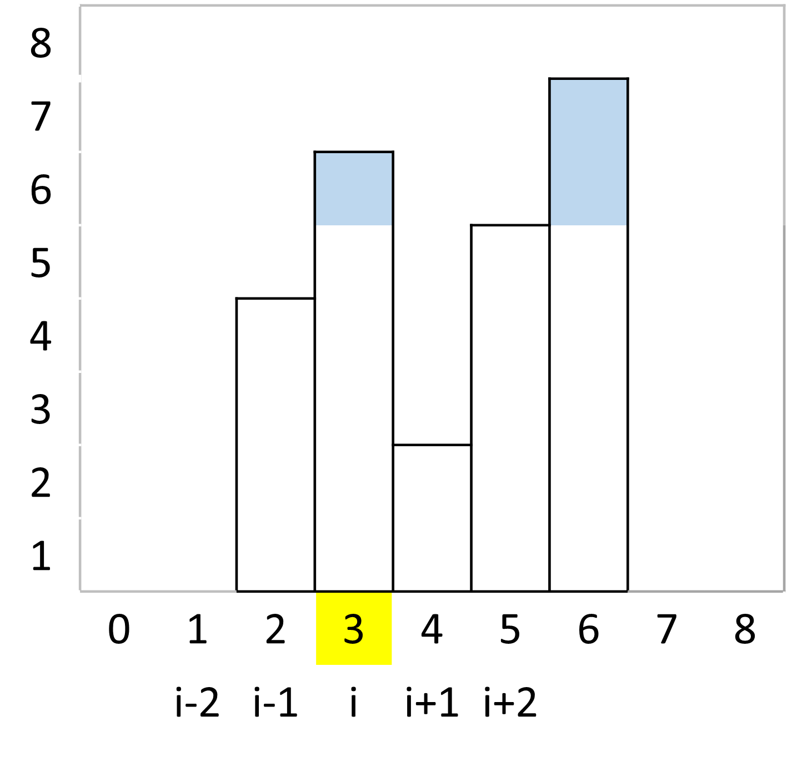

# View

## 아이디어

1. 하나의 빌딩에 대한 조망권을 계산해본다.
2. 모든 빌딩에 대해 이 과정을 반복한다.


### 조망권 계산은 어떻게 할까?




- 좌/우의 4개의 빌딩들 보다 높이가 커야 한다.
- 위 조건에 부합하면, 4개 중 최대값과의 차이가 조망권 층수가 된다.

```python

# arr[]: 입력 배열
# i: 조망권을 계산할 빌딩의 인덱스
max_h = max(arr[i-2], arr[i-1], arr[i+1], arr[i+2])
if arr[i] > max_h:
  arr[i] - max_H   # 조망권 층 수
```