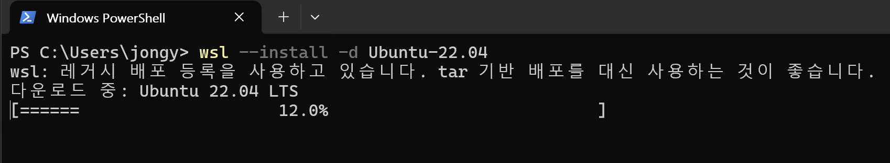
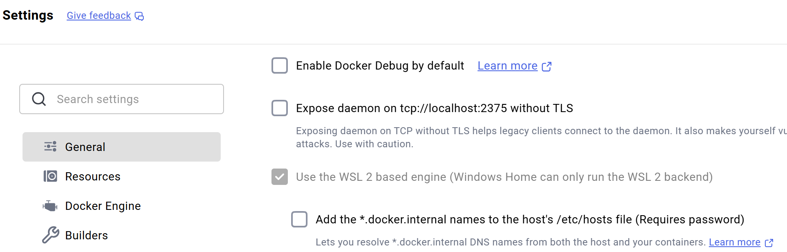
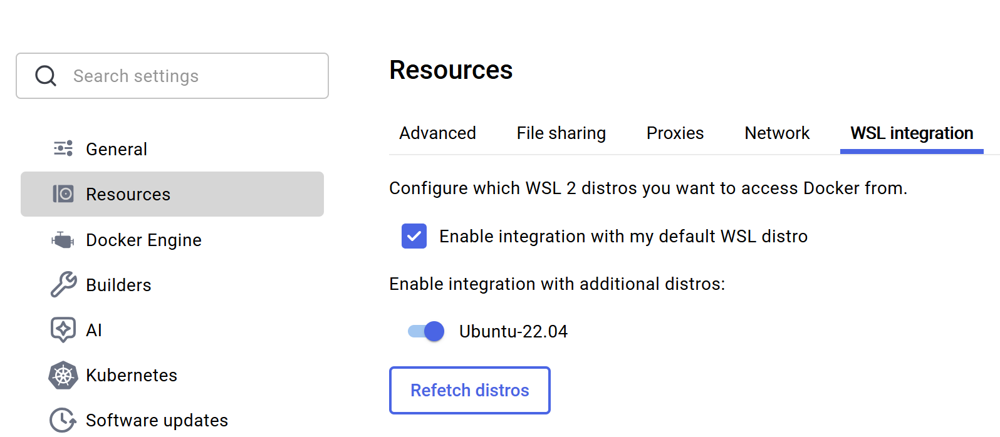
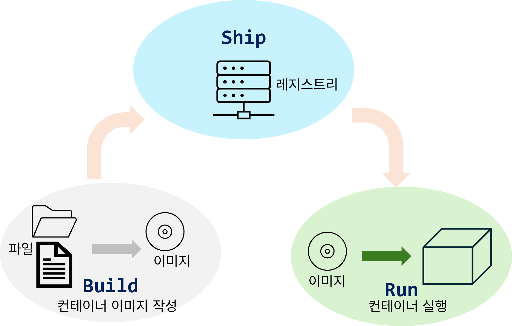
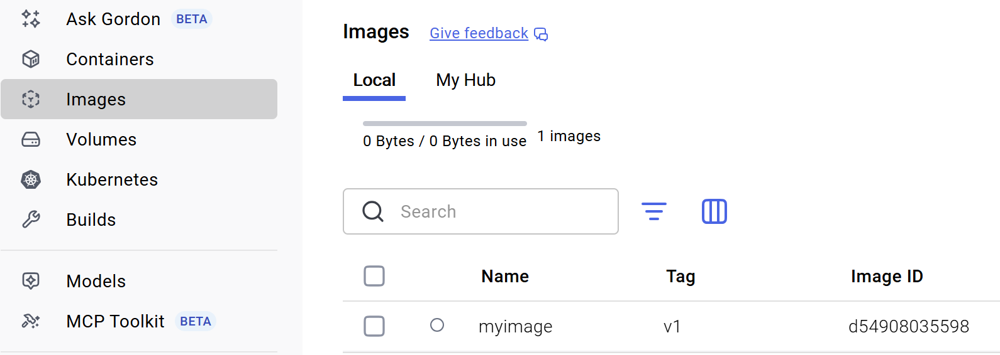
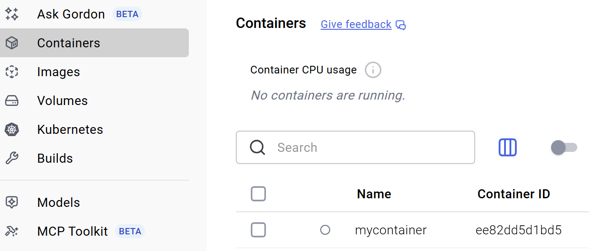

# Docker 소개


---

# 컨테이너 살펴보기

## 1. 컨테이너 실행

## 2. 컨테이너 이미지

---

# 도커의 기본 기능


---

# WSL 설치

- wsl 설치 [doc](https://docs.docker.com/desktop/setup/install/windows-install/#wsl-verification-and-setup)

```bash
# 버전 확인
wsl --version

# wsl 설치 하기
wsl --install
```

---

# Ubuntu 설치

- `Unbuntu` 설치하기
```
wsl --install -d Ubuntu-22.04
```


---

# Docker Desktop 설치

- [Docker Desktop 설치](https://docs.docker.com/desktop/setup/install/windows-install/)

> 가상화(Virtualization) 기능이 BIOS에서 활성화되어 있어야 한다.
일반적으로 대부분의 PC에서 기본적으로 활성화되어 있지만, 비활성화되어 있는 경우 BIOS에 진입하여 수동으로 켜준다. 


---

- 설정 > General > Use the WSL 2 Based engine 체크



---

- 설정 > Resources > WSL Integration
  - 설치한 `Ubuntu` 와 연결하기



---

# 도커 작업 흐름


## Build, Ship, Run

- build: 컨테이너 이미지 작성
  - 어플리케이션, 의존 파일, 환경설정
- Ship: 레지스트리를 통한 컨테이너 배포
- Run: 컨테이너 실행 



---

# 이미지 작성

- 컨테이너 이미지는 컨테이너로 실행할 어플리케이션, 의존파일, 컨테이너 환경 설정 등을 포함한 컨테이너 재료
- 빌드는 컨테이너 이미지 작성을 의미

## 컨테이너 재료
- **도커파일(dockerfile)** : 컨테이너 작성 절차 기록
- 컨텍스트(context): 컨테이너에 저장하거나 빌드 시 사용하는 파일(예> 어플리케이션 소스 코드)

---

- build 명령어 실행

```bash
docker build -t myimage:v1 ./myimage
```
- `-t`: 이미지에 부여할 이름 지정
- `이미지 이름` : `태그`
  - 태그를 지정하지 않으면 `latest` 로 기본 적용

---

- docker desktop에서 확인


- CLI로 확인
```bash
docker image ls myimage:v1
# 출력 내용 
IMAGE        ID             DISK USAGE   CONTENT SIZE   EXTRA
myimage:v1   d54908035598        117MB         29.5MB
```
---

# Run 실행

```bash
docker run --name mycontainer myimage:v1
```
- `--name`: 실행하는 컨테이너에 부여할 이름




- 컨테이너 실행 중지 & 삭제
```bash
docker stop mycontainer

docker rm mycontainer
```
---

# docker image

```bash
# 이미지 생성
docker build -t <이미지 이름> <대상 폴더>

# 이미지 목록
docker images

# 이미지 삭제(remove image)
docker rmi <이미지 ID>
docer rmi [이미지이름]:[태그]


```


---

#### AI 개발이 활발해 질 수록 컨테이너와 쿠버네티스 같은 기술이 더 팔요해질 것
#### `안전하게 실패할 수 있는 환경`


