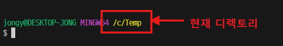
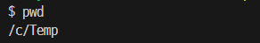

# CLI 명령어

- bash 터미널


- 항상 현재 작업 디렉토리를 확인하는 습관을 가진다.

### `pwd`

- 현재 작업 디렉토리의 경로를 출력



----------------------------------

### `touch` <파일명>

- 빈 텍스트 파일을 생성한다.
- 현재 작업 디렉토리가 아닌 곳에 파일을 생성하려면 **상대경로** 또는 **절대경로**로 작성
```sh
$ touch README.md

# 다수 파일들을 한번에 생성
$ touch a.txt b.txt c.txt

# 부모 디렉토리에 생성
$ touch ../parent.txt

# 자식 디렉토리에 생성
$ touch ./sub_folder/child.txt
```
----------------------------------

# 경로
- 컴퓨터에 저장된 파일은 모두 주소를 가진다.
- 주소(위치 정보)를 표현하는 방식
  1. **현재위치**를 기준으로 말하는 상대경로
  2. **루트(root)** 를 기준으로 말하는 절대경로

----------------------------------

## 절대경로 (Absolute Path)

**"불변의 주소, 뿌리부터 시작하는 길"**

- 절대경로는 파일 시스템의 최상위 루트(Root, `/`) 디렉토리부터 목적지까지의 모든 경로를 다 적는 방식
   - 마치 우리가 택배를 보낼 때 쓰는 **'대한민국 서울특별시 강남구...'**로 시작하는 고정된 주소와 동일

- **특징:** 내가 현재 어디에 있든 상관없이 항상 같은 곳을 가리킵니다.
- **시작점:** 항상 `/` (루트)로 시작합니다.
- **예시:** `/Users/gemini/Documents/python/homework.py`

```bash
# 내가 어디 있든 이 명령은 항상 같은 폴더로 이동합니다.
cd /Users/gemini/Desktop/projects

```
----------------------------------
## 상대경로 (Relative Path)

**"나를 기준으로 설명하는 길"**

- 상대경로는 **'현재 내가 서 있는 위치'**를 기준으로 위치를 설명하는 방식
  - 친구에게 길을 알려줄 때 "여기서 앞으로 세 발짝 가서 왼쪽으로 돌아"라고 하는 것

- **특징:** 내가 어디에 있느냐에 따라 목적지가 다름
- `.` (점 하나): **현재** 내 위치
- `..` (점 둘): **상위** 폴더 (뒤로 가기)

* **예시:** `../images/photo.jpg` (부모 디렉토리 안의 photo.jpg)

```bash
# 현재 폴더 안의 'src' 폴더로 들어가기
cd ./src
# 상위 폴더로 나갔다가 'data' 폴더로 들어가기
cd ../data
```
----------------------------------
### `cd` 

- 현재 작업 디렉토리를 변경
```sh
$ cd my_works

# 상대 경로 - 현재 디렉토리를 기준으로 표현
$ cd ./samples/test

# 절대 경로 - 루트 디렉토리를 기준으로 표현
$ cd /c/temp/samples
```

----------------------------------

### 경로 작성 시 `~` 의 의미
- 경로 표현에서 `~` 은 **홈 디렉토리를** 의미한다.
- 어디에 있든 `cd ~` 를 입력하면 본인의 홈 디렉토리로 이동한다.
  - 윈도우 환경에서 홈은 `c:\Users\<계정명>` 이다.
  - 터미널에서는`pwd`로 확인하면 `/c/Users/<계정명>` 로 출력

----------------------------------
### 바로 이전 디렉토리로 이동하기
```bash
cd -
```
- 현재 위치에서 바로 직전에 머물렀던 폴더로 돌아가고 싶을 때는 대시(-)를 사용

#### 예시 상황 (Scenario)

1. 현재 위치: /Users/student/Desktop
2. 이동: cd ~/Downloads (현재 위치는 Downloads)
3. 마법의 명령어: `cd -` 입력

=> **결과: 다시 /Users/student/Desktop으로 복귀!**

----------------------------------
### 폴더 생성하기
### `mkdir` <폴더명>

- 폴더(디렉토리)를 생성
```sh
$ mkdir folder-name

# 경로를 지정해서 생성
$ mkdir ./folder-name/sub-folder
```
----------------------------------
### 폴더 내부 확인하기
### `ls`

- 현재 폴더에 존재하는 파일/폴더들의 목록을 출력
```sh
$ ls
$ ls ..        # 부모 폴더 출력
$ ls /c/temp   # 절대 경로(루트부터)로 표현

# 숨김 파일/폴더도 모두 출력
$ ls -a        
```
----------------------------------
### 파일/폴더 삭제하기
### `rm`

- 파일/디렉토리 삭제
- 특히, 디렉토리를 삭제 할 때는 `-r` 옵션을 적용

```sh
$ rm <file-name>

# 디렉토리를 삭제하기
$ rm -r <folder-name>
```

> **### 주의 ####**
> - `rm` 은 영구히 파일을 삭제하는 명령어
> - 윈도우 환경에서와 같이 휴지통으로 보내지 않는다.
> - 복구할 수 없으니 주의해야 한다.

<!-- _footer: 휴지통으로 보내려면 `trash-cli`와 같은 도구를 설치. 혹은, 'rm -i'를 통해 확인 과정 추가 -->
----------------------------------

#### !!주의!!

> CLI 환경(터미널)에서 명령어를 실행할 때는  항상 현재 작업 디렉토리(present working directory)를 인지하고 있어야 한다.
> 
> - `pwd` 명령어를 입력하면 현재 작업 디렉토리의 정보를 출력한다.
----------------------------------

> **간단 실습**
> 1. 현재 디렉토리에 `sample.txt` 파일을 생성한다.
> 2. '안녕하세요!!' 라고 입력하고 저장한다.
> 3. 터미널에서 `cat sample.txt` 라고 입력해서 결과를 확인한다.
  - `cat` 은 텍스트 파일의 내용을 출력하는 명령어
> 4. 부모 디렉토리로 이동한다.
> 5. `cat sample.txt` 이라고 입력했을 때 에러 메시지를 확인한다.

----------------------------------

## 유용한 기능

### `Tap` 키를 잘 활용한다.
- 명령어 다음에 오는 파일이름이나 경로를 작성하는 경우 일부만 작성한 상태에서 `Tab`키를 누르면 자동 완성된다

### 터미널에 출력된 내용 지우기
- `clear` 또는 `CRTL + L` 을 입력

### 명령어에 대한 도움말
- `--help` 옵션을 사용
- 예> `ls --help`

