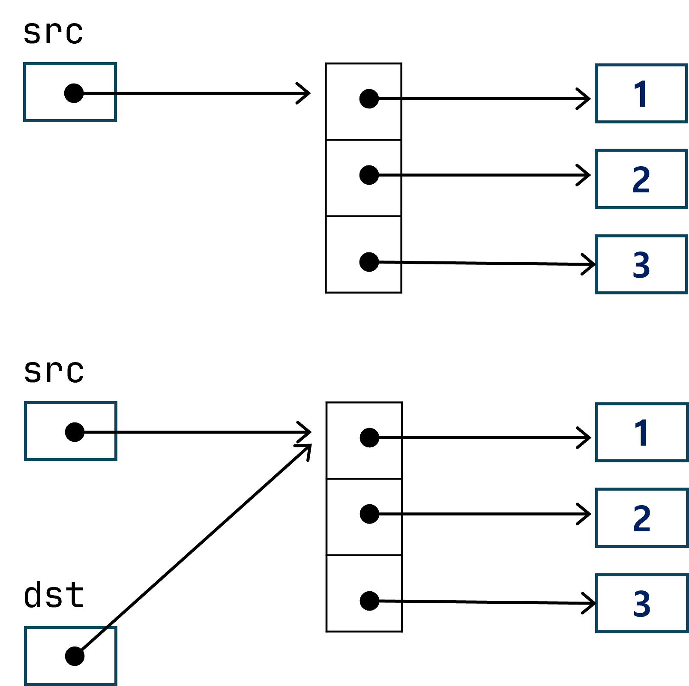
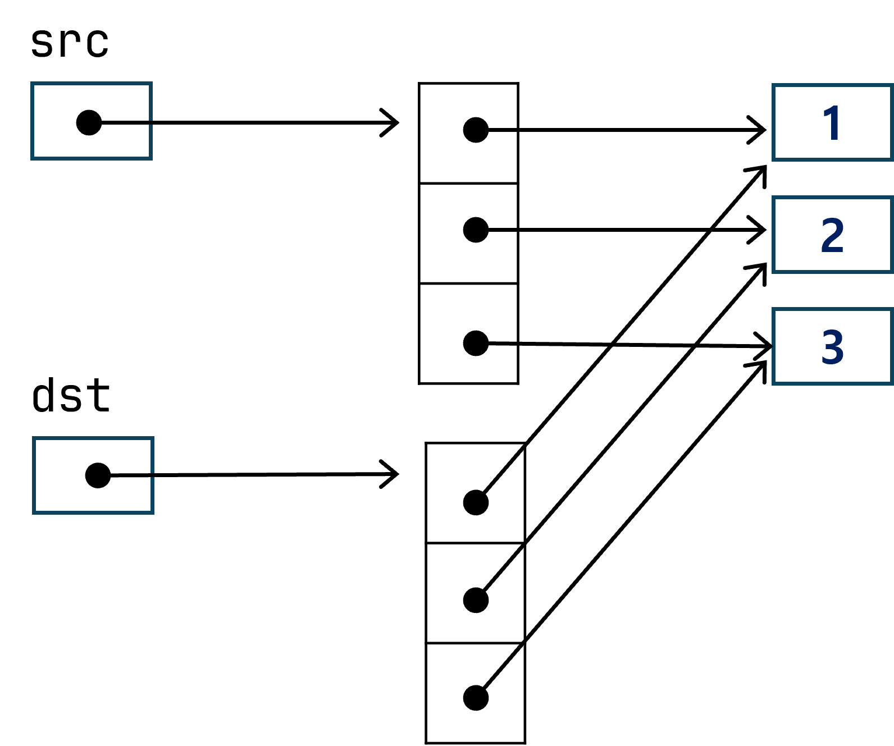
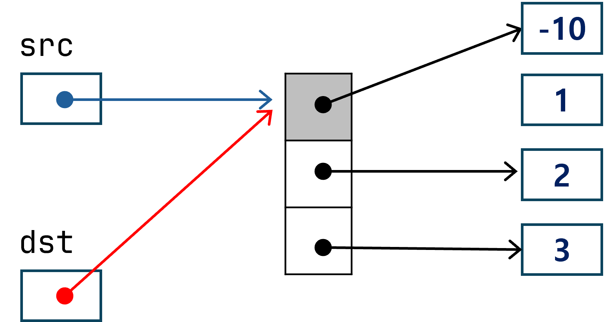
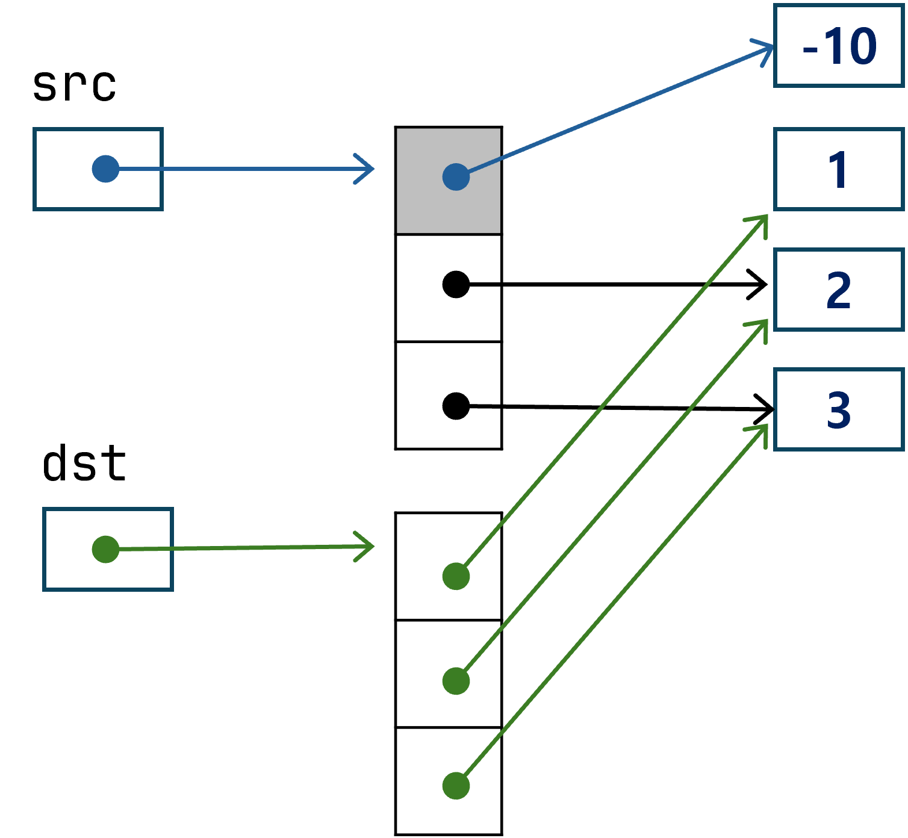
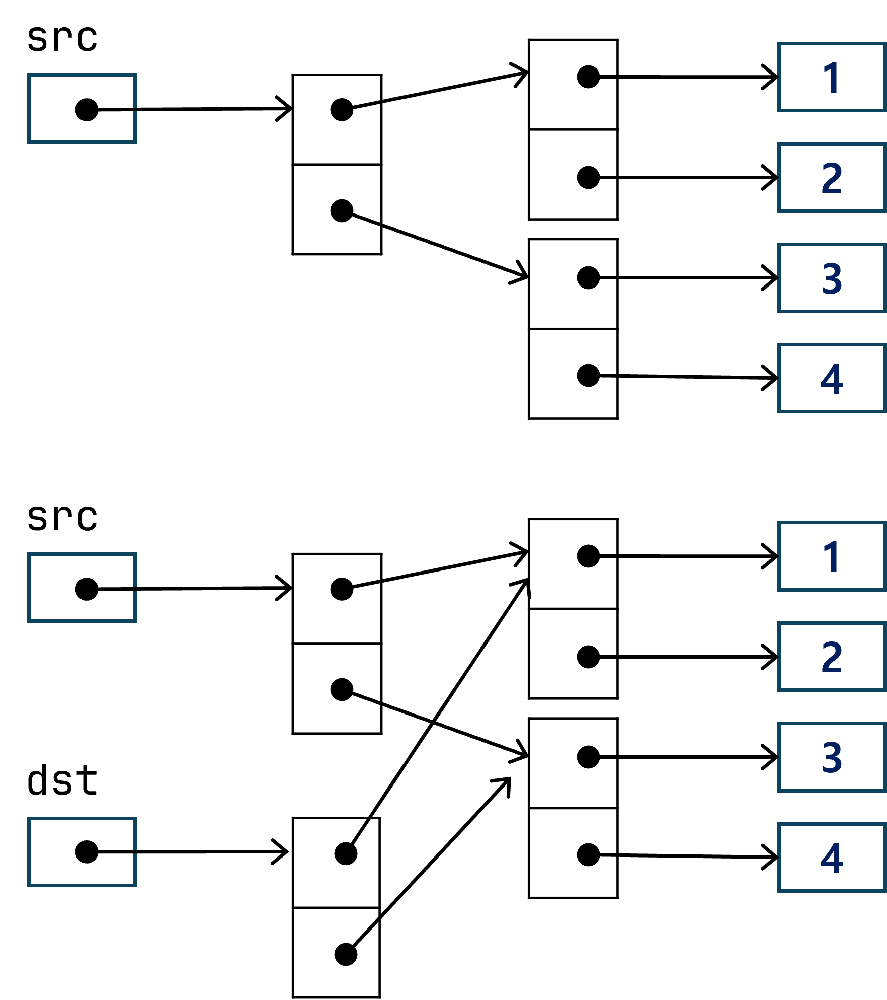
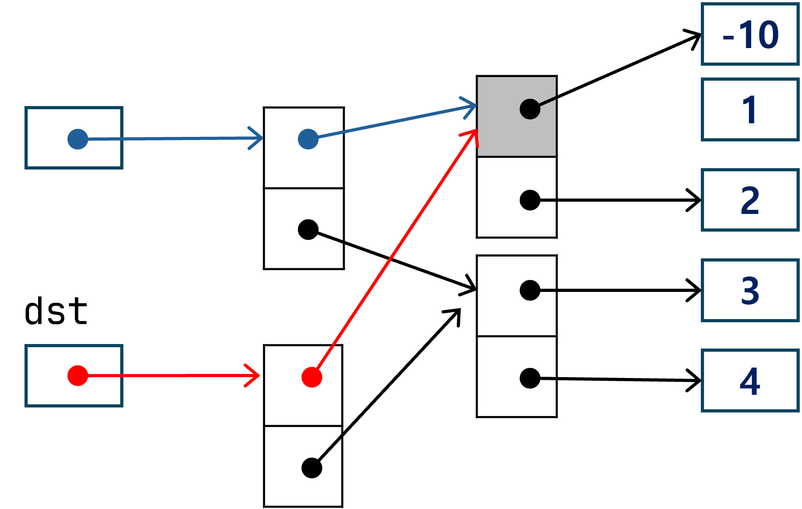
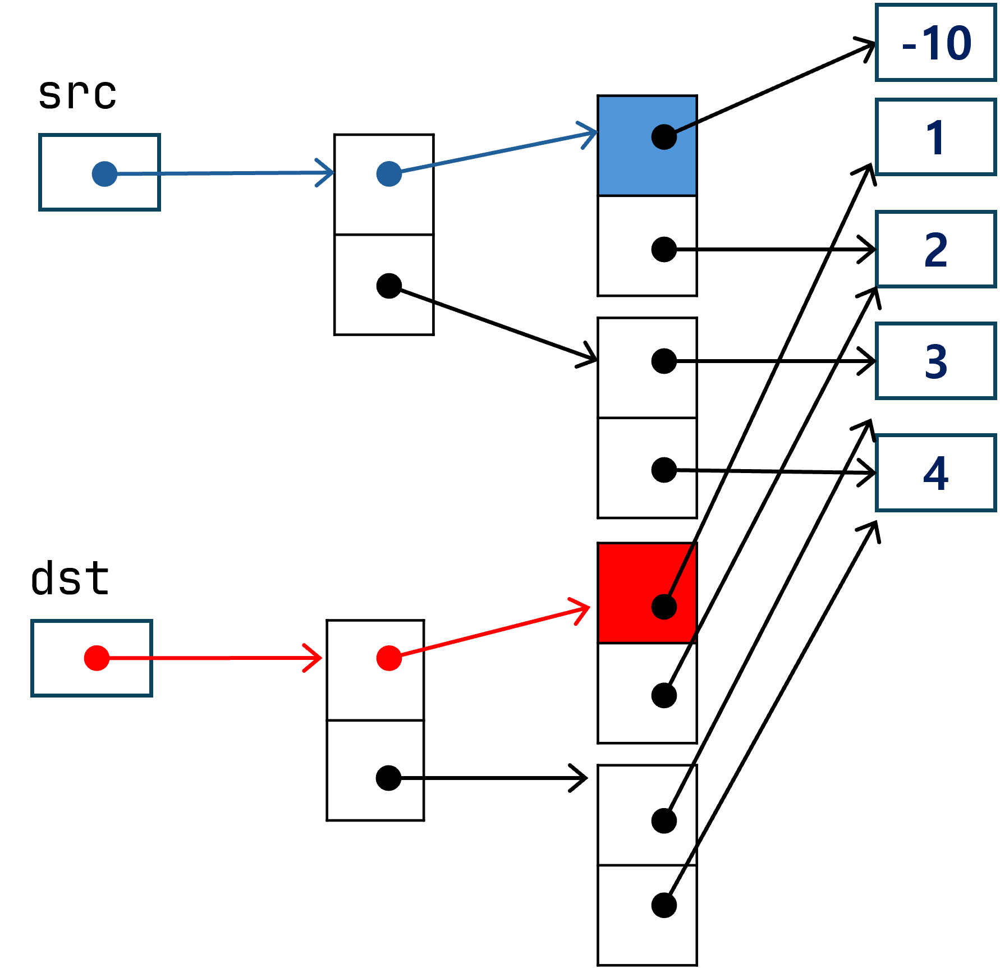

# shallow copy



```python
# 객체의 비교 연산
src = [1, 2, 3]
dst = src

print(src, dst)
print(src == dst)
print(id(src), id(dst))
print(src is dst)   
```
- 출력
```
[1, 2, 3] [1, 2, 3]
True
2269290634496 2269290634496
True
```
---------------------------------

# shallow copy



```python
# 객체의 비교 연산
src = [1, 2, 3]
dst = src[:]      # shallow copy
 
print(src, dst)
print(src == dst)
print(id(src), id(dst))
print(src is dst)
```
- 출력
```
[1, 2, 3] [1, 2, 3]
True
2269290587584 2269290613568
False
```

---------------------------------

# shallow copy



```python
# 객체의 비교 연산
src = [1, 2, 3]
dst = src      # shallow copy
src[0] = -10      
print(src, dst)
print(src == dst)
print(id(src), id(dst))
print(src is dst)
```
- 출력
```
[-10, 2, 3] [-10, 2, 3]
True
2269290047936 2269290047936
True
```
---------------------------------

# shallow copy



```python
# 객체의 비교 연산
src = [1, 2, 3]
dst = src[:]      # shallow copy
src[0] = -10   
print(src, dst)
print(src == dst)
print(id(src), id(dst))
print(src is dst)
```
- 출력
```
[-10, 2, 3] [1, 2, 3]
False
2269290279552 2269290613568
False
```

---------------------------------

# shallow copy



```python
src = [[1, 2], [3, 4]]
dst = src[:]

print(src, dst)
print(src == dst)
print(src is dst)
```
- 출력
```
[[1, 2], [3, 4]] [[1, 2], [3, 4]]
True
False
```
---------------------------------

# shallow copy



```python
src = [[1, 2], [3, 4]]
dst = src[:]
src[0][0] = -10
print(src, dst)
print(src == dst)
print(src is dst)
```
- 출력
```
[[-10, 2], [3, 4]] [[-10, 2], [3, 4]]
True
False
```
---------------------------------

# shallow copy


```python
from copy import deepcopy

src = [[1, 2], [3, 4]]
dst = deepcopy(src)

print(src, dst)
print(src == dst)
print(src is dst)
```
- 출력
```
[[1, 2], [3, 4]] [[1, 2], [3, 4]]
True
False
```
---------------------------------

# shallow copy




```python
from copy import deepcopy

src = [[1, 2], [3, 4]]
dst = deepcopy(src)
src[0][0] = -10
print(src, dst)
print(src == dst)
print(src is dst)
```
- 출력
```
[[-10, 2], [3, 4]] [[1, 2], [3, 4]]
False
False
```


---------------------------------

# List 주의

```python
lst1 = [0] * 3
lst2 = [0 for _ in range(3)]
print()
```

- 아래 경우에 주의
```python
lst1 = [[1, 2]] * 3
lst2 = [[1, 2] for _ in range(3)]
print()
```