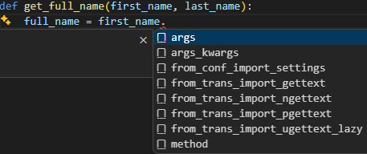
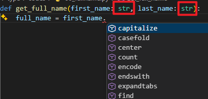
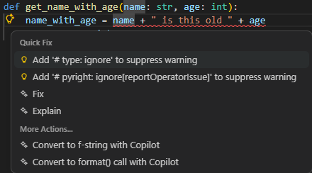

# 파이썬의 타입

- 파이썬은 선택적으로 "타입 힌트(type hints)"(“type annotations”라고도 함)를 지원

- **타입 힌트** 또는 **어노테이션** 은 변수의 타입을 선언할 수 있게 해주는 특수한 구문

- 변수 타입을 선언하면 에디터와 도구가 더 나은 지원을 제공


> **FastAPI** 는 타입 힌트에 기반을 두고 있으며, 이는 많은 장점과 이점을 제공한다.

---

# 간단한 예시 1

```python
# Python 3.10+
def get_full_name(first_name, last_name):
    full_name = first_name.title() + " " + last_name.title()
    return full_name
print(get_full_name("john", "doe"))
```


- `ctrl + space` 활용
- `first_name.` 에서 `title()` 메소드를 자동 완성 안됨.  `first_name`이 `str` 인지 알 수 없다.
---

# 간단한 예시 1
```python
# Python 3.10+
def get_full_name(first_name: str, last_name:str):
    full_name = first_name.
    
```


----------------------------

# 간단한 예시 2

- 타입 힌트가 있으면 오류 검사도 가능

```python
def get_name_with_age(name: str, age: int):
    name_with_age = name + " is this old " + age
    return name_with_age
```

-----------

- `pylance` 확장 프로그램 설치 및 활성화

- **Python > Analysis: Type Checking Mode** 항목 찾기
- `off`: 타입 체크를 수행하지 않고 구문 오류나 기본적인 분석 정보만 제공
- `basic`: 명시적인 타입 오류나 유효하지 않은 속성 접근 등 기본적인 타입 규칙 위반 사항을 체크하여 보고
- `standard`: (주로 Pyright 환경에서 사용) 기본 체크에 더해 라이브러리 타입 스텁 확인 등 좀 더 포괄적인 표준 분석을 수행
- `strict`: 모든 변수와 함수에 타입 힌트 작성을 강제. 가장 엄격한 수준으로 잠재적인 타입 불일치 위험을 모두 찾아낸다.

-------------

- **Type Checking Mode** 를 `basic`으로 설정한다.

- 오류가 있는 `name_with_age = name + " is this old " + age` 코드에 붉은색 밑줄이 표시된다.


-------------

# Simple 타입

- `str` 을 포함해서 파이썬의 표준 타입을 선언할 수 있다.

  - `int`
  - `float`
  - `bool`
  - `bytes`

--------------

# `typing` 모듈

- 표준 라이브러의 `typing` 모듈에서 `import` 해서 사용하는 타입들 있다.

## Any

- `Any`: 아무 타입
```python
from typing import Any
def process_item(item: Any):
    print(item)
```

----------

## Generic 타입
- 일부 타입은 대괄호 안에 **타입 매개변수** 를 받아 내부 타입을 정의
- 이렇게 타입 매개변수를 받을 수 있는 타입을 **Generic Types** 또는 **Generics** 라고 한다.

  - `list`
  - `tuple`
  - `set`
  - `dict`

```python
def process_items(items: list[str]):
    for item in items:
        print(item)
```

-------------

## Generics 예시

- `tuple` 과 `set`

```python
def process_items(items_t: tuple[int, int, str], items_s: set[bytes]):
    return items_t, items_s
```
  - `items_t`는 3개의 아이템을 가지고, 각 타입은 `int`, `int`, 그리고 `str`
  - `items_s`는 `set`이며, 각 아이템 타입은 `bytes`

--------------

- `dict`
```python
def process_items(prices: dict[str, float]):
    for item_name, item_price in prices.items():
        print(item_name)
        print(item_price)
```
  - `prices`는 `dict`
    
    - **key** 는 `str`
    - **value** 는 `float` 

----------------

## Union

- 여러 타입 중 하나가 될 수 있다고 선언
- 두 타입을 세로 막대( **|** )로 구분

```python
def process_item(item: int | str):
    print(item)
```
------------

## None 일 수 있음

```python
def say_hi(name: str | None = None):
    if name is not None:
        print(f"Hey {name}!")
    else:
        print("Hello World")
```

-------------------


